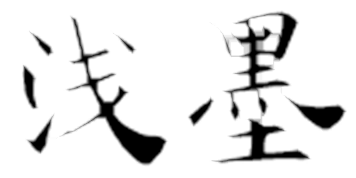

[toc]

[main page](../../entry.md)

# 数据集

* [cifar-10](https://www.cs.toronto.edu/~kriz/cifar.html): 10 classes with 60000 images

# 传统图像处理

## 基本概念

### 对比度与亮度

* 对比度与亮度定义
    * 图像亮度本质上图像中每个像素的亮度，每个像素的亮度本质上RGB值的大小，RGB值为0是像素点为黑色，RGB都为255时像素点最亮，为白色。对比度则是不同像素点之间的差值，差值越大，对比度越明显。从直方图分析的观点来看，对比度越好的图片，直方图曲线会越明显，分布也越显得均匀。
* 调整方式
    $$
    V_{r/g/b} = contrast*(V_{r/g/b} - \bar{V}_{r/g/b}) + brightness*\bar{V}_{r/g/b}
    $$
* 调整经验值
    * 对比度 contrast的最佳取值范围在[0~4]
    * 亮度 brightness的最佳取值范围在[0~2]

## 基本操作

### 二值化

* 大律法（OSTU）
    * 原理：最大类间方差，将图像分为前景和背景
    * 缺点：对噪音敏感，且仅对类间方差为单峰的图像产生较好的分割效果
    * 公式描述，$u$为图像平均值，$u_0$为背景平均值，$w_0$为背景占比，$u_1$为前景平均值，$w_1$为前景占比，$g(t)$为目标函数。
        $$
        \begin{aligned}
        u &= w_0*u_0 + w_1*u_1 \\
        min\ g(t) &=w_0*(u_0-u)^2+w_1*(u_1-u)^2=w_0*w_1*(u_0-u_1)^2
        \end{aligned}
        $$
    * 计算流程：
        1. 直方图
        2. 对0~255，逐个分析当前的$g(t)$是否最大，否则就更新
* 迭代二值化法

    * 原理：预设阈值，求取两平均值的中值，设为下一阈值，迭代至相等。和非监督的k-means方法的原理类似。
    * 计算流程：
        1. 求出图象的最大灰度值和最小灰度值，分别记为$g_l$和$g_u$，令初始阈值为：
            $$
                T^0=\frac{g_l+g_u}{2}
            $$
        2. 根据阈值$T^0$将图象分割为前景和背景，分别求出两者的平均灰度值$A_b$和$A_f$
        3. 计算$T_k$直至收敛
            $$
                T^k=\frac{A_b+A_f}{2}
            $$
    * 参考: [十三种基于直方图的图像全局二值化算法原理、实现、代码及效果](https://www.cnblogs.com/Imageshop/p/3307308.html)

### 腐蚀与膨胀

* 膨胀与腐蚀
    * 膨胀：卷积求取局部最大值
    * 腐蚀：卷积求取局部最小值
    * 效果
        * 原图
            
        * 膨胀
            
        * 腐蚀
            

### 分割

* 分水岭法（watershed）
    * 分水岭算法的思想来源于地形学
    * 描述分水岭变换有两种方法：一种是“雨滴法”，另一种方法是模拟“溢流”的过程
    * 参考： [opencv-watershed](http://docs.opencv.org/3.1.0/d3/db4/tutorial_py_watershed.html)
* 图割法（graph-cut）

### 旋转

* 图像旋转
    * 前向映射
        * 过程：将点移动至图像中心，再旋转，再移动回去
        * 公式：目标点$T$，原始点$S$，旋转角度顺时针$\theta$
        $$
            \begin{bmatrix} T_x & T_y & 1 \\ \end{bmatrix}  = \begin{bmatrix} S_x & S_y & 1 \\ \end{bmatrix}
            \begin{bmatrix} 1 & 0 & 0 \\ 0 & -1 & 0 \\ -0.5W & 0.5H & 1 \\ \end{bmatrix} 
            \begin{bmatrix} cos\theta & -sin\theta & 0 \\ sin\theta & cos\theta & 0 \\ 0 & 0 & 1 \\ \end{bmatrix}
            \begin{bmatrix} 1 & 0 & 0 \\ 0 & -1 & 0 \\ 0.5W & 0.5H & 1 \\ \end{bmatrix} 
        $$
        * 旋转后图像宽高
        $$
            \begin{aligned}
            m_{new} = |m*cos\theta|+|n*sin\theta| \\
            n_{new} = |n*cos\theta|+|m*sin\theta|
            \end{aligned}
        $$
        * 缺点：目标图像中的部分点没有对应到原图像的点上，形成间隙
          
    * 反向映射
        * 过程：从旋转后的图像出发，找到对应的原图像的点
        * 实现方式：前向映射的公式反向变换即可
        * 优势：目标图像没有间隙
         
    * 参考：[图像旋转原理及实现](https://blog.csdn.net/lkj345/article/details/50555870)

### 滤波

* 中值滤波
    * 原理：非线性平滑，将每一象素点的灰度值设置为该点某邻域窗口内的所有象素点灰度值的中值
    * 作用：对消除椒盐噪音非常有效
* 高斯滤波
    * 作用：信号的平滑处理
    * 计算：由于高斯滤波器的卷积核参数是线性相关的（二维标准正态分布x,y方向独立的），因此2D高斯卷积核$K$可以被拆分为$K=uu^T$，从而加速计算。

### 其他

* 直方图均衡化
    * 作用：直方图均衡化的作用是图像增强

## 梯度与边缘检测

* sobel算子
    * 定义
        * 水平方向
            $$
            G_x = 
                \begin{bmatrix}
                -1 & 0 & 1 \\
                -2 & 0 & 2 \\
                -1 & 0 & 1 \\
                \end{bmatrix}
            $$
        * 垂直方向
            $$
            G_y = 
                \begin{bmatrix}
                -1 & -2 & -1 \\
                0 & 0 & 0 \\
                1 & 2 & 1 \\
                \end{bmatrix}
            $$
        * 边缘图像
            $$
            G = \sqrt{{G_x}^2+{G_y}^2}
            $$
    * 用途：边缘检测
    * 优点：方法简单、处理速度快,并且所得的边缘光滑、连续
    * 缺陷：边缘较粗,由于处理时需作两值化处理,故得到的边缘与阈值的选取也有很大的关系
* prewitt算子
* canny算子

    * 是对sobel算子的改进，改进方面：
        * 基于边缘梯度方向的非极大值抑制。
        * 双阈值的滞后阈值处理。
    * 优势：低错误率，边缘点被很好的定位
    * 计算流程
        1. 高斯平滑
        2. 使用sobel算子计算梯度幅度和方向
        3. 根据角度对幅值进行非极大值抑制
               
            * **边缘可以划分为垂直、水平、45°、135°4个方向**
            * 非极大值抑制即为沿着上述4种类型的梯度方向，比较3*3邻域内对应邻域值的大小：
            * 在每一点上，领域中心 x 与沿着其对应的梯度方向的两个像素相比，**若中心像素为最大值，则保留，否则中心置0，这样可以抑制非极大值**，保留局部梯度最大的点，以得到细化的边缘
            * 注意，最终只输出一幅图像数据N［i,j］，并用其来生成不同阈值下的N1［i,j］和N2［i,j］
        4. 用双阈值算法检测和连接边缘 
            * 高阈值得到的边缘信息准确但容易断裂，低阈值得到的边缘信息重复单不容易断裂，因此用低阈值数据将高阈值数据的边缘进行缝合
            * 双阈值算法对非极大值抑制图象作用两个阈值τ1和τ2，且2τ1≈τ2，从而可以得到两个阈值边缘图象N1［i,j］和N2［i，j］。由于N2［i，j］使用高阈值得到，因而含有很少的假边缘，但有间断(不闭合)。双阈值法要在N2［i，j］中把边缘连接成轮廓，当到达轮廓的端点时，该算法就在N1［i,j］的8邻点位置寻找可以连接到轮廓上的边缘，这样，算法不断地在N1［i,j］中收集边缘，直到将N2［i,j］连接起来为止。
     * 参考：[Canny算子边缘检测原理及实现](https://blog.csdn.net/weixin_40647819/article/details/91411424)
* 综合
    * 一般方法：使用小波变换wavelet增强图像,然后使用[迭代二值化](#iterate-binarization)/[canny算子](#canny)进行图像分割

## 角点与特征

* sift
    * 名称：尺度不变特征转换(Scale-invariant feature transform或SIFT)
    * 解释：在不同的尺度空间上查找关键点(特征点)，并计算出关键点的方向
    * 优点：SIFT所查找到的关键点是一些十分突出，不会因光照，仿射变换和噪音等因素而变化的点，如角点、边缘点、暗区的亮点及亮区的暗点等。
    * 缺点：计算慢，实时性不高；有时特征点较少；对边缘光滑的目标无法准确提取特征点。
    * 应用： 物体辨识、机器人地图感知与导航、影像缝合、3D模型建立、手势辨识、影像追踪和动作比对

## 图像变换

### 小波变换

* 处理非平稳过程下的频域分析
* 从FFT到WAVELET的演进过程（处理非平稳过程，或者说对随时间变化的信号的表达）：
    * 傅里叶变换处理非平稳信号有天生缺陷。它只能获取一段信号总体上包含哪些频率的成分，但是对各成分出现的时刻并无所知。
    * STFT(Short-time Fourier Transform, STFT)，对时域加窗。但问题是，窗太窄，频率分辨率不够；窗太宽，时域分辨率不够，而且STFT做不到正交化
    * 将无限长的三角函数基换成了有限长的会衰减的小波基，不仅可以知道信号有这样频率的成分，而且知道它在时域上存在的具体位置。
* 定义
    $$
        WT(a,\tau)=\frac{1}{\sqrt{a}}\int^\infty_{-\infty}f(t)*\psi(\frac{t-\tau}{a})dt
    $$
    * 尺度a控制小波函数的伸缩，平移量 τ控制小波函数的平移。尺度就对应于频率（反比），平移量 τ就对应于时间。
* 直观理解
    
    * 小波变换的输出为三维，translation对应于平移，scale对应于尺度
    
* 其他优势
    * 对于阶跃响应等突变信号，小波变换拟合起来更加方便
* 应用
    * 图像压缩
    * 图像增强
    * 图像模糊
* 参考：[如何通俗地讲解傅立叶分析和小波分析间的关系？](https://www.zhihu.com/question/22864189)

## 其他

### 背景建模

* 高斯背景建模
    * 单高斯背景模型（Single Gaussian Background Model）的基本思想是：将图像中每一个像素点的颜色值看成是一个随机过程X，并假设该点的某一像素值出现的概率服从高斯分布。令$I(x,y,t)$表示像素点$(x,y,t)$在$t$时刻的像素值。其中$u_t$,$\sigma_t$分别为$t$时刻该像素高斯分布的期望值和标准差
    $$
        P(I(p_x,p_y,t))=\eta(x,u_t,\sigma_t)=\frac{1}{\sqrt{2\pi}\sigma_t}e^{\frac{(x-u_t)^2}{2{\sigma_t}^2}}
    $$
    * 计算过程
        * 初始化，通常设置std为20
            $$
                \begin{aligned}
                u_0&=I(x,y,0) \\
                \sigma_0&=std
                \end{aligned}
            $$
        * 判断，在正态分布的范围内，则为背景
            $$
                |I(p_x,p_y,t)-u_{t-1}(x,y)|<\lambda
            $$
        * 更新
            $$
                \begin{aligned}
                u_t(x,y)&=(1-\alpha)u_{t-1}(x,y)+\alpha{I(x,y,t)} \\
                {\sigma_t}^2(x,y)&=(1-\alpha){\sigma_{t-1}}^2(x,y)+\alpha{(I(p_x,p_y,t)-u_t(x,y)^2))}
                \end{aligned}
            $$
    * 该算法与[K-means](./TODO)和[EM算法](./TODO)类似，均有E-step和M-step
    * 参考:[背景建模算法](https://blog.51cto.com/underthehood/484191)