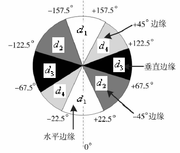
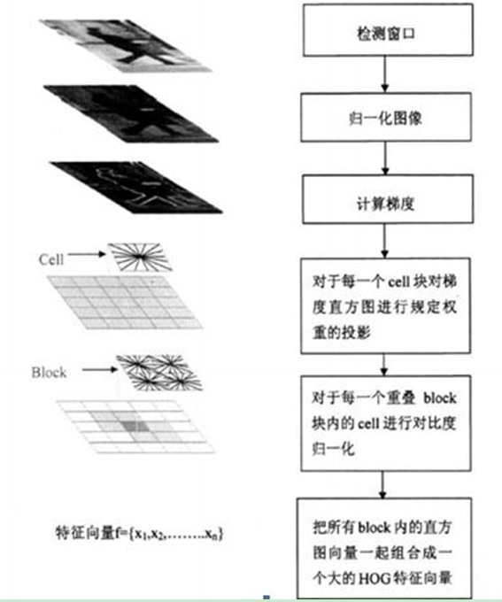
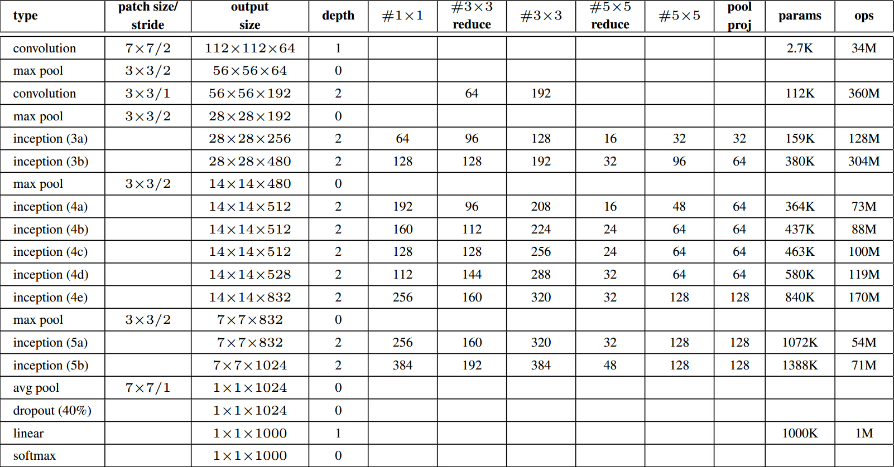
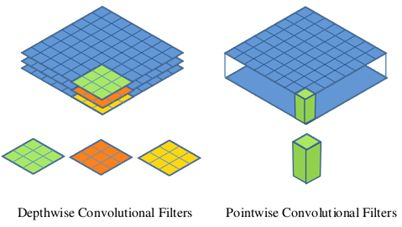

[toc]

[main page](../../entry.md)

# 数据集

* [cifar-10](https://www.cs.toronto.edu/~kriz/cifar.html): 10 classes with 60000 images
* [caltech](http://www.vision.caltech.edu/Image_Datasets/CaltechPedestrians/): Caltech Pedestrian Detection Benchmark, 10 hours of 640x480 video
* [coco](http://cocodataset.org/#overview): microsoft, object detection, 20G images

# 传统图像处理

## 基本概念

### 对比度与亮度

* 对比度与亮度定义
    * 图像亮度本质上图像中每个像素的亮度，每个像素的亮度本质上RGB值的大小，RGB值为0是像素点为黑色，RGB都为255时像素点最亮，为白色。对比度则是不同像素点之间的差值，差值越大，对比度越明显。从直方图分析的观点来看，对比度越好的图片，直方图曲线会越明显，分布也越显得均匀。
* 调整方式
    $$
    V_{r/g/b} = contrast*(V_{r/g/b} - \bar{V}_{r/g/b}) + brightness*\bar{V}_{r/g/b}
    $$
* 调整经验值
    * 对比度 contrast的最佳取值范围在[0~4]
    * 亮度 brightness的最佳取值范围在[0~2]

### gamma

* gamma校正
    * 什么是gamma： 物理显示设备上luminance的生成，通常和它输入的信号不成正比的，存在非线性的关系。这个输入信号,电压的幂定律( power-law)响应的数值，就被称为gamma
    * 为什么要gamma：**gamma 校正是指更改 gamma 值以匹配监视器的中间灰度**；Gamma 校正补偿了不同输出设备存在的颜色显示差异，从而使图像在不同的监视器上呈现出相同的效果。gamma 值为 1，对应一个“理想”监视器；也就是说，这个监视器具有从完美的白色通过灰色到黑色的连续线性渐变效果。然而，理想的显示设备是不存在的。电脑监视器是“非线性”的设备。gamma 值越高，非线性程度越大。NTSC 视频的标准 gamma 值为 2.2。对于电脑监视器，gamma 值一般在 1.5 到 2.0 之间。
    * 下图中横轴为灰度值，纵轴为亮度值
    

## 基本操作

### 二值化

* 大律法（OSTU）
    * 原理：最大类间方差，将图像分为前景和背景
    * 缺点：对噪音敏感，且仅对类间方差为单峰的图像产生较好的分割效果
    * 公式描述，$u$为图像平均值，$u_0$为背景平均值，$w_0$为背景占比，$u_1$为前景平均值，$w_1$为前景占比，$g(t)$为目标函数。
        $$
        \begin{aligned}
        u &= w_0*u_0 + w_1*u_1 \\
        min\ g(t) &=w_0*(u_0-u)^2+w_1*(u_1-u)^2=w_0*w_1*(u_0-u_1)^2
        \end{aligned}
        $$
    * 计算流程：
        1. 直方图
        2. 对0~255，逐个分析当前的$g(t)$是否最大，否则就更新
* 迭代二值化法

    * 原理：预设阈值，求取两平均值的中值，设为下一阈值，迭代至相等。和非监督的k-means方法的原理类似。
    * 计算流程：
        1. 求出图象的最大灰度值和最小灰度值，分别记为$g_l$和$g_u$，令初始阈值为：
            $$
                T^0=\frac{g_l+g_u}{2}
            $$
        2. 根据阈值$T^0$将图象分割为前景和背景，分别求出两者的平均灰度值$A_b$和$A_f$
        3. 计算$T_k$直至收敛
            $$
                T^k=\frac{A_b+A_f}{2}
            $$
    * 参考: [十三种基于直方图的图像全局二值化算法原理、实现、代码及效果](https://www.cnblogs.com/Imageshop/p/3307308.html)

### 归一化

* normalization
    * 作用类似于对比度拉伸(contrast stretching)或直方图拉伸(histogram stretching)，对数据范围进行变换
    $$
    I_N=(I-Min)\frac{newMax-newMin}{max-min}+newMin
    $$

### 腐蚀与膨胀

* 膨胀与腐蚀
    * 膨胀：卷积求取局部最大值
    * 腐蚀：卷积求取局部最小值
    * 效果
        * 原图  
            
        * 膨胀  
            
        * 腐蚀  
            

### 分割

* 分水岭法（watershed）
    * 分水岭算法的思想来源于地形学
    * 描述分水岭变换有两种方法：一种是“雨滴法”，另一种方法是模拟“溢流”的过程
    * 参考： [opencv-watershed](http://docs.opencv.org/3.1.0/d3/db4/tutorial_py_watershed.html)
* 图割法（graph-cut）

### 旋转

* 图像旋转
    * 前向映射
        * 过程：将点移动至图像中心，再旋转，再移动回去
        * 公式：目标点$T$，原始点$S$，旋转角度顺时针$\theta$
        $$
            \begin{bmatrix} T_x & T_y & 1 \\ \end{bmatrix}  = \begin{bmatrix} S_x & S_y & 1 \\ \end{bmatrix}
            \begin{bmatrix} 1 & 0 & 0 \\ 0 & -1 & 0 \\ -0.5W & 0.5H & 1 \\ \end{bmatrix} 
            \begin{bmatrix} cos\theta & -sin\theta & 0 \\ sin\theta & cos\theta & 0 \\ 0 & 0 & 1 \\ \end{bmatrix}
            \begin{bmatrix} 1 & 0 & 0 \\ 0 & -1 & 0 \\ 0.5W & 0.5H & 1 \\ \end{bmatrix} 
        $$
        * 旋转后图像宽高
        $$
            \begin{aligned}
            m_{new} = |m*cos\theta|+|n*sin\theta| \\
            n_{new} = |n*cos\theta|+|m*sin\theta|
            \end{aligned}
        $$
        * 缺点：目标图像中的部分点没有对应到原图像的点上，形成间隙  

          
    * 反向映射
        * 过程：从旋转后的图像出发，找到对应的原图像的点
        * 实现方式：前向映射的公式反向变换即可
        * 优势：目标图像没有间隙  

         
    * 参考：[图像旋转原理及实现](https://blog.csdn.net/lkj345/article/details/50555870)

### 滤波

* 中值滤波
    * 原理：非线性平滑，将每一象素点的灰度值设置为该点某邻域窗口内的所有象素点灰度值的中值
    * 作用：对消除椒盐噪音非常有效
* 高斯滤波
    * 作用：信号的平滑处理
    * 计算：由于高斯滤波器的卷积核参数是线性相关的（二维标准正态分布x,y方向独立的），因此2D高斯卷积核$K$可以被拆分为$K=uu^T$，从而加速计算。

### 其他

* 直方图均衡化
    * 作用：直方图均衡化的作用是图像增强

## 梯度与边缘检测

* sobel算子
    * 定义
        * 水平方向
            $$
            G_x = 
                \begin{bmatrix}
                -1 & 0 & 1 \\
                -2 & 0 & 2 \\
                -1 & 0 & 1 \\
                \end{bmatrix}
            $$
        * 垂直方向
            $$
            G_y = 
                \begin{bmatrix}
                -1 & -2 & -1 \\
                0 & 0 & 0 \\
                1 & 2 & 1 \\
                \end{bmatrix}
            $$
        * 边缘图像
            $$
            G = \sqrt{{G_x}^2+{G_y}^2}
            $$
    * 用途：边缘检测
    * 优点：方法简单、处理速度快,并且所得的边缘光滑、连续
    * 缺陷：边缘较粗,由于处理时需作两值化处理,故得到的边缘与阈值的选取也有很大的关系
* prewitt算子
* canny算子

    * 是对sobel算子的改进，改进方面：
        * 基于边缘梯度方向的非极大值抑制。
        * 双阈值的滞后阈值处理。
    * 优势：低错误率，边缘点被很好的定位
    * 计算流程
        1. 高斯平滑
        2. 使用sobel算子计算梯度幅度和方向
        3. 根据角度对幅值进行非极大值抑制

               
            * **边缘可以划分为垂直、水平、45°、135°4个方向**
            * 非极大值抑制即为沿着上述4种类型的梯度方向，比较3*3邻域内对应邻域值的大小：
            * 在每一点上，领域中心 x 与沿着其对应的梯度方向的两个像素相比，**若中心像素为最大值，则保留，否则中心置0，这样可以抑制非极大值**，保留局部梯度最大的点，以得到细化的边缘
            * 注意，最终只输出一幅图像数据N［i,j］，并用其来生成不同阈值下的N1［i,j］和N2［i,j］
        4. 用双阈值算法检测和连接边缘 
            * 高阈值得到的边缘信息准确但容易断裂，低阈值得到的边缘信息重复单不容易断裂，因此用低阈值数据将高阈值数据的边缘进行缝合
            * 双阈值算法对非极大值抑制图象作用两个阈值τ1和τ2，且2τ1≈τ2，从而可以得到两个阈值边缘图象N1［i,j］和N2［i，j］。由于N2［i，j］使用高阈值得到，因而含有很少的假边缘，但有间断(不闭合)。双阈值法要在N2［i，j］中把边缘连接成轮廓，当到达轮廓的端点时，该算法就在N1［i,j］的8邻点位置寻找可以连接到轮廓上的边缘，这样，算法不断地在N1［i,j］中收集边缘，直到将N2［i,j］连接起来为止。
     * 参考：[Canny算子边缘检测原理及实现](https://blog.csdn.net/weixin_40647819/article/details/91411424)
* 综合
    * 一般方法：使用小波变换wavelet增强图像,然后使用[迭代二值化](#iterate-binarization)/[canny算子](#canny)进行图像分割

## 角点与特征

* 图像特征发展史
    * sift(feature descriptor) -> bins/grids -> hog(object template) -> Deep Learning
    * [From feature descriptors to deep learning: 20 years of computer vision](http://www.computervisionblog.com/2015/01/from-feature-descriptors-to-deep.html)
* sift角点（特征）
    * 名称：尺度不变特征转换(Scale-invariant feature transform或SIFT)
    * 解释：在不同的尺度空间上查找关键点(特征点)，并计算出关键点的方向
    * 优点：SIFT所查找到的关键点是一些十分突出，不会因光照，仿射变换和噪音等因素而变化的点，如角点、边缘点、暗区的亮点及亮区的暗点等。
    * 缺点：计算慢，实时性不高；有时特征点较少；对边缘光滑的目标无法准确提取特征点。
    * 应用： 物体辨识、机器人地图感知与导航、影像缝合、3D模型建立、手势辨识、影像追踪和动作比对
* hog特征
    * 名称：Histogram of Oriented Gradient
    * 理论：在一副图像中，局部目标的表象和形状（appearance and shape）能够被梯度或边缘的方向密度分布很好地描述。
    * 优势：由于HOG是在图像的局部方格单元上操作，所以它对图像几何的和光学的形变都能保持很好的不变性；在粗的空域抽样、精细的方向抽样以及较强的局部光学归一化等条件下，只要行人大体上能够保持直立的姿势，可以容许行人有一些细微的肢体动作，这些细微的动作可以被忽略而不影响检测效果。因此HOG特征是特别适合于**做图像中的人体检测**。
    * 流程：
        1. 灰度化（二值化）
        2. 归一化（normalization）
        3. 计算图像每个像素的梯度（包括大小和方向）
        4. 将图像划分成小cells（例如6*6像素/cell）
        5. 统计每个cell的梯度直方图（不同梯度的个数）
        6. 将每几个cell组成一个block（例如3*3个cell/block），一个block内所有cell的特征descriptor串联起来便得到该block的HOG特征descriptor
        7. 将图像image内的所有block的HOG特征descriptor串联起来就可以得到该image（你要检测的目标）的HOG特征descriptor了。这个就是最终的可供分类使用的特征向量了

     

    * 图形化理解hog特征

     
     

    * 应用：配合SVM分类器，可以实现行人检测等功能，比如:
        * [Histograms of Oriented Gradients for Human Detection](https://lear.inrialpes.fr/people/triggs/pubs/Dalal-cvpr05.pdf)
        * [Implementation of Robust HOG-SVM based Pedestrian Classification](https://pdfs.semanticscholar.org/a996/42470504acae74488c0db9cccac663b736fc.pdf)
        * [opencv源码解析之(6)：hog源码分析](https://www.cnblogs.com/tornadomeet/archive/2012/08/15/2640754.html)

## 图像变换

### 小波变换

* 处理非平稳过程下的频域分析
* 从FFT到WAVELET的演进过程（处理非平稳过程，或者说对随时间变化的信号的表达）：
    * 傅里叶变换处理非平稳信号有天生缺陷。它只能获取一段信号总体上包含哪些频率的成分，但是对各成分出现的时刻并无所知。
    * STFT(Short-time Fourier Transform, STFT)，对时域加窗。但问题是，窗太窄，频率分辨率不够；窗太宽，时域分辨率不够，而且STFT做不到正交化
    * 将无限长的三角函数基换成了有限长的会衰减的小波基，不仅可以知道信号有这样频率的成分，而且知道它在时域上存在的具体位置。
* 定义
    $$
        WT(a,\tau)=\frac{1}{\sqrt{a}}\int^\infty_{-\infty}f(t)*\psi(\frac{t-\tau}{a})dt
    $$
    * 尺度a控制小波函数的伸缩，平移量 τ控制小波函数的平移。尺度就对应于频率（反比），平移量 τ就对应于时间。
* 直观理解
    
    
    * 小波变换的输出为三维，translation对应于平移，scale对应于尺度
    
    
* 其他优势
    * 对于阶跃响应等突变信号，小波变换拟合起来更加方便
* 应用
    * 图像压缩
    * 图像增强
    * 图像模糊
* 参考：[如何通俗地讲解傅立叶分析和小波分析间的关系？](https://www.zhihu.com/question/22864189)

## 其他

### 背景建模

* 高斯背景建模
    * 单高斯背景模型（Single Gaussian Background Model）的基本思想是：将图像中每一个像素点的颜色值看成是一个随机过程X，并假设该点的某一像素值出现的概率服从高斯分布。令$I(x,y,t)$表示像素点$(x,y,t)$在$t$时刻的像素值。其中$u_t$,$\sigma_t$分别为$t$时刻该像素高斯分布的期望值和标准差
    $$
        P(I(p_x,p_y,t))=\eta(x,u_t,\sigma_t)=\frac{1}{\sqrt{2\pi}\sigma_t}e^{\frac{(x-u_t)^2}{2{\sigma_t}^2}}
    $$
    * 计算过程
        * 初始化，通常设置std为20
            $$
                \begin{aligned}
                u_0&=I(x,y,0) \\
                \sigma_0&=std
                \end{aligned}
            $$
        * 判断，在正态分布的范围内，则为背景
            $$
                |I(p_x,p_y,t)-u_{t-1}(x,y)|<\lambda
            $$
        * 更新
            $$
                \begin{aligned}
                u_t(x,y)&=(1-\alpha)u_{t-1}(x,y)+\alpha{I(x,y,t)} \\
                {\sigma_t}^2(x,y)&=(1-\alpha){\sigma_{t-1}}^2(x,y)+\alpha{(I(p_x,p_y,t)-u_t(x,y)^2))}
                \end{aligned}
            $$
    * 该算法与[K-means](./TODO)和[EM算法](./TODO)类似，均有E-step和M-step
    * 参考:[背景建模算法](https://blog.51cto.com/underthehood/484191)

# 深度学习

## 基础概念

* 经典教材
    * CS course in stanford
        * [CS231n: Convolutional Neural Networks for Visual Recognition](http://cs231n.stanford.edu/syllabus.html)
        * [CS230: Deep Learning](http://cs230.stanford.edu/syllabus/)
    * Neural Networks and Deep Learning
        * [Neural Networks and Deep Learning](http://neuralnetworksanddeeplearning.com/)
        * [神经网络与深度学习](https://tigerneil.gitbooks.io/neural-networks-and-deep-learning-zh/content/index.html)
* 经典概念
    * 指标
        * True/False: 判断正确/错误
        * Positive/Negative: 正样本/负样本

        ||POSITIVE|NEGATIVE|
        |---|---|---|
        |TRUE|TP 被模型预测为正的正样本|TN 被模型预测为负的负样本|
        |FALSE|FP 被模型预测为正的负样本|FN 被模型预测为负的正样本|

        * precesion = TP/(TP+FP)
        * recall = TP/(TP+FN)

    * weight decay(权值衰减)
        * 定义：weight decay is an additional term in the weight update rule that causes the weights to exponentially decay to zero, if no other update is scheduled.
        * 意义：类似于高斯先验，正则化损失函数，防止过拟合，weight decay就是$\eta\lambda{w_i}$这部分
        $$
            \begin{aligned}
            \tilde{E}(w)&=E(w)+\frac{\lambda}{2}w^2 \\
            w_i &\leftarrow w_i - \eta\frac{\partial{E}}{\partial{w_i}}-\eta\lambda{w_i}
            \end{aligned}
        $$
        * 参考：[Difference between neural net weight decay and learning rate](https://stats.stackexchange.com/questions/29130/difference-between-neural-net-weight-decay-and-learning-rate)
    * batch size
        * in training phase, batch size defines number of samples that going to be propagated through the network.
        * mini-batch & single-batch(stochastic) & all-batch difference
            * pros and cons of mini-batch
            * pros: requires less memory & trains faster with mini-batches
            * cons: fluctuates in training(less accurate estimate of the gradient)
            * refer: [What is batch size in neural network?](https://stats.stackexchange.com/questions/153531/what-is-batch-size-in-neural-network
    * weight init(weight filler，权值初始化)
        * xavier(uniform data in a range)
        * gaussian
    * dropout
        * 目的：解决全连接层过拟合问题
        * 机制：Forward的时候都要随机的断开$\sigma$比例的连接, 只更新剩下的weight；predict的时候, 使用全部的连接, 但weights全部都需要乘上$1-\sigma$系数。可以看出该机制类似于bagging
        * 来源：hinton [Improving neural networks by preventing co-adaptation of feature detectors](https://arxiv.org/pdf/1207.0580.pdf)
    * image mean
        * 目的：
            * 归一化(和image scale一起)，便于后续网络保持数据归一化，便于提取特征；
            * Subtracting the dataset mean serves to "center" the data
        * 参考：[Why normalize images by subtracting dataset's image mean](https://stats.stackexchange.com/questions/211436/why-normalize-images-by-subtracting-datasets-image-mean-instead-of-the-current)
    * img2col
        
        
    * gradient vanishing(梯度消失)
        * If a change in the parameter's value causes very small change in the network's output - the network just can't learn the parameter effectively. The gradients of the network's output with respect to the parameters in the early layers become extremely small. That's a fancy way of saying that even a large change in the value of parameters for the early layers doesn't have a big effect on the output.
    * batch normalization
        * 目的：解决在训练过程中，中间层数据分布发生改变的情况
        * 来源：[Batch Normalization: Accelerating Deep Network Training by Reducing Internal Covariate Shift](https://arxiv.org/abs/1502.03167)
        * 作用：
            * 改善流经网络的梯度；
            * 允许更大的学习率，大幅提高训练速度；
            * 减少对初始化的强烈依赖
            * 改善正则化策略，作为正则化的一种形式，减少对drop out、L2正则项参数的依赖
        * 定义：做一个归一化处理（归一化至：均值0、方差为1），然后再进入网络的下一层
        * 其他：BN层训练完毕参数确定后，可在推理时直接吸收至卷积参数中
        * 参考：[深度学习中 Batch Normalization为什么效果好？](https://www.zhihu.com/question/38102762)

## 检测网络

### 指标与基本概念

* AP(Average Precision)
    * 相比较与曲线图，在某些时候还是一个具体的数值能更直观地表现出模型的性能
    $$
        ap = \int^1_0p(r)dr
    $$
* IoU(intersection-over-union)
    * 模型产生的目标窗口和原来标记窗口的交叠率
    $$
        IoU = \frac{DetectionResult\cap{GroudTruth}}{DetectionResult\cup{GroudTruth}}
    $$
* NMS(Non-Maximum Suppression)
    * 根据score矩阵和region的坐标信息，从中找到置信度比较高的bounding box。首先，NMS计算出每一个bounding box的面积，然后根据score进行排序，**把score最大的bounding box作为队列中**。接下来，**计算其余bounding box与当前最大score与box的IoU，去除IoU大于设定的阈值的bounding box**。然后重复上面的过程，直至候选bounding box为空。最终，检测了bounding box的过程中有两个阈值，一个就是IoU，另一个是在过程之后，从候选的bounding box中剔除score小于阈值的bounding box。

### 典型网络模型

* RCNN 2014
    * [Rich feature hierarchies for accurate object detection and semantic segmentation](https://arxiv.org/abs/1311.2524)
    * key feature
        * 将CNN结构应用到提取出来的区域
        * 针对标记数据很少的问题，利用辅助训练集如ImageNet的预训练再进行fine-tuning
        * 检测方式：Selective Search提取候选区域
        * 分类方式：使用特定的SVM分类器对第二步的特征向量进行分类
* fast RCNN 2015
    * [Fast R-CNN](https://arxiv.org/abs/1504.08083)
* faster RCNN 2015
    * [Faster R-CNN: Towards Real-Time Object Detection with Region Proposal Networks](https://arxiv.org/abs/1506.01497)
    * key feature
        * 使用一组基础的conv+relu+pooling层提取image的feature maps
        * Roi Pooling。该层收集输入的feature maps和proposals，综合这些信息后提取proposal feature maps，送入后续全连接层判定目标类别。
        * 检测方式：Region Proposal Networks。RPN网络用于生成region proposals。该层通过softmax判断anchors属于foreground或者background，再利用bounding box regression修正anchors获得精确的proposals。
        * 分类方式：利用proposal feature maps计算proposal的类别，同时再次bounding box regression获得检测框最终的精确位置(该部分将学习到平移和缩放参数)。
        * structure

        

        * 参考：[Faster RCNN详解](http://blog.csdn.net/zy1034092330/article/details/62044941)
* Yolov2 2016
    * [YOLO9000: Better, Faster, Stronger](https://arxiv.org/abs/1612.08242)
    * key feature
        * batch normalization
        * High Resolution Classifier。预训练分类网络的分辨率为448*448。然后fine tune为检测网络。（原来都是基于224x224大小分辨率作为模型输入）
        * Convolutional With Anchor Boxes。YOLO(v1)使用全连接层数据进行bounding box预测，这会丢失较多的空间信息定位不准。卷积特征图上进行滑窗采样，每个中心预测9种不同大小和比例的建议框。用预测相对偏移（offset）取代直接预测坐标简化了问题。
        * 基础框架：Darknet-19

## 分类网络

### 指标与基本概念

* ROC(receiver operating characteristic curve)
    * 横轴FPR（False Positive Rate，负样本判断错误概率）
    * 纵轴TPR（True Positive Rate，正样本判断正确概率）
    * ROC曲线的横坐标和纵坐标其实是没有相关性的，所以不能把ROC曲线当做一个函数曲线来分析，应该把ROC曲线看成无数个点，每个点都代表一个分类器
    

### 典型网络模型
* AlexNet 2012
    * key feature
        * dropout
        * data augmentation(flip, randomly crop, color jittering)
        * lrn(local response normalization) for inhibit saturate
        * pooling for inhibit overfit and ReLU for inhibit saturate
    * [structure](https://github.com/BVLC/caffe/blob/master/models/bvlc_reference_caffenet/deploy.prototxt)
* GoogleNet 2014
    * key feature
        * inception
        
        
    * structure
        
        
* VGG 2014
    * [Very Deep Convolutional Networks for Large-Scale Image Recognition](https://arxiv.org/abs/1409.1556)
    * key feature
        * 连续conv多，计算量巨大
    * structure
        
        
* resnet 2015
    * key feature
        * bottleneck结构
    * structure
        
        
* computation size(MAC) and parameter size
    * 参考：[模型参数与计算量](https://hey-yahei.cn/2019/01/07/MXNet-OpSummary/index.html)

| Model                | Params(M) | Muls(GMAC) | Params(M) | Muls(G) | Top1 Acc | Top5 Acc |
|----------------------|-------------|-----------|---------------|-------------|----------|----------|
| AlexNet              | 61\.1       | 0\.71     | 2\.47         | 0\.66       | 0\.5492  | 0\.7803  |
| VGG11                | 132\.86     | 7\.61     | 9\.22         | 7\.49       | 0\.6662  | 0\.8734  |
| VGG13                | 133\.04     | 11\.3     | 9\.4          | 11\.18      | 0\.6774  | 0\.8811  |
| VGG16                | 138\.63     | 15\.47    | 14\.71        | 15\.35      | 0\.7323  | 0\.9132  |
| VGG19                | 143\.67     | 19\.63    | 20\.02        | 19\.51      | 0\.7411  | 0\.9135  |
| VGG11\_bn            | 132\.87     | 7\.62     | 9\.23         | 7\.49       | 0\.6859  | 0\.8872  |
| VGG13\_bn            | 133\.06     | 11\.32    | 9\.42         | 11\.2       | 0\.6884  | 0\.8882  |
| VGG16\_bn            | 138\.37     | 15\.48    | 14\.73        | 15\.36      | 0\.731   | 0\.9176  |
| VGG19\_bn            | 143\.69     | 19\.65    | 20\.05        | 19\.52      | 0\.7433  | 0\.9185  |
| Inception\_v3        | 23\.87      | 5\.72     | 21\.82        | 5\.72       | 0\.7755  | 0\.9364  |
| ResNet18\_v1         | 11\.7       | 1\.82     | 11\.19        | 1\.82       | 0\.7093  | 0\.8992  |
| ResNet34\_v1         | 21\.81      | 3\.67     | 21\.3         | 3\.67       | 0\.7437  | 0\.9187  |
| ResNet50\_v1         | 25\.63      | 3\.87     | 23\.58        | 3\.87       | 0\.7647  | 0\.9313  |
| ResNet101\_v1        | 44\.7       | 7\.59     | 42\.65        | 7\.58       | 0\.7834  | 0\.9401  |
| ResNet152\_v1        | 60\.4       | 11\.3     | 58\.36        | 11\.3       | 0\.79    | 0\.9438  |
| ResNet18\_v2         | 11\.7       | 1\.82     | 11\.18        | 1\.82       | 0\.71    | 0\.8992  |
| ResNet34\_v2         | 21\.81      | 3\.67     | 21\.3         | 3\.67       | 0\.744   | 0\.9208  |
| ResNet50\_v2         | 25\.6       | 4\.1      | 23\.55        | 4\.1        | 0\.7711  | 0\.9343  |
| ResNet101\_v2        | 44\.64      | 7\.82     | 42\.59        | 7\.81       | 0\.7853  | 0\.9417  |
| ResNet152\_v2        | 60\.33      | 11\.54    | 58\.28        | 11\.53      | 0\.7921  | 0\.9431  |
| DenseNet121          | 8\.06       | 2\.85     | 7\.04         | 2\.85       | 0\.7497  | 0\.9225  |
| DenseNet161          | 28\.9       | 7\.76     | 26\.69        | 7\.76       | 0\.777   | 0\.938   |
| DenseNet169          | 14\.31      | 3\.38     | 12\.64        | 3\.38       | 0\.7617  | 0\.9317  |
| DenseNet201          | 20\.24      | 4\.32     | 18\.32        | 4\.31       | 0\.7732  | 0\.9362  |
| MobileNet\_v1\_1\.00 | 4\.25       | 0\.57     | 3\.23         | 0\.57       | 0\.7105  | 0\.9006  |
| MobileNet\_v1\_0\.75 | 2\.6        | 0\.33     | 1\.83         | 0\.33       | 0\.6738  | 0\.8782  |
| MobileNet\_v1\_0\.50 | 1\.34       | 0\.15     | 0\.83         | 0\.15       | 0\.6307  | 0\.8475  |
| MobileNet\_v1\_0\.25 | 0\.48       | 0\.04     | 0\.22         | 0\.04       | 0\.5185  | 0\.7608  |
| MobileNet\_v2\_1\.00 | 3\.54       | 0\.32     | 2\.26         | 0\.32       | 0\.7192  | 0\.9056  |
| MobileNet\_v2\_0\.75 | 2\.65       | 0\.19     | 1\.37         | 0\.19       | 0\.6961  | 0\.8895  |
| MobileNet\_v2\_0\.50 | 1\.98       | 0\.1      | 0\.7          | 0\.09       | 0\.6449  | 0\.8547  |
| MobileNet\_v2\_0\.25 | 1\.53       | 0\.03     | 0\.25         | 0\.03       | 0\.5074  | 0\.7456  |
| SqueezeNet1\_0       | 1\.25       | 0\.82     | 0\.74         | 0\.73       | 0\.5611  | 0\.7909  |
| SqueezeNet1\_1       | 1\.24       | 0\.35     | 0\.72         | 0\.26       | 0\.5496  | 0\.7817  |

## 分割网络

* FCN 2014
    * [Fully Convolutional Networks for Semantic Segmentation](https://arxiv.org/abs/1411.4038)
    * key feature
        * upsampling back and fusion with previous layer
    * structure
        * [prototxt](https://github.com/shelhamer/fcn.berkeleyvision.org/blob/master/voc-fcn8s/deploy.prototxt)

    
    * drawback
        * 得到的结果还是不够精细。进行8倍上采样虽然比32倍的效果好了很多，但是上采样的结果还是比较模糊和平滑，对图像中的细节不敏感。
        * 对各个像素进行分类，没有充分考虑像素与像素之间的关系。忽略了在通常的基于像素分类的分割方法中使用的空间规整（spatial regularization）步骤，缺乏空间一致性。
* SegNet 2015
    * [SegNet: A Deep Convolutional Encoder-Decoder Architecture for Image Segmentation](https://arxiv.org/pdf/1511.00561.pdf)
    * key feature
        * pooling index & Unpooling
        * encoder network：vgg16 （remove fc，大大减少了参数，从134M减少到14.7M）
        * decoder：每个decoder对应一个encoder
        * 实时性更好
    * structure
        * [prototxt](https://github.com/alexgkendall/SegNet-Tutorial/blob/master/Models/segnet_inference.prototxt)
    

## 轻量级网络

* 轻量级网络中常见的结构
    * fire module & depthwise conv & pointwise conv & group conv & shuffle
    * 参考：
        * [变形卷积核、可分离卷积？卷积神经网络中十大拍案叫绝的操作](https://zhuanlan.zhihu.com/p/28749411)
        * [CNN 模型压缩与加速算法综述](https://cloud.tencent.com/developer/article/1005738)
* SqueezeNet 2016
    * [SqueezeNet: AlexNet-level accuracy with 50x fewer parameters and <0.5MB model size](https://arxiv.org/abs/1602.07360)
    * key feature
        * fire module。一个fire module 包含一个squeeze 卷积层（只包含1x1卷积核）和一个expand卷积层（包含1x1和3x3卷积核）。其中，squeeze层借鉴了inception的思想，利用1x1卷积核来降低输入到expand层中3x3卷积核的输入通道数。
    * structure
        * [prototxt](https://github.com/forresti/SqueezeNet/blob/master/SqueezeNet_v1.1/deploy.prototxt)

        
* MobileNet 2017
    * [MobileNets: Efficient Convolutional Neural Networks for Mobile Vision Applications](https://arxiv.org/abs/1704.04861)
    * key feature
        * 放弃pooling直接采用stride = 2进行卷积运算
        * depthwise separable convolutions
    * structure
        * [prototxt](https://github.com/shicai/MobileNet-Caffe/blob/master/mobilenet_deploy.prototxt)

        
        
* ShuffleNet 2017
    * [ShuffleNet: An Extremely Efficient Convolutional Neural Network for Mobile Devices](https://arxiv.org/abs/1707.01083)
    * key feature
        * group conv + channel shuffle。ShuffleNet在每一次层叠这种Group conv层前，都进行一次channel shuffle，shuffle过的通道被分配到不同组当中。进行完一次group conv之后，再一次channel shuffle，然后分到下一层组卷积当中，以此循环。
    * structure
        * [prototxt](https://github.com/farmingyard/ShuffleNet/blob/master/shufflenet_1x_g3_deploy.prototxt)

        
