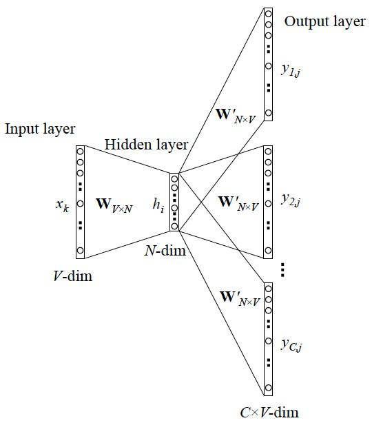

[toc]

[main page](../../entry.md)

# 基础

## 常见的NLP任务及对应数据集
|name|full name|type|subtype|comment|
|---|---|---|---|---|
|SQuAD|Standford Question Answering Dataset|token-level task||样本为语句对. 给出一个问题, 和一段来自于Wikipedia的文本, 其中这段文本之中, 包含这个问题的答案, 返回一短语句作为答案.|
|NER|Named Entity Recognition|token-level task||对句子中的每个token打标签, 判断每个token的类别.|
|MNLI|Multi-Genre Natural Language Inference|sequence-level task|Natural Language Inference|GLUE Datasets 推断两个句子是意思相近, 矛盾, 还是无关的.|
|QQP|Quora Question Pairs|sequence-level task|Sentence Pair Classification|判断两个来自于Quora的问题句子在语义上是否是等价的|
|QNLI|Question Natural Language Inference|sequence-level task|Sentence Pair Classification|二分类问题, 两个句子是一个(question, answer)对. 正样本为answer是对应question的答案, 负样本则相反.|
|STS-B|Semantic Textual Similarity Benchmark|sequence-level task|Sentence Pair Classification|类似回归的问题. 给出一对句子, 使用1~5的评分评价两者在语义上的相似程度.|
|MRPC|Microsoft Research Paraphrase Corpus|sequence-level task|Sentence Pair Classification|句子对来源于对同一条新闻的评论. 判断这一对句子在语义上是否相同.|
|RTE|Recognizing Textual Entailment|sequence-level task|Sentence Pair Classification|二分类问题, 类似于MNLI, 但是数据量少很多|
|SST-2|Stanford Sentiment Treebank|sequence-level task|Single Sentence Classification|单句的二分类问题, 句子的来源于人们对一部电影的评价, 判断这个句子的情感.|
|CoLA|Corpus of Linguistic Acceptability|sequence-level task|Single Sentence Classification|单句的二分类问题, 判断一个英文句子在语法上是不是可接受的.|
|SWAG|Situations With Adversarial Generations|sequence-level task||给出一个陈述句子和4个备选句子, 判断前者与后者中的哪一个最有逻辑的连续性, 相当于阅读理解问题.|

* [自然语言处理全家福：纵览当前NLP中的任务、数据、模型与论文](https://zhuanlan.zhihu.com/p/38445982)  
* [Tracking Progress in Natural Language Processing](https://github.com/sebastianruder/NLP-progress)  

## 常见的NLP数据增强方法
1. 同义词替换（SR: Synonyms Replace）：不考虑stopwords，在句子中随机抽取n个词，然后从同义词词典中随机抽取同义词，并进行替换。  
2. 随机插入(RI: Randomly Insert)：不考虑stopwords，随机抽取一个词，然后在该词的同义词集合中随机选择一个，插入原句子中的随机位置。该过程可以重复n次。  
3. 随机交换(RS: Randomly Swap)：句子中，随机选择两个词，位置交换。该过程可以重复n次。  
4. 随机删除(RD: Randomly Delete)：句子中的每个词，以概率p随机删除。

参考  
* [NLP中一些简单的数据增强技术](https://zhuanlan.zhihu.com/p/63182132)  

## 常见的NLP数据清洗方法
1. 缩略词更改  
2. 拼写校正  
3. 标点符号  
4. 符号替换  
5. 去除空格  

# 网络结构

## RNN

* 序列问题
    * 输入为序列x1...xn，输出为序列y1...yn
    * 自然语言处理问题。x1可以看做是第一个单词，x2可以看做是第二个单词，依次类推。
    * 语音处理。此时，x1、x2、x3……是每帧的声音信号。
    * 时间序列问题。例如每天的股票价格等等。
* RNN(1986, David Rumelhart)
    * 基本概念
        * t时刻隐变量：$h^{(t)}=\phi(Ux^{(t)}+Wh^{(t-1)}+b)$
            * 其中$\phi()$为激活函数，一般会选择tanh函数，b为偏置。
        * t时刻输出：$o^{(t)}=Vh^{(t)}+c$
        * 模型的预测输出为：$\widehat{y}^{(t)}=\sigma(o^{(t)})$
            * 其中σ​为激活函数，通常RNN用于分类，故这里一般用softmax函数。
    * 详解
        * seq2seq模式
            * sequence-to-sequence结构的RNN要求序列等长

        

        * vec2seq模式

        

        * seq2vec模式

        

        * encoder-decoder structure(seqN-to-seqM)可变长
            * 大部分问题序列都是不等长的，如机器翻译中，源语言和目标语言的句子往往并没有相同的长度。
            * step 1：将输入数据编码成一个上下文向量c，这部分称为Encoder，得到c有多种方式，最简单的方法就是把Encoder的最后一个隐状态赋值给c，还可以对最后的隐状态做一个变换得到c，也可以对所有的隐状态做变换。
            * ​ step 2：用另一个RNN网络（我们将其称为Decoder）对其进行编码，(A)是将步骤一中的c​作为初始状态输入到Decoder

            

            * step 2: (B)将c作为Decoder的每一步输入

            

    * 训练过程
        *  W和U的偏导的求解由于需要涉及到历史数据，其偏导求起来相对复杂。为了简化推导过程，我们假设只有三个时刻，那么在第三个时刻 L对W，L对U的偏导数分别为：
        * $\frac{\partial L^{(3)}}{\partial W}=\frac{\partial L^{(3)}}{\partial o^{(3)}}\frac{\partial o^{(3)}}{\partial h^{(3)}}\frac{\partial h^{(3)}}{\partial W}+\frac{\partial L^{(3)}}{\partial o^{(3)}}\frac{\partial o^{(3)}}{\partial h^{(3)}}\frac{\partial h^{(3)}}{\partial h^{(2)}}\frac{\partial h^{(2)}}{\partial W}+\frac{\partial L^{(3)}}{\partial o^{(3)}}\frac{\partial o^{(3)}}{\partial h^{(3)}}\frac{\partial h^{(3)}}{\partial h^{(2)}}\frac{\partial h^{(2)}}{\partial h^{(1)}}\frac{\partial h^{(1)}}{\partial W}$
        * $\frac{\partial L^{(3)}}{\partial U}=\frac{\partial L^{(3)}}{\partial o^{(3)}}\frac{\partial o^{(3)}}{\partial h^{(3)}}\frac{\partial h^{(3)}}{\partial U}+\frac{\partial L^{(3)}}{\partial o^{(3)}}\frac{\partial o^{(3)}}{\partial h^{(3)}}\frac{\partial h^{(3)}}{\partial h^{(2)}}\frac{\partial h^{(2)}}{\partial U}+\frac{\partial L^{(3)}}{\partial o^{(3)}}\frac{\partial o^{(3)}}{\partial h^{(3)}}\frac{\partial h^{(3)}}{\partial h^{(2)}}\frac{\partial h^{(2)}}{\partial h^{(1)}}\frac{\partial h^{(1)}}{\partial U}$
        * 可以观察到，在某个时刻的对W或是U的偏导数，需要追溯这个时刻之前所有时刻的信息。根据上面两个式子得出L在t时刻对W和U偏导数的通式：
        * $\frac{\partial L^{(t)}}{\partial W}=\sum_{k=0}^{t}\frac{\partial L^{(t)}}{\partial o^{(t)}}\frac{\partial o^{(t)}}{\partial h^{(t)}}(\prod_{j=k+1}^{t}\frac{\partial h^{(j)}}{\partial h^{(j-1)}})\frac{\partial h^{(k)}}{\partial W}$
        * $\frac{\partial L^{(t)}}{\partial U}=\sum_{k=0}^{t}\frac{\partial L^{(t)}}{\partial o^{(t)}}\frac{\partial o^{(t)}}{\partial h^{(t)}}(\prod_{j=k+1}^{t}\frac{\partial h^{(j)}}{\partial h^{(j-1)}})\frac{\partial h^{(k)}}{\partial U}$
    * 缺点
        * 远距离信息无法有效保留
        * 训练loss波动较大。训练类型为BPTT（back propagation through time）
        * 训练存在梯度消失问题（解决方式包括1.使用RELU减少衰减，2.加入BN加速收敛，3.使用LSTM）
    * 参考
        * [recurrent neural network](https://en.wikipedia.org/wiki/Recurrent_neural_network)
        * [第六章 循环神经网络(RNN)](https://github.com/scutan90/DeepLearning-500-questions/blob/master/ch06_%E5%BE%AA%E7%8E%AF%E7%A5%9E%E7%BB%8F%E7%BD%91%E7%BB%9C(RNN)/%E7%AC%AC%E5%85%AD%E7%AB%A0_%E5%BE%AA%E7%8E%AF%E7%A5%9E%E7%BB%8F%E7%BD%91%E7%BB%9C(RNN).md)
* LSTM(1997, Schmidhuber)
    * 特点
        * 解决远距离信息丢失问题
        * 忘记门和输入门为C提供了一条高速同路，远端信息没有丢失
    * 详解
        * 忘记门
            * $f_t=\sigma(W_f[h_{t-1},x_t]+b_f)$
        * 输入门
            * $i_t=\sigma(W_i[h_{t-1},x_t]+b_i)$
            * $\tilde{C_t}=tanh(W_C[h_{t-1},x_t]+b_C)$
            * $C_t=f_tC_{t-1}+i_t\tilde{C_t}$
        * 输出门
            * $o_t=\sigma(W_o[h_{t-1},x_t]+b_o)$
            * $h_t=o_ttanh(C_t)$

        

    * 缺点
        * 输出只能依赖于输入的前序信息，无法编码从后到前的信息。
        * 针对encoder-decoder structure结构，当输入序列过长时，中间特征C会丢失较多信息
    * 参考
        * [recurrent neural network](https://en.wikipedia.org/wiki/Recurrent_neural_network)
        * [第六章 循环神经网络(RNN)](https://github.com/scutan90/DeepLearning-500-questions/blob/master/ch06_%E5%BE%AA%E7%8E%AF%E7%A5%9E%E7%BB%8F%E7%BD%91%E7%BB%9C(RNN)/%E7%AC%AC%E5%85%AD%E7%AB%A0_%E5%BE%AA%E7%8E%AF%E7%A5%9E%E7%BB%8F%E7%BD%91%E7%BB%9C(RNN).md)
* Bi-LSTM(2013, Alex Graves)
    * 特点
        * 从开始到结束和从结束到开始两种方式学习信息，使得上下文联系更为紧密
    * 缺点
        * 针对encoder-decoder structure结构，当输入序列过长时，中间特征C会丢失较多信息
    * 示例
        * forward-hidden-i + backward-hidden-(N-i)
        * (前向“我”+后向“我”)

        

        * forward-hidden-i + backward-hidden-i
        * (前向“我”+后向“中国”，前后信息融合)

        

    * 参考
        * [BiLSTM介绍及代码实现](https://www.jiqizhixin.com/articles/2018-10-24-13)
        * [SPEECH RECOGNITION WITH DEEP RECURRENT NEURAL NETWORKS](https://arxiv.org/pdf/1303.5778.pdf)
* seq2seq attention(2014, Dzmitry Bahdanau)
    * 特点
        * 不依赖于单独的中间信息表达，输入序列数据量较大时信息不丢失
    * 详解
        * 利用decoder的当前hidden layer和encoder的所有hidden layer的信息推断学习出注意力的概率分布。将该概率分布点乘encoder的hidden layer，即可得到Ci，并根据Ci和decoder-hi-1得出decoder-hi
        * encoder hidden states: $h_t$ 对应下图中的左侧。Encoder方面接受的是每一个单词word embedding，和上一个时间点的hidden state。输出的是这个时间点的hidden state。
        * decoder hidden states: $s_t$ 对应下图中的右侧。**Decoder方面接受的是目标句子里单词的word embedding**，和上一个时间点的hidden state。
        * context vector: $c_i=\sum_{j=1}^{T_x}a_{ij}h_j$
        * weights: $a_{ij}=\frac{exp(e_{ij})}{\sum_{k=1}^{T_x}exp(e_{ik})}$
        * para for comp weights: $e_{ij}=v_a^Ttanh(W_as_{i-1}+U_ah_j)$
            * $e_{ij}$也可以是s和h通过general,dot的方式计算得出。
            * 权重参数，也就是alignment model的参数是完全学习出来的
        * output: $\hat{s}_t=tanh(W_c[c_t, s_t])$
        * output prob: $p(y_t|x)=softmax(W_s\hat{s}_t)$
        * 图中s为decoder-hidden-layer

        

        

    * 缺点
        * attention模式的输入序列只能为固定长度，限制了使用的灵活性，遇到更长的句段时信息会被截断
    * 应用
        * 图像领域
            * 差异点1：attention可以直接应用于图像领域。在图像领域中，encoder部分的hidden states直接由cnn特征提取完成。attention执行decoder部分。
            * 差异点2：lstm单元的输入在图像中不仅包含了输出的word embedding，也包含了加权的$h_t$（即$c_t$）。
                * $p(y_t|a,y_{t-1})=kexp(L_o(Ey_{t-1}+L_ss_t+L_cc_t))$
            * 参见：[Show, Attend and Tell: Neural Image Caption Generation with Visual Attention](https://arxiv.org/pdf/1502.03044.pdf)
    * 参考
        * [Neural Machine Translation by Jointly Learning to Align and Translate](https://arxiv.org/abs/1409.0473)
        * [【NLP论文笔记】Neural machine translation by jointly learning to align and translate](https://www.jianshu.com/p/8d6341ded7eb)
        * [第六章 循环神经网络(RNN)](https://github.com/scutan90/DeepLearning-500-questions/blob/master/ch06_%E5%BE%AA%E7%8E%AF%E7%A5%9E%E7%BB%8F%E7%BD%91%E7%BB%9C(RNN)/%E7%AC%AC%E5%85%AD%E7%AB%A0_%E5%BE%AA%E7%8E%AF%E7%A5%9E%E7%BB%8F%E7%BD%91%E7%BB%9C(RNN).md)
        * [真正的完全图解Seq2Seq Attention模型](https://zhuanlan.zhihu.com/p/40920384)
        * [Attention and Augmented Recurrent Neural Networks](https://distill.pub/2016/augmented-rnns/)
* transformer(2017, google)
    * 特点
        * self-attention
            * 引入K/V/Q三类向量，不借助decoder的hidden layer即可完成注意力分析
        * transformer结构
            * 多重encoder+decoder的拼装
        * multi-head attention
            * 多个attention结构的拼接，有助于并行化加速，解决RNN的训练速度慢的问题
        * positional encoding
            * 词向量中加入信息数据（告诉模型每一个词的位置信息），该论文中用sin/cos计算得出

        

        

    * 缺点
        * self-attention这里就出现一个问题，如果输入的句子特别长，那就为形成一个 NxN的attention map，这就会导致内存爆炸...所以要么减少batch size多gpu训练，要么剪断输入的长度，还有一个方法是用conv对K,V做卷积减少长度。
        * 注意力**只能处理固定长度的文本字符串**。在输入系统之前，文本必须被分割成一定数量的段或块。
        * 这种**文本块会导致上下文碎片化**。例如，如果一个句子从中间分隔，那么大量的上下文就会丢失。换言之，在不考虑句子或任何其他语义边界的情况下对文本进行分隔。
        * transformer-XL有效的解决了该问题。在这种架构中，**在先前段中获得的隐状态被重用为当前段的信息员**。它支持对长期依赖建模，因为信息可以从一个段流向下一个段。
    * 参考
        * [Attention Is All You Need](https://arxiv.org/pdf/1706.03762.pdf)
        * [【NLP论文笔记】Attention Is All You Need（Transformer 模型结构理解）](https://www.jianshu.com/p/bb7935f5c717)
* BERT(2018, google)
    * 特点
        * 多种embedding组合
            * token & segment & position
        * 多种pretrain task
            * Mask LM + Next Sentence Prediction
    * 结构

    

    * 参考
        * [一文理解 Transformer 的工作原理](https://www.infoq.cn/article/QBloqM0Rf*SV6v0JMUlF)
        * [【NLP】Google BERT详解](https://zhuanlan.zhihu.com/p/46652512)
        * [2020开年解读：NLP新范式凸显跨任务、跨语言能力，语音处理落地开花](https://www.msra.cn/zh-cn/news/features/2019-review-nlp-speech)

## word2vec

* word2vec(2013, Mikolov)
    * 简介
        * word2vec是词嵌入(word embeding)的一种方法
        * 在 NLP 中，把 x 看做一个句子里的一个词语，y 是这个词语的上下文词语，那么这里的 f，便是 NLP 中经常出现的『语言模型』（language model）
            * $f(x)->y$
        * word2vec得到语言模型的词向量，也就是将onehot向量编码成词向量的一种方法
    * 详解
        * 由于输入词向量为one hot编码，因此该位置对应的权重可唯一的表示输入词向量。而当权重的维度小于输入词向量的维度时，word2vec的本质就是降维操作。
            * $h=W^Tx=W^T_{(k,)}=v^T_{W_I}$

        

        * 提升训练速度的方法
            * 对于拥有10000个单词的词汇表，我们如果想嵌入300维的词向量，那么我们的输入-隐层权重矩阵和隐层-输出层的权重矩阵都会有 10000 x 300 = 300万个权重，在如此庞大的神经网络中进行梯度下降是相当慢的。
            * 可选用的方法包括：Hierarchical Softmax，negative sampling，高频次词减少训练样本个数，常见单词组合作为一个单词处理
        * Hierarchical Softmax
            * 目的：**提升训练速度**。词汇表一般在百万级别以上，这意味着输出层需要进行softmax计算各个词的输出概率的的计算量很大。使用Hierarchical Softmax将计算量从N下降至logN
            * 思想：Hierarchical Softmax，仅计算一部分的概率值
            * 霍夫曼树构建：在word2vec中，约定编码方式和上面的例子相反，即约定左子树编码为1，右子树编码为0，同时约定左子树的权重不小于右子树的权重。
            * 霍夫曼树的所有内部节点就类似之前神经网络隐藏层的神经元,其中，根节点的词向量对应我们的投影后的词向量，而所有叶子节点就类似于之前神经网络softmax输出层的神经元，叶子节点的个数就是词汇表的大小。

            

            * [word2vec原理(一) CBOW与Skip-Gram模型基础](https://www.cnblogs.com/pinard/p/7160330.html)
            * [word2vec原理(二) 基于Hierarchical Softmax的模型](https://www.cnblogs.com/pinard/p/7243513.html)
        * negative sampling
            * 目的：提升训练速度。
            * 思想：负采样每次让一个训练样本**仅仅更新一小部分的权重**，这样就会降低梯度下降过程中的计算量。实验发现其还能提升词的质量。
            * 举例：用训练样本 ( input word: "fox"，output word: "quick") 来训练我们的神经网络时，随机选择一小部分的negative words（比如选5个negative words）和当前的“positive” word进行权重更新
            * [理解 Word2Vec 之 Skip-Gram 模型](https://zhuanlan.zhihu.com/p/27234078)
    * skip-gram
        * 简介
            * 输入该词，输出相关词。输入是特定的一个词的词向量，而输出是特定词对应的上下文词向量。

        

    * CBOW(Continuous Bag-of-Words)
        * 简介
            * 输入相关词，输出该词。CBOW模型的训练输入是某一个特征词的上下文相关的词对应的词向量，而输出就是这特定的一个词的词向量。
        * 实现机制
            * 初始化$W$，$W'$
            * 计算输入x,计算均值
            * 计算输出向量y，求出误差
            * 反向更新$W$，$W'$

        

    * 应用
        * NLP
        * 关系挖掘
        * 相似性推理
    * 其他问题
        * word2vec为什么不用现成的DNN模型，要继续优化出新方法呢？
            * 最主要的问题是DNN模型的这个处理过程非常耗时。我们的词汇表一般在百万级别以上，这意味着我们DNN的输出层需要进行softmax计算各个词的输出概率的的计算量很大。
    * 参考
        * [word2vec有什么应用？](https://www.zhihu.com/question/25269336)
        * [word2vec是如何得到词向量的？](https://www.zhihu.com/question/44832436)
        * [word2vec Parameter Learning Explained](https://arxiv.org/pdf/1411.2738.pdf)
        * [[NLP] 秒懂词向量Word2vec的本质](https://zhuanlan.zhihu.com/p/26306795)
        * [wevi: word embedding visual inspector](https://ronxin.github.io/wevi/)