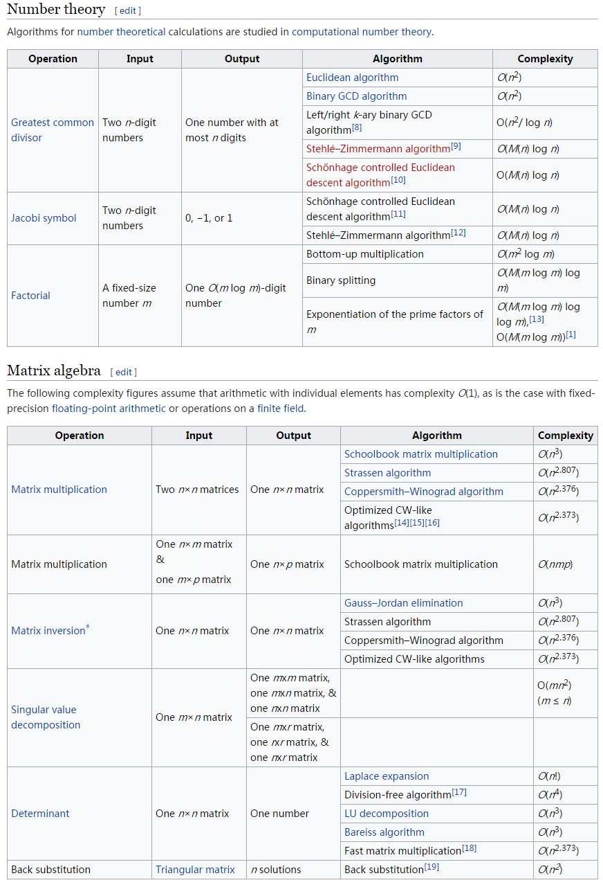

[toc]

[math](./math.md)

# matrix computation

## transformation

## computation complexity

matrix computation complexity in general

|type|algorithm|complexity|comment|
|---|---|---|---|
|QR decomposition|householding reflection|$O(\frac{2}{3}n^3)$||