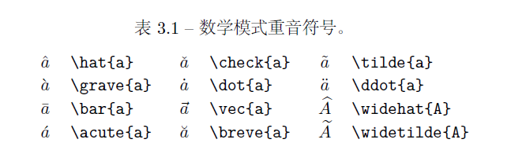
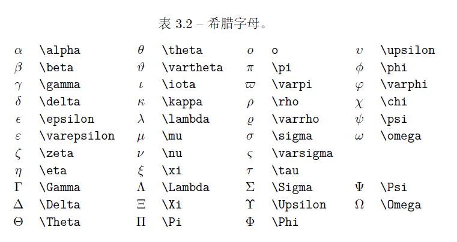
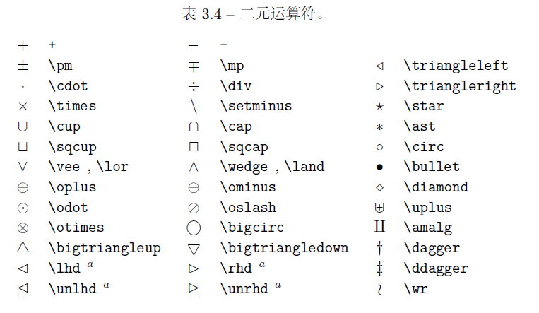
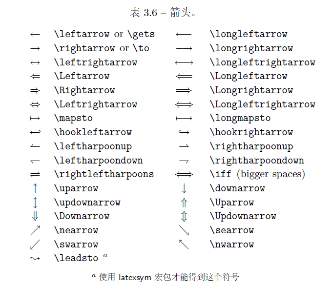
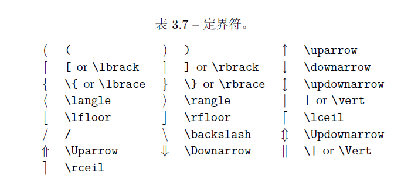

[toc]

[main page](../entry.md)

# 数学符号

参考：[Latex所有常用数学符号整理](https://blog.csdn.net/Ying_Xu/article/details/51240291)

## 数学模式重音符号

## 希腊字母

## 二元关系

## 二元运算符

## “大”运算符

## 箭头

## 定界符

## 大定界符

