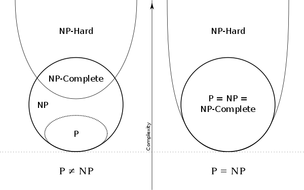

[toc]

[programming](./prog.md)

# computing theory

## NP problem

* 概念理解
    * P问题：可以在多项式时间内被解决的问题。
    * NP问题：可以在多项式时间内被验证，但是不确定是否可以在多项式时间内找出解。
    * NP-hard问题： 如果所有NP问题都可以多项式归约到问题A, 那么问题A就是NP-Hard。(很难找到多项式时间算法的问题)
    * NP-Complete问题：如果一个问题已经被证明是一个NP-Hard问题，并且可以证明该问题是一个NP问题，那么该问题是NPC问题。
    * P=NP？：是否所有的NP问题，其实都是P类问题呢，只是尚未发现。
* 关联分析
    * P属于NP，NPC属于NP与NP-HARD的交集
	* 属于NP-Hard但不属于NP-Complete的问题：不可解问题--[停机问题]([停机问题的直观解释](https://www.cnblogs.com/zhangzefei/p/9743546.html))
	* NP-complete：著名的给图染色、哈密尔顿环、背包、货郎问题都是 NP 完全问题

* 历史关系
    * 任意NP问题都能被规约到。Stephen A. Cook证明了1971年证明了NP完全问题的祖先就是SAT。SAT问题是指给定一个包含n个布尔变量的逻辑式，问是否存在一个取值组合，使得该式被满足。Cook证明了SAT是一个NPC问题，如果SAT容易解决，那么所有NP都容易解决。
* 图灵机
    * 图灵机：无限状态空间（内存无限大），给定操作指令集（指令集有限），符号表，操作机，输出序列
    * 图灵机可解决什么问题：计算问题
    * 图灵完备：满足图灵机要求的语言即为图灵完备的（所有可计算的问题均可通过该语言编码计算）。
        * c++、python图灵完备
        * latex、sql、re不支持分支、跳转、递归，因此图灵不完备

# 编码算法

* [huffman coding(霍夫曼编码)](https://zh.wikipedia.org/wiki/%E9%9C%8D%E5%A4%AB%E6%9B%BC%E7%BC%96%E7%A0%81)
    * 介绍：最优二叉树，是一种带权路径长度最短的二叉树。
    * 带权路径最短：树的路径长度是从树根到每一结点的路径长度之和，记为WPL=（W1*L1+W2*L2+W3*L3+...+Wn*Ln），N个权值Wi（i=1,2,...n）构成一棵有N个叶结点的二叉树，相应的叶结点的路径长度为Li（i=1,2,...n）。可以证明霍夫曼树的WPL是最小的。

    
    

# 图算法

* 图算法问题综述
    * 图基础算法（[【图算法】综述](https://www.cnblogs.com/XBWer/p/4086255.html)）
        * DFS/BFS/topological sort/minimum spanning tree(kruskal & prim)
    * 图论与组合优化
        * TSP 生产调度问题 01背包问题 装箱问题 图着色问题 最大团问题等
    * 其他
        * 动态规划解决01背包问题-01背包有动态规划解法且时间复杂度为O(n*W)，单实际为O(n*2^L)，称为**伪多项式时间算法**（[为什么0-1背包问题是NP完全问题，但该问题还有动态规划的解法](https://blog.csdn.net/jim7424994/article/details/39926459)）
* 匹配问题
    * 概念
        * 二分图：设G=(V, E)是一个无向图。如果顶点集V可分割为两个互不相交的子集X和Y，并且图中每条边连接的两个顶点一个在X中，另一个在Y中，则称图G为二分图。
        * 匹配：给定一个二分图G，在G的一个子图M中，M的边集{E}中的任意两条边都不依附于同一个顶点，则称M是一个匹配。
        * 最大匹配：选择边数最大的子图称为图的最大匹配问题(maximal matching problem)
        * 完美匹配：如果一个匹配中，图中的每个顶点都和图中某条边相关联，则称此匹配为完全匹配，也称作完备匹配。
        * 增广路：设M为二分图G已匹配边的集合，若P是图G中一条连通两个未匹配顶点的路径（P的起点在X部，终点在Y部，反之亦可），并且属M的边和不属M的边(即已匹配和待匹配的边)在P上交替出现，则称P为相对于M的一条增广路径。
    * 匈牙利算法（[二分图匹配——匈牙利算法和KM算法](https://blog.csdn.net/c20180630/article/details/70175814)）
        * 思想：用增广路求最大匹配（寻找增广路，再做翻转，直至找不到为止，即可得到最大匹配）
        * 算法解决最大匹配，时间复杂度为(n为节点数，m为边数)
            * 找一次增广路径的时间为
                * 邻接矩形 时间O(n2) 空间O(n2)
                * 邻接表 时间O(n+m) 空间O(n+m)
            * 总时间
                * 邻接矩阵：O(n3)
                * 邻接表：O(nm)
* 最短路径
    * dijkstra算法
        * 算法耗时(未拓扑排序)
            * $O(E*T_{dk}+V*T_{em})$
                * $T_{dk}$(decrease key)
                    * 选用二项堆(binary heap)：$O(lgn)$ $O(1)$
                    * 选用斐波那列堆(Fibonacci heap): $O(1)$
                * $T_{em}$(extract minimum)
                    * 选用二项堆(binary heap)：$O(lgn)$
                    * 选用斐波那列堆(Fibonacci heap): $O(lgn)$
            * 参考
                * [Dijkstra's_algorithm](https://en.wikipedia.org/wiki/Dijkstra's_algorithm)
                * [Fibonacci_heap](https://en.wikipedia.org/wiki/Fibonacci_heap)
                * [Binary_heap](https://en.wikipedia.org/wiki/Binary_heap)
        * 算法耗时(若最短路径图已经过拓扑排序)
            * 复杂度为$O(e+v)$
            * 参考
                * [Topological ordering and shortest paths](https://www.ics.uci.edu/~eppstein/161/960208.html)
                * [algorithm@ Shortest Path in Directed Acyclic Graph](https://www.cnblogs.com/fu11211129/p/5367252.html)
    * KSP问题
        * K-Shortest Paths Optimization
        * 常见算法包括
            * Suurballe
                * 简介：解决两个不相交路径的最小路径问题，两次调用dijkstra算法，对于KSP问题，复杂度为O(k(E+VlogV))
                * [Suurballe algorithm](https://en.wikipedia.org/wiki/Suurballe%27s_algorithm)
                * [Disjoint Paths in a Network ](https://pdfs.semanticscholar.org/8fe0/35f498ecc7d3b68e5488dc83e1f7facf75e8.pdf)
            * 偏离路径算法等改进智能算法
                * Yen： O(Kn(m+nlgn)) n个节点m条边
                * Hershberger：O(K(m+nlgn))
                * 参考
                    * [K最短路径算法综述 Review on K shortest paths algorithms](http://www.docin.com/p-1153851036.html)
                    * [Yen's Algorithm](https://www.cnblogs.com/qq952693358/p/7354070.html)
                    * [K_shortest_path_routing](https://en.wikipedia.org/wiki/K_shortest_path_routing)
            * 算法优化加速
                * K条最短路径问题是Hoffman和Pavley在1959年首先提出的[1]。90年代中旬对它的研究达到高潮。1973年Fox提出一个时间复杂度为O(m+knlogn)的串行算法[2]；Eppstein在1999年得到了一个很好的串行算法[3]，给定两点间的N条最短路径需要O(m+nlogn+k)时间，从所有点到给定目的点间的最短路径需要O（m+nlogn+nk）时间。E.Ruppert在2000年对Eppstein的算法进行并行化[4]，时间复杂度为O(logk+logn)。
                * [1] W. Hoffman and R. Pavley. A method of solution of the Nth best path problem. Journal of the ACM,6:506–514, 1959.
                * [2] B. L. Fox. Calculating kth shortest paths. INFOR; Canadian Journal of Operational Research, 11(1):66–70, 1973.
                * [3] D. Eppstein. Finding the k shortest paths. SIAM Journal on Computing, 28(2):652–673, April 1999.
                * [4] E. Ruppert Finding the k Shortest Paths in Parallel1 Algorithmica (2000) 28: 242–25
    * 应用
        * 跟踪问题与KSP
            * 形成约束流，转换为凸问题，可用LP完成但复杂度高，或者转换为KSP问题，复杂度低。（可见论文[Multiple Object Tracking using K-Shortest Paths Optimization](https://infoscience.epfl.ch/record/164041/files/top.pdf)，及其[解读](https://blog.csdn.net/hfutzxy/article/details/71425728)）

