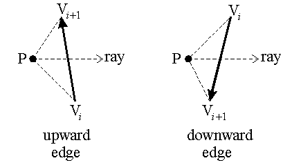
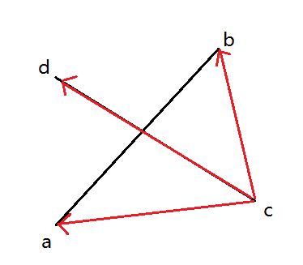

[toc]

[programming](./prog.md)

# common algorithm

* 坐标空间转换
    * 世界坐标->相机坐标->像空间坐标->像素坐标
* 点顺时针排序
    * 方法：只需建立一种偏序关系即可，而这种偏序关系则有叉积的正负位移确定
        * a点在b点的逆时针方向，反之在b点的顺时针方向

        $$
            \begin{bmatrix} a_x & a_y \\ b_x & b_y \\ \end{bmatrix} > 0
        $$

        * 该等式的3D模式为，下述行列式则是求取3维空间中叉积的方向和大小

        $$
            \begin{bmatrix} i & j & k \\ a_x & a_y & a_z \\ b_x & b_y & b_z \\ \end{bmatrix}
        $$

    * 参考：[多边形点集排序](https://www.cnblogs.com/dwdxdy/p/3230156.html)

* 点包含
    * 交叉数方法
        * 射线与多边形的交点为奇数，则包含该点，否则不包含
        * 需要对各线段逐个判别是否相交
    * 绕数法
        * 方法1：先对多边形的点进行排序，然后计算角度，角度和为0，则不包含该点，角度和是2pi的整数倍则包含该点
            * 劣势：与各个线段计算夹角，acos函数耗时较大
        * 方法2：先对多边形的点进行排序，然后仅计算在点右边的线段的正负总数，总数为0则不包含，否则包含（其中正为upward edge，负为downward edge）

        
    
    * 参考：[point in polygon](https://en.wikipedia.org/wiki/Point_in_polygon)
* 线段相交
    * 经典方法
        * 步骤1：快速排斥实验，判断矩形区是否相交
            
            ```c
            if(!(min(a.x,b.x)<=max(c.x,d.x)
            && min(c.y,d.y)<=max(a.y,b.y)
            && min(c.x,d.x)<=max(a.x,b.x)
            && min(a.y,b.y)<=max(c.y,d.y)))
            ```

        * 步骤2：跨立实验，判断线段是否相交
            * (ca x cd)·(cb x cd)<=0 则说明ca cb相对于cd的方向不同（x为叉乘）
            * 该判断需操作两次，两次都小于0才判定为相交

            ```c
            u=(c.x-a.x)*(b.y-a.y)-(b.x-a.x)*(c.y-a.y);
            v=(d.x-a.x)*(b.y-a.y)-(b.x-a.x)*(d.y-a.y);
            w=(a.x-c.x)*(d.y-c.y)-(d.x-c.x)*(a.y-c.y);
            z=(b.x-c.x)*(d.y-c.y)-(d.x-c.x)*(b.y-c.y);
            return (u*v<=0.00000001 && w*z<=0.00000001);
            ```

        

        * 参考：[计算几何-判断线段是否相交](https://www.cnblogs.com/wuwangchuxin0924/p/6218494.html)

* 图形交点
    * 依次调用线段相交进行匹配即可
* 图形面积
    * 三角形
        * 直接使用叉乘计算
    * 四边形
        * 先进行点排序，然后切分为两个三角形，再计算三角形面积
    * 任意凸多边形
        * 先进行点排序，然后选取一个点，计算序列三角形的面积
    * 任意多边形
        * 方法1： 预先固定顺序（否则无法预知多边形形状），再逐个计算三角形面积（注，这里可以为负）（[计算任意多边形的面积](https://www.cnblogs.com/TenosDoIt/p/4047211.html)）
        * 方法2：皮克定理  多边形面积S = 多边形内整数点的个数 n + 多边形边上整数点的个数 / 2 - 1 （[皮克定理和任意多边形的面积公式](https://blog.csdn.net/qq_41157137/article/details/83901535)）
* 团块分析
    * 又称(连通域标记/连通域分析/Connected Component Labeling)
	* 常见算法1: 基于行程的标记算法
    	* a.扫描每行的连同区域并标记
    	* b.对本行与上行的连同区域进行处理
    	* c.对最终得到的等价对kv对进行深度遍历，得到等价树
	* 常见算法2: 基于轮廓的标记算法
    	* 扫描外轮廓，再扫描内部轮廓
  	* 统计意义上方法1比方法2速度快（[图像分析：二值图像连通域标记](https://www.cnblogs.com/ronny/p/img_aly_01.html)）