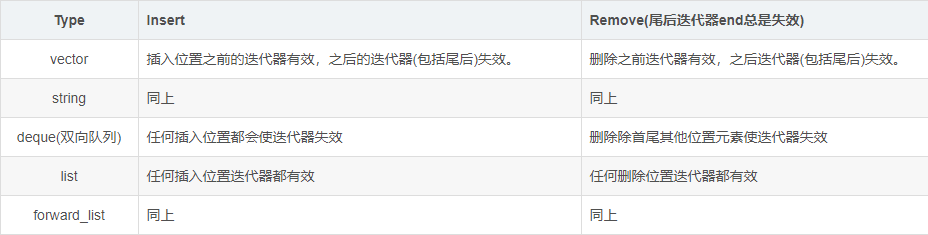
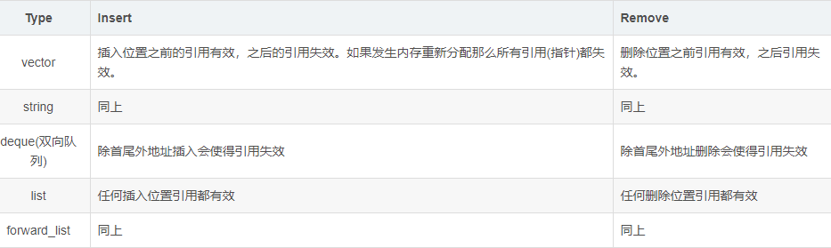

[toc]

[programming](./prog.md)

# C

* const
    * `char * const cp`: 定义一个指向字符的指针常数，即const指针
    * `const char* p`: 定义一个指向字符常数的指针
    * `char const* p`: 等同于const char* p
* 传递引用和指针的区别
    * 引用只能在定义时被初始化一次，之后不可变；指针可变；
    * 引用没有const，指针有const，const的指针不可变；
    * 引用不能为空，指针可以为空；


# semantic

## basic

* inline
    * 关键字inline 必须与函数定义体放在一起才能使函数成为内联，仅将inline 放在函数声明前面不起任何作用。
    * 定义在类声明之中的成员函数将自动地成为内联函数
        
        ```c++
        class A
        {
            public:void Foo(int x, int y) {  } // 自动地成为内联函数
        }
        ```

* 异常
    * 析构函数不能抛出异常
        * 1）如果析构函数抛出异常，则异常点之后的程序不会执行，如果析构函数在异常点之后执行了某些必要的动作比如释放某些资源，则这些动作不会执行，会造成诸如资源泄漏的问题。
        * 2）通常异常发生时，c++的机制会调用已经构造对象的析构函数来释放资源，此时若析构函数本身也抛出异常，则前一个异常尚未处理，又有新的异常，会造成程序崩溃的问题。
    * 参考
        * [C++的异常处理](https://blog.csdn.net/daheiantian/article/details/6530318)
* 友元
    * 友元基本概念
        * 友元包含友元类，友元函数，和友元成员函数三种。总的来说友元是**授权关系**，**友元类是被授权的类**，可以访问被授权类的所有成员变量和函数
        * [友元(友元函数、友元类和友元成员函数) C++](https://www.cnblogs.com/zhuguanhao/p/6286145.html)
    * 友元与模板
        1. 一对一友好关系
        
        ```c++
        template <typename T>
        class Blob {
            //每个Blob实例将访问权限授予与相同类型实例化的BlobPtr和相等运算符
            friend class BlobPtr<T>;
        };
        ```
    	
        1. 普通类与友元模板
        
        ```c++
        class C {
            friend class Pal<C>; //用类C实例化的Pal是C的一个友元
            //Pal1的所有实例都是C的友元，且无须前置声明
            template <typename T> friend class Pal1;
        };
        ```

        1. 类模板与普通友元

        ```c++
        template <typename T>
        class C2 {
            //Pal2是一个非模板类，它是C2所有实例的友元，不需要前置声明
            friend class Pal2;
        };
        ```

	    1. 类模板与友元模板（多对多关系）
	    
        ```c++
        template <typename T>
        class C2 {
            //Pal3的所有实例都是C2的每个实例的友元，同样不需要前置声明
            template <typename X> friend class Pal3;
        };
        ```

        * 参考：[C++类模板与友元的关系](https://www.jianshu.com/p/6613dbd0827d)

## conversion & poly

* 自动类型推断
    * 意义
        * 自动类型推断和返回值占位。auto在C++98中的标识临时变量的语义，由于使用极少且多余，在C++11中已被删除。前后两个标准的auto，完全是两个概念。
    * 适用场景
        * 自动帮助推断类型
        * 当类型冗长时，可以通过该方式自动推断类型，节约编码实现。比如iterator可直接用stl实例获取
        * 模板编程时，搞不清左值对应的类型时，使用自动推断实现。
    * 注意
        * 使用时必须初始化
* 强制转换
    * dynamic_cast
        * This cast is used for handling polymorphism. You only need to use it when you're casting to a derived class. This is exclusively to be used in inheritence when you cast from base class to derived class.
    * static_cast
        * 	A `static_cast` is a cast from one type to another that (intuitively) is a cast that could under some circumstance succeed and **be meaningful in the absence of a dangerous cast**. For example, you can static_cast a `void*` to an `int*`, since the `void*` might actually point at an `int*`, or an int to a char, since such a conversion is meaningful. However, you cannot static_cast an `int*` to a `double*`, since this conversion only makes sense if the `int*` has somehow been mangled to point at a `double*`.
    * reinterpret_cast
        * 	A `reinterpret_cast` is a cast that represents an **unsafe conversion that might reinterpret the bits of one value** as the bits of another value. For example, casting an `int*` to a `double*` is legal with a reinterpret_cast, though the result is unspecified. Similarly, casting an `int` to a `void*` is perfectly legal with reinterpret_cast, though it's unsafe. Neither static_cast nor reinterpret_cast can remove const from something. You cannot cast a `const int*` to an `int*` using either of these casts. For this, you would use a const_cast.
    * const_cast
        * can be used to remove or add const to a variable. This can be useful if it is necessary to add/remove constness from a variable.
    * c_type_cast
        * A C-style cast of the form (T) is defined as **trying to do a static_cast** if possible, falling back **on a reinterpret_cast** if that doesn't work. It also will apply a **const_cast if it absolutely must**.
    * refer:[What is the difference between static_cast and reinterpret_cast?](https://stackoverflow.com/questions/6855686/what-is-the-difference-between-static-cast-and-reinterpret-cast)
* 重写与重载
    * override重写 参数相同 子类与父类
    * overload重载 参数不同 类内部
    * protected可以被继承，不可被访问；virtual属性不可改变，子类的虚函数可以不用申明virtual
    * 默认为private继承（c++多重继承中默认为private继承方式 ）
    * 派生类屏蔽基类同名函数，如要调用基类的，则需要使用作用域操作符
* operator overloading
    * subscripting [] operator
        * 如何定义下标重载运算符
        * `class-X &operator[](int i)`
    * class member access operator
        * 如何定义成员函数访问重载运算符
        * `class-X* operator->() const` ，例如：
        
        ```c++
        void f(Ptr p ) {
            p->m = 10 ; // (p.operator->())->m = 10
        }
        ```
    
    * Function Call Operator
        * When you overload ( ), you are not creating a new way to call a function. Rather, you are creating an operator function that can be passed an arbitrary number of parameters.
        * `() -->class-X operator()(int a, int b, int c)`
    * type conversion operator
        
        ```c++
        class D {
            D(double d) : d_(d) {}
            /* “(int)D”类型转换 */
            operator int() const {
            std::cout << "(int)d called!" << std::endl;
            return static_cast<int>(d_);
            }

            double d_;
        };
        ```

## RTTI

* RTTI
    * typeid
        * typeid always return the real type for an object(which virtual interface) and return the declaration type for a pointer

        ```c++
        Class B : public Class A
        A* ptr = New B()
        typeid(ptr).name() = A
        ```

        ```c++
        A/B has no virtual interface
        Class B : public Class A
        A* ptr = New B()
        typeid(*ptr).name() = A
        ```

        ```c++
        A/B has virtual interface
        Class B : public Class A
        A* ptr = New B()
        typeid(*ptr).name() = B
        ```

## lamada

* lambda function
    * 示例讲解
        * `[] () -> int { return 1; }  `

        |`[]`|`()`|`->xxx` |`{ ……; } ` |
        |---|---|---|---|
        |Capture |Parameters|Return type|Function body|

        * 	注意，return类型编译器可以根据返回值自行推断，所以可以不写参数列表与普通函数调用类似

    * 捕获列表
        * `[]` 不截取任何变量
        * `[&]` 截取外部作用域中所有变量，并作为引用在函数体中使用
        * `[=]` 截取外部作用域中所有变量，并拷贝一份在函数体中使用
        * `[=, &foo]`   截取外部作用域中所有变量，并拷贝一份在函数体中使用，但是对foo变量使用引用
        * `[bar]`   截取bar变量并且拷贝一份在函数体重使用，同时不截取其他变量
        * `[this]`  截取当前类中的this指针。如果已经使用了&或者=就默认添加此选项。
	* 示例
	
        ```c++
        ir::PostOrderVisit(e, [&ret, &visited](const NodeRef& n) {
                const ir::Call *call = n.as<ir::Call>();
                if (call != nullptr && call->func.defined()) {
                    Tensor t = Operation(call->func.node_).output(call->value_index);
                    if (!visited.count(t)) {
                    ret.push_back(t);
                    visited.insert(t);
                    }
                }
        });
        ```

## advanced

* 左值与右值
    * 基本概念
        * 左值是可以放在赋值号左边可以被赋值的值；左值必须要在内存中有实体；
        * 右值当在赋值号右边取出值赋给其他变量的值；右值可以在内存也可以在CPU寄存器。
        * 一个对象被用作右值时，使用的是它的**内容(值)**，被当作左值时，使用的是它的**地址**。
    * 语法
        * 左值引用:`type &引用名 = 左值表达式;`
        * 右值引用:`type &&引用名 = 右值表达式;`
    * 右值引用的作用
        * **数据对象的移动**
        * 绑定的对象（引用的对象）不同，左值引用绑定的是返回左值引用的函数、赋值、下标、解引用、前置递增递减
        * 左值持久，右值短暂，右值只能绑定到临时对象，所引用的对象将要销毁或该对象没有其他用户。使用右值引用的代码可以自由的接管所引用对象的内容
        * 总之右值引用**一般绑定临时的右值表达式**，或者**使用基于右值引用设计的转移构造函数**
    * `std::move`
        * 示例
            * `int && rrval = std::move(val);`
            * 直接把左值或者右值转换成右值引用，但在调用完`std::move`之后，不能再使用`val`，只能使用 `rrval`
        * 解释
            * 由于STL里面默认的库已经支持右值引用，也有所谓的移动构造函数如下面的形式A (A&& a){} 这里不能使用const A&& a，因为需要改变a。移动构造函数主要的用途是，当你不需要在使用一个变量的时候，可以直接通过该构造函数来实现把该变量的数据转换到另一个变量中，**省去调用默认的赋值构造或者拷贝构造函数带来额外的开销**，如string类在赋值或者拷贝构造函数中会声明char数组来存放数据，然后把原string中的 char 数组被析构函数释放，如果a是一个临时变量，则上面的拷贝，析构就是多余的，完全可以**把临时变量a中的数据直接 “转移” 到新的变量下面**即可。
        * 实现机制
        
        ```c++
		template<typename T>
		typename remove_reference<T>::type && move(T&& t)
		{
		    return static_cast<typename remove_reference<T>::type &&>(t);
		}
        ```

		* `std::move(string("hello"))`调用解析：
            1. 根据模板推断规则，确地T的类型为string;
            2. `typename remove_reference<T>::type &&` 的结果为 `string &&`;
            3. move函数的参数类型为`string&&`;
            4. `static_cast<string &&>(t)`，`t`已经是`string&&`，于是类型转换什么都不做，返回`string &&`;
    * `std::swap`
        * 顾名思义，a/b交换身体，类似于调用两次move
    * 参考
        * [左值引用和右值引用随笔](https://www.cnblogs.com/cly-blog/p/5980546.html)
        * [std::move](https://zh.cppreference.com/w/cpp/utility/move)
        * [std::swap](https://zh.cppreference.com/w/cpp/utility/move)

# STL

## STL operation

* assign a vector when init
    * `std::vector<int> v { 34,23 };`

## STL behavior

* [stl do not destruct a pointer element](https://stackoverflow.com/questions/4260464/does-stdlistremove-method-call-destructor-of-each-removed-element)
    * this pointer may be a static object, deleting one of those yields undefined behavior
    * no way to figure out whether the pointee has already been released, deleting twice yields undefined behavior
    * Uninitialized pointers, also undefined behavior.
* [reason of iterator failed](https://blog.csdn.net/y1196645376/article/details/52938474)
    * 容器的迭代器为什么会失效？--> 容器的元素在容器内部搬家了。（导致门牌号失效）

    

    * 容器元素的引用(指针)为什么会失效？-->内存发生变化
    
    

# smart pointer

* `std::unique_ptr`
    * purpose: tie the lifetime of the object to a particular block of code
    * feature: automatic destruction & exception handling
* `std::shared_ptr`
    * purpose: the lifetime of your object is much more complicated, and is not tied directly to a particular section of code or to another object.
    * feature: reference counting the pointer. This does allow the pointer to be copied. When the last "reference" to the object is destroyed, the object is deleted.
* `std::weak_ptr`
    * purpose: fix dangling reference and circular references in `std::shared_ptr`
    * feature: define a weak (uncounted) reference to a shared_ptr
* 参考
    * [What is a smart pointer and when should I use one?](http://stackoverflow.com/questions/106508/what-is-a-smart-pointer-and-when-should-i-use-one)