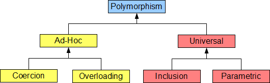

[toc]

[main page](../entry.md)

# menu

* compiler
    * [compiler](./compiler.md)
* language
    * [java](./java.md)
    * [cpp](./cpp.md)
    * [python](./python.md)
    * [javascript](./data/js/javascript.xmind)
    * web
        * [gojs](./data/web/gojs.xmind)
        * [HTML](./data/web/HTML.xmind)
* programming
    * [algorithm](./algorithm.md)
* computer graphics
    * [cg](./cg.md)

# common concept

* pure function
    * def: A function is said to be pure if it returns same set of values for same set of inputs and does not have any observable side effects.
    * benefit: pure lets the compiler know that it can make certain optimisations about the function
        * e.g. With a pure function, the compiler can know that it needs to evaluate `fun(10)` once and once only, rather than 1000 times. For a complex function, that's a big win.

        ```c
        for (int i = 0; i < 1000; i++){
        printf("%d", fun(10));}
        ```
* meta programming
    * 元编程概念：用代码生成代码的编程方式
* declarative language
    * def: when you write your code in such a way that it describes what you want to do, and not how you want to do it.
    * It is left up to the compiler to figure out the how. Examples of declarative programming languages are SQL and Prolog. 
* language comparison
    * [Perl, Python, Ruby, PHP, C, C++, Lua, tcl, javascript and Java comparison](https://raid6.com.au/~onlyjob/posts/arena/)
        * 相比于c，c++在内存和速度上均有较大妥协，在字符串操作中甚至不如perl语言
    * [为什么尽管 C++ 早就有了很多现代功能，但是却长期给人原始的印象呢？](https://www.zhihu.com/question/39400487)
        * 2003 年以前，个人计算机的一大部分需求是 content creation。比如文字排版、图像制作。这个需求在 03 年之后的比例逐渐降低。
        * 之后大部分新增用户的需求转向信息的整合共享。
        * 前后的区别在于，content creation 的工具需要和 OS/hardware 更强的互操作，而信息整合共享往往需要一个能更好的处理 on-wire protocol 和字符串的语言就够了。
* closure
    * def: 在计算机科学中，闭包（英语：Closure），又称词法闭包（Lexical Closure）或函数闭包（function closures），是引用了自由变量的函数。
    * 用处：将数据保存起来，以后再使用，会觉得很自然。将代码保持起来，以后再使用，也是类似。代码指令执行时候，会处于一定的环境，单纯将代码保存下来，还是不够的，需要将代码所处的环境也保存下来。闭包其实是，将代码跟代码所处于的环境做为一个整体来看待。周围的环境，表现为代码所使用的数据。在有些语言中，这个概念叫代码块（block），匿名函数(lambda)等等。这一设定也使得环境的延时执行变得便捷。
* Polymorphism
    * 多态类别
        * ad hoc polymorphism:  work on a **finite set of different and potentially unrelated types**
            * coercion
            * overloading
        * universal polymorphism: work on a **potentially infinite number of types across some common structure**
            * inclusion
            * parametric

    

    * Difference of each other
        * Subtype Polymorphism (**Runtime Polymorphism**).
            * In type theory it's also known as inclusion polymorphism.
            * 这就是cpp中的多态概念
        * Parametric Polymorphism (Compile-Time Polymorphism)
            * Parametric polymorphism provides a means to execute the same code for any type.
            * In C++ parametric polymorphism is implemented via **templates**.
            * 这就是cpp中的模板概念
        * Ad-hoc Polymorphism (Overloading)
            * Ad-hoc polymorphism allows functions with the same name act differently for each type. For example, given two ints and the + operator, it adds them together. Given two std::strings it concatenates them together. This is called overloading.
            * 这就是cpp中的函数重载概念
        * Coercion Polymorphism (Casting)
            * Coercion happens when an object or a primitive is cast into another object type or primitive type
            * 这就是cpp中的类型转换概念
    * Diff between **ad hoc polymorphism**(特设多态) and **parameter polymorphism**(参数多态)
        * ad hoc - that work differently on different argument types
        * Parameter - that work uniformly on a range of argument types 
    * 举例

    ||type|poly|
    |---|---|---|
    |python|Strongly typed Dynamic language|Support overloading and inclusion poly|
    |c++|Strongly typed Static Language|Support All 4 Poly|

    * 参考
        * [Overview of Polymorphism](https://ict.senecacollege.ca/~oop244/pages/content/adhoc.html)
        * [The Four Polymorphisms in C++](https://catonmat.net/cpp-polymorphism)

* type inference
    * **Static language needs Type inference** only (auto in c++, ease for programming)
    * Statically typed languages
        * A language is statically typed if the type of a variable is **known at compile time**. For some languages this means that you as the programmer must specify what type each variable is (e.g.: Java, C, C++); **other languages offer some form of type inference**, the capability of the type system to deduce the type of a variable (e.g.: OCaml, Haskell, Scala, Kotlin)
        * The main advantage here is that **all kinds of checking can be done by the compiler**, and therefore a lot of trivial bugs are caught at a very early stage.
        * Examples: C, C++, Java, Rust, Go, Scala
    * Dynamically typed languages
        * A language is dynamically typed if the type is associated with run-time values, and not named variables/fields/etc. This means that you as a programmer can write a little quicker because you do not have to specify types every time (unless using a statically-typed language with type inference).
        * Most scripting languages have this feature as there is no compiler to do static type-checking anyway, but you may find yourself searching for a bug that is due to the interpreter misinterpreting the type of a variable. Luckily, scripts tend to be small so bugs have not so many places to hide.
        * Examples: Perl, Ruby, Python, PHP, JavaScript
    * 参考:[What is the difference between statically typed and dynamically typed languages?](https://stackoverflow.com/questions/1517582/what-is-the-difference-between-statically-typed-and-dynamically-typed-languages)