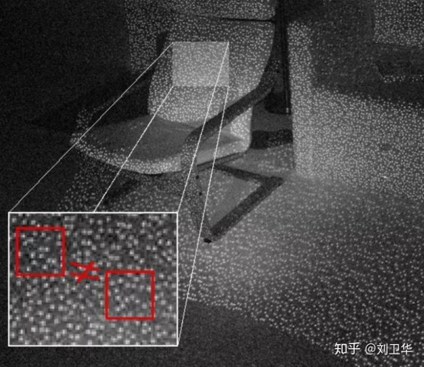

[toc]

[sensor](./sensor_entry.md)

# 机器视觉

## 相机基本知识

* 相机类型
  * 面阵相机系统
  * 线扫描系统
* 触发与同步
  * 自由触发：按相机自己的时钟抓拍，目标每次出现在图像的不同位置
  * 外部触发：按外部传感器的触发信号抓拍，目标每次出现在相同位置
* 镜头
  * 镜头焦距
    * 常用的有3.5mm，4mm，6mm，8mm，12mm等
      * 2.5mm视场100°，视距1.5m内车牌;
      * 2.8mm视场90°，视距2m内车牌;
      * 3.6mm视场75°，视距2.5m内车牌;
      * 4mm视场70°，视距3m内内车牌;
      * 6mm视场60°，视距5m内车牌;
      * 8mm视场40°，视距7m内车牌;
      * 12mm视场30°，视距9m内车牌;
      * 16mm视场20°，视距20m内车牌;
      * 30mm视场10°，视距30m内车牌;
      * 60mm视场5°，视距50m内车牌;
  * 景深
    * 当对某一点对焦时，其前后可形成清晰的像，这前后距离就叫做景深
    * 光圈越小/焦距越小/对焦距离越远，景深越大
  * 变形率
    * 单位长度上的变形大小，所有镜头普遍存在，一般焦距越短变形率越大，变形率小于2%都是不错的镜头
    * 变形类型包括barrel畸变和pincushion畸变

## 光源打开方式

* 打光重要性
  * 打光的目标就是最大化感兴趣区域的特征，同时抑制其他特征
  * 好的打光可以：对比度比明显，均匀性良好，一致性好
  * 好的打光方式等与成功了一大半
* 打光方式
  * 同轴照明方式
    * 适合检测镜面物体上的痕迹
  * 沐光方式（高角度环形光）
    * 优点是亮度大，灵活；缺点是阴影和反光
    * 适合检测平面和有纹理的表面
  * 低角度方式
    * 相比沐光方式，光照角度低，与检测物距离更近
    * 适合凸显物理边缘和高度变化（硬币纹理）
  * 背光方式
    * 光源均匀的从被检测物体的背面向相机方向照射，可获得清晰轮廓
    * 常用语物体外形检测和尺寸检测
  * 散射照明方式（积分光源）
    * 先把光纤投射到粗糙的漫反射表面，产生无方向融合的光，然后再投射到被检测物体，产生均匀的照明
    * 适合检测表面高反光的柔性物体
  * 聚光方式（线光源）
    * 再条形光源上加个柱形透镜，将光源汇聚成一条直线，以产生高亮度的线光源
    * 用于线扫描项目
  * 其他技术
    * 颜色互补。可使用颜色互补原理，使用某种颜色的光源，将某些颜色的纹理滤除，便于后续检测
    * 偏振镜。消除或减弱物体表面紊乱的强反光

## 应用

* 物体检测
  * 有无检测（邮件包裹中有无东西），残次品检测，统计个数
* 读码
  * 条码，二维码
* 瑕疵检测
  * 缺陷检测，污渍检测，包括
    * 电子器件中的：电镀不良，器件污点
    * 纺织行业中的：缺经，破洞，脏污
    * 包装行业中的：保质期有无，标签歪斜
* 标定
  * 测量，定位，对位
* 形态学处理
* 分割
* 模板匹配
* OCR/OCV
* 目标分类
* 频域分析

## 行业分析

* 国际
  * 康耐视：读码、定位、测量
  * 基恩士：2D/3D检测
  * Datalogic：读码
* 国内
  * 凌云：印刷、PCB\LCD
  * 大恒：印刷、医药
  * 微视：相机

# 编解码

## 编解码方式与技术

* 编解码标准
  * ITU-T
    * H.264/H.265
  * ISO/IEC
    * MPEG
* 关键技术
  * 预测编码（连续时间预测，连续空间预测）
  * 分块运动补偿
  * 变换编码：DCT/FFT
  * 量化：将含有大量的数据集合映射到含有少量的数据集合中
  * 熵编码（霍夫曼编码，游距编码）
  * 去块滤波
* 可参考
  * H.265/HEVC编码器框架

    

# 深度相机

* 常见深度相机
  * kinect（结构光）
  * iPhone人脸解锁（结构光）
* 常用技术
  * TOF技术(time of flight)
    * TOF和毫米波雷达，超声波雷达一样，都是利用相位法测量距离，但是光波和电磁波在物理特性上的差别决定了其测量精度上的差异
    * TOF为什么现在才出现：由于测量光的飞行时间需要非常高的频率和精度，早期的ToF设备在体积上一直存在问题，成本也高，所以多只用于工业领域。ToF的小型化极大依赖于近年来集成电路与传感器技术上的突破，使得在CMOS芯片上对光脉冲相位的测量逐渐变得可行。
    * 优势：强光鲁棒性好，远距离稳定。测量距离方面，ToF也具备一定优势。由于ToF接收传感器所接收的每个像素点对应一个物体表面的实际位置，只要有反射光回来，就可以通过解相位的方法获取到深度。其测量精度不会随着测量距离的增大而降低，其测量误差在整个测量范围内基本上是固定的。而且由于太阳光并未经过调制，可以简单认为它对相位是没有影响的，所以ToF对于室外强光环境也有一定的鲁棒性。
    * 劣势：功耗高，分辨率低。分辨率方面，采用ToF技术的深度相机分辨率目前还偏低，一般也就320*240的水准，功耗上也略微不尽人意。
  * 双目立体视觉技术
    * 原理：简单几何
    * 技术：主要体现在，1.标定，2.如何确定同一物体在不同相机成像中的位置
  * 结构光技术
    * 原理：结构光是通过红外激光器，将具有一定结构特征的光线投射到被拍摄物体上，再由专门的红外摄像头进行采集反射的结构光图案，根据三角测量原理进行深度信息的计算。
  
      
    * 应用：iPhoneX上的Truedepth相机，用的是以色列PrimeSense公司的Light Coding技术。
    * 优点：功耗低，距离近时精度更高。这种方案和ToF相比，计算量少功耗低，在近距离范围内精度更高，所以在人脸识别，手势识别方面极具优势。
    * 缺点：室外差，远距离表现差，不抗反光。由于投射的经过编码的图像或散斑光点，在室外容易被强自然光淹没，所以结构光方案在室外并不好用。当物体距离相机较远时，物体上投射到的图像或光点越大，精度也越差；它也容易受光滑平面的反光影响，比如投射到镜子上。
* 参考
  * [ToF技术是什么？和结构光技术又有何区别](https://zhuanlan.zhihu.com/p/51218791)