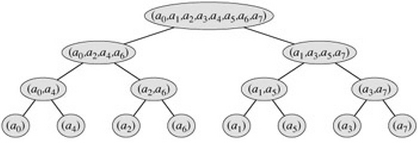

[toc]

[sensor](./sensor_entry.md)


* 基础概念
    * Chirp信号
        * 频率随时间而改变（增加或减少）的信号，这种信号听起来类似鸟鸣的啾声。
        * 为了能够测量长距离又保留时间的分辨率，雷达需要短时间的派冲波但是又要持续的发射信号，啁啾信号可以同时保留连续信号和脉冲的特性，因此被应用在雷达和声纳探测上。
        * signal: $exp(j(2\pi(0.5kt+f_0)*t))$
        * distance: $f=kt=\frac{2kR}c$
        * velocity: $φ=\frac{2\pi2Rmod(φ)}λ$
    * 循环卷积与线性卷积
        * 循环卷积是使用DFT(FFT)计算线性卷积时的衍生品，直接使用线性卷积对时域进行计算，时间复杂度为O（LM），其中L为f的长度，M为g的长度；而使用DFT变换到频率后，可使用FFT，将计算复杂度降低。但使用的过程中，要讲线性卷积变换为循环卷积，那么为了保证对其，需要将信号长度补零为l+m-1。
        * 卷积（线性卷积）
            * 连续 $(f*g)(t)={\int}_{-\infty}^{\infty}f(\tau)g(t-\tau)d\tau$
            * 离散 $(f*g)[n]={\sum}_{m=-\infty}^{\infty}f[n-m]g[m]$
        * 循环卷积([Circular convolution](https://en.wikipedia.org/wiki/Circular_convolution))
            * 连续 $(f*g_T)(t)={\int}_{t_0}^{t_0+T}[{\sum}_{k=-\infty}^{\infty}f(\tau+kT)]g_T(t-\tau)d\tau$
            * 离散 $(f_N*g)[n]={\sum}_{m=-\infty}^{\infty}f_N[n-m]g[m]$
        * 参考
            * [循环卷积和线性卷积在信号处理中的意义是什么？](https://www.zhihu.com/question/25525824)
            * [线性卷积和循环卷积的比较与理解](https://blog.csdn.net/witnessai1/article/details/53324561)
* 傅里叶
    * 傅里叶性质
        * 时域：周期连续 <--> 频域：离散非周期
        * 时域：非周期连续 <--> 频域：连续非周期（FT）
        * 时域：非周期离散 <--> 频域：连续周期（DTFT）
        * 时域：周期离散 <--> 频域：离散周期(DFT)
        * [Properties of Fourier Transform](http://fourier.eng.hmc.edu/e101/lectures/handout3/node2.html)
            * 线性
            * 时域平移==频率旋转
            * 频域平移==时域旋转
            * 复共轭（时域real，频域共轭对称）
    * 演进过程
        * 傅里叶级数(周期函数)
            * 傅里叶变换认为一个周期函数(信号)包含多个频率分量，任意函数（信号）f(t)可通过多个周期函数（基函数）相加而合成。
            * $c_k$被称作傅里叶级数
        
            $$
            f(t)=\frac{a_0}2+{\sum}_{k=1}^n(a_kcos2{\pi}kt+b_ksin2{\pi}kt)={\sum}_{k=-n}^nc_ke^{2{\pi}ikt}
            $$

            $$
            c_k={\int}_0^1e^{-2{\pi}ikt}f(t)dt
            $$

            $$
            f(t)={\sum}_{k=-n}^n{{\int}_0^1e^{-2{\pi}ikt}f(t)dt}e^{2{\pi}ikt}
            $$

        * 傅里叶变换（非周期函数）（FT）[傅里叶变换概念及公式推导](https://blog.csdn.net/lzzdflg/article/details/78254381)
            * 对于非周期函数我们可以假设为非周期函数是一个周期函数的某个部分，但这个非周期函数的t范围可以非常的大。傅里叶变换当周期趋近于无穷，是傅里叶系数的一般化
            * 那么把k变化为k/T进行上述推演
            * 对于周期为1的函数频域上每条线的间隔为1。而对于周期为T的函数，频域上的间隔为1/T。**当T趋近于无穷，频谱间隔越来越近，最终频谱变为连续的**。

            $$
            c_k={\frac{1}{T}}{\int}_{\frac{-T}{2}}^{\frac{T}{2}}e^{-2{\pi}i\frac{k}{T}t}f(t)dt
            $$
            
            * 此时$c_k$为0，讨论已无意义，因此另外设计函数gf
            
            $$
            gf(\frac{k}{T})={\int}_{\frac{-T}{2}}^{\frac{T}{2}}e^{-2{\pi}i\frac{k}{T}t}f(t)dt
            $$

            $$
            f(t)={\sum}_{k=-\infty}^{\infty}gf(\frac{k}{T})e^{2{\pi}i\frac{k}{T}t}\frac{1}{T}
            $$      

            * 用s替换k/T，可得傅里叶变换

            $$
            gf(s)={\int}_{-\infty}^{\infty}e^{-2{\pi}ist}f(t)dt
            $$

            $$
            f(t)={\int}_{-\infty}^{\infty}gf(s)e^{2{\pi}ist}dt
            $$      

    * 离散傅里叶（DFT）([傅里叶变换的连续与离散](https://www.jianshu.com/p/710170afaa99)， [离散傅里叶变换（DFT）数学例子](https://blog.csdn.net/We_are_family678/article/details/79890931))
        * 某个连续函数f(t)，它的傅里叶变换为F(μ)。用冲激序列s(t)对f(t)进行取样。

            $$
            s(t)={\sum}_{n=-\infty}^{\infty}\delta(t-n{\Delta}T)
            $$      

            $$
            g(t)=f(t)s(t)={\sum}_{n=-\infty}^{\infty}f(t)\delta(t-n{\Delta}T)
            $$
        
        * 设g(t)的傅里叶变换为G(μ)，s(t)的傅里叶变换为S(μ)，根据卷积定理有。从该结论可知，**G(u)是周期为1/ΔT的周期函数**

            $$
            S(u)=\frac{1}{{\Delta}T}{\sum}_{n=-\infty}^{\infty}\delta(u-\frac{n}{{\Delta}T})
            $$

            $$
            G(u)=F(u)*S(u)={\int}_{-\infty}^{\infty}F(\tau)S(u-\tau)d\tau=\frac{1}{{\Delta}T}{\sum}_{n=-\infty}^{\infty}F(u-\frac{n}{{\Delta}T})
            $$

        * **把G(μ)用F(μ)的原函数f(t)表示**，写成类似于傅里叶变换的形式，**此时G(μ)还是连续函数**

            $$
                \begin{aligned}
                G(u) &= {\int}_{-\infty}^{\infty}g(t)e^{-j2{\pi}ut}dt \\
                &= {\int}_{-\infty}^{\infty}f(t)s(t)e^{-j2{\pi}ut}dt \\
                &= {\int}_{-\infty}^{\infty}{\sum}_{n=-\infty}^{\infty}f(t)\delta(t-n{\Delta}T)e^{-j2{\pi}ut}dt \\
                &= {\sum}_{n=-\infty}^{\infty}{\int}_{-\infty}^{\infty}\delta(t-n{\Delta}T)f(t)e^{-j2{\pi}ut}dt \\
                &= {\sum}_{n=-\infty}^{\infty}f(n{\Delta}T)e^{-j2{\pi}un{\Delta}T}
                \end{aligned}
            $$

        * **将上式离散化（在一个周期内对它离散）**，把区间[0, 1/ΔT]分为M等份，即令$u=\frac{m}{M{\Delta}T},m=0,1,2,...,M-1$，可以得到G(μ)在一个周期的离散

            $$
            Gm={\sum}_{n=-\infty}^{\infty}f_ne^{-j2{\pi}\frac{m}{M{\Delta}T}n{\Delta}T}={\sum}_{n=-\infty}^{\infty}f_ne^{-j2{\pi}mn/M}
            $$

        * **求和范围缩小**。上式已经很接近DFT的定义了，但因为求和上下限是无穷大，还不能用于实际计算。这时就要对f(t)作一下假定了。假定f(t)是时域有限的（实际信号函数几乎都是这种）

            $$
            Gm=={\sum}_{n=0}^{M-1}f_ne^{-j2{\pi}mn/M}
            $$
    * 2d FFT（[傅里叶变换(二维离散傅里叶变换)](https://blog.csdn.net/thecentry/article/details/80709593)）
        * 实数输入，幅值输出，中心对称。

        
* FFT物理意义（通过示例讲解）
    * 示例中假设FFT的采样频率fs为256Hz，采样点数N为256
    * 若输入为实数
        * 频率与采样点数的对应关系
            * 分辨率为fs/N = 1Hz，若采样点数为512，则分辨率为0.5Hz

        | 0   | 1   | 2   | 3   | 4   | 5   | … | 127   | 128     | … | 256   |
        |-----|-----|-----|-----|-----|-----|---|-------|---------|---|-------|
        | 0Hz | 1Hz | 2Hz | 3Hz | 4Hz | 5Hz |   | 127Hz | \-128Hz |   | \-1Hz |

        * 输出结果幅值
            * 幅值V转换为频率对应的数值为V/(N/2)，对0频率而言为V/(N)
    * 若输入为虚数
        * 频率与采样点数的对应关系
            * 实数情况完全一致
        * 输出结果幅值
            * 幅值V转换为频率对应的数值为V/N
    * 采样定理
        * 奈奎斯特采样定理可知，**采样频率必须是实际频率的2倍以上**，才能保证采样精度
        * **采样填零**，使用padding zero的方式（实际采样64个点，但后续再填充64个0点），可以增加一倍的频域的分辨率，同时频域幅值对应减少一半
        * 当实际频率逐渐逼近采样频率的一半时，**FFT得到的频值的准确性也在逐步下降**
            * 比如用256Hz分别采样下列频率得到的峰值：

            | $7sin(2*pi*10*x)$  | $7sin(2*pi*50*x)$   | $7sin(2*pi*100*x)$   |
            |-----|-----|-----|
            | 6.98 | 6.5 | 5.9 |

    * 参考
        * [How do I obtain the frequencies of each value in an FFT?](https://stackoverflow.com/questions/4364823/how-do-i-obtain-the-frequencies-of-each-value-in-an-fft)
        * [傅里叶变换使采样频率fs和采样点数N 怎么取？](https://www.ilovematlab.cn/thread-541003-1-1.html)
        * [How to interpret FFT results – obtaining magnitude and phase information](https://www.gaussianwaves.com/2015/11/interpreting-fft-results-obtaining-magnitude-and-phase-information/)
        * [FFT后的物理意义](https://www.xuebuyuan.com/539160.html)
* FFT运算
    * 基本实现
        * 参考：[快速傅里叶变换(FFT)详解](https://www.cnblogs.com/zwfymqz/p/8244902.html)
    * fftshift
        * fftshift只是为了显示对称，即中间显示低频分量，两侧显示高频分量
        * 若不做fftshift则高频在中间低频在两侧
        * The fft() function will return the approximation of the DFT with omega (radians/s) from 0 to pi
        * 	让数据的中心点为0，即原先数据为
            * 0Hz	1Hz	2Hz	3Hz	4Hz	5Hz	…	127Hz	-128Hz	…	-1Hz
        * 后续数据转化为
            * -128Hz	-127Hz	…	-4Hz	-3Hz	-2Hz	-1Hz	0Hz	1Hz	…	127Hz

        * [When should I use fftshift(fft(fftshift(x))) and when fft(x)?](https://stackoverflow.com/questions/33846123/when-should-i-use-fftshiftfftfftshiftx-and-when-fftx)
    * 蝶式运算
        * FFT运算背景
            * 其中$x_1(k)$为上一轮的偶数序列，$x_2(k)$为上一轮的奇数序列
        
        $$
        x(k)=x_1(k)+W^k_Nx_2(k) (k=0,1...,\frac{N}{2}-1)
        $$

        $$
        x(k)=x_1(k)-W^k_Nx_2(k) (k=\frac{N}{2},..., N-1)
        $$

        * 基2运算(radix-2)([用c语言实现的FFT](https://blog.csdn.net/tf18269639242/article/details/53024276))
            * 由上述背景可知，N点FFT运算可以分成log2（N）级，每一级都有N/2个碟形，FFT的基本思想是用3层循环完成全部运算(N点FFT)
                * 第一层为stage，第二层为每组group的个数，第三层为group内的单元个数
            
            

            ```c
            /*快速傅里叶变换*/
            void fft()
            {
                int i=0,j=0,k=0,l=0;
                complex up,down,product;
                change();  //调用变址函数
                for(i=0;i< log(size_x)/log(2) ;i++)        /*一级蝶形运算 stage */
                {   
                    l=1<<i;
                    for(j=0;j<size_x;j+= 2*l )     /*一组蝶形运算 group,每个group的蝶形因子乘数不同*/
                    {            
                        for(k=0;k<l;k++)        /*一个蝶形运算 每个group内的蝶形运算*/
                        {       
                            mul(x[j+k+l],W[size_x*k/2/l],&product);
                            add(x[j+k],product,&up);
                            sub(x[j+k],product,&down);
                            x[j+k]=up;
                            x[j+k+l]=down;
                        }
                    }
                }
            }
            ```

        * 基2改进（[C++实现FFT代码](https://blog.csdn.net/heycwn/article/details/51202506)）
            * 位翻转置换，提升访问效率
            
            

            ```c
            void bitrp (float xreal [], float ximag [], int n)
            {
                // 位反转置换 Bit-reversal Permutation
                int i, j, a, b, p;
                for (i = 1, p = 0; i < n; i *= 2)
                    p ++;

                for (i = 0; i < n; i ++)
                {
                    a = i;
                    b = 0;
                    for (j = 0; j < p; j ++)
                    {
                        b = (b << 1) + (a & 1);    // b = b * 2 + a % 2;
                        a >>= 1;        // a = a / 2;
                    }
                    if ( b > i)
                    {
                        swap (xreal [i], xreal [b]);
                        swap (ximag [i], ximag [b]);
                    }
                }
            }
            ```
        
        * 基4运算(radix-4)
            * radix-4相对于radix-2的优势在于乘法计算相对更少
                * [Radix-4 FFT versus Radix-2](https://dsp.stackexchange.com/questions/9938/radix-4-fft-versus-radix-2):It depends. Theoretically you can save a few multiplies with a radix-4 as radix-4 has a 1/4th the number of butterflies and 3 mpy + 8 adds per butterfly (if properly structured) and the radix 2 has 1 mpy + 2 adds per butterfly.
                * 从上述描述可以看出，radix-4（3 mpy + 8 adds），radix-2（4 mpy + 8 adds），**减少25%的乘法计算**

            

            * [The Split-Radix Fast Fourier Transforms with Radix-4 Butterfly Units](http://www.apsipa.org/proceedings_2013/papers/164_The-Split-Chung-2932897.pdf)
        * 其他优化
            * NE10
                * [Ne10 FFT 介绍：支持基3、基5 FFT，NEON带来显著的性能提升](https://community.arm.com/cn/b/blog/posts/ne10-fft-3-5-fft-neon)
                * [[原创]Ne10 FFT 介绍](https://community.arm.com/cn/b/blog/posts/ne10-fft)
                * [Ne10 FFT feature](https://community.arm.com/developer/tools-software/oss-platforms/b/android-blog/posts/ne10-fft-feature)
            * sparse
                * [What is the sparse Fourier transform?](https://dsp.stackexchange.com/questions/2317/what-is-the-sparse-fourier-transform)
                * [Low-rank approximation of the STFT matrix : good audio compression technique?](https://dsp.stackexchange.com/questions/27340/low-rank-approximation-of-the-stft-matrix-good-audio-compression-technique)
