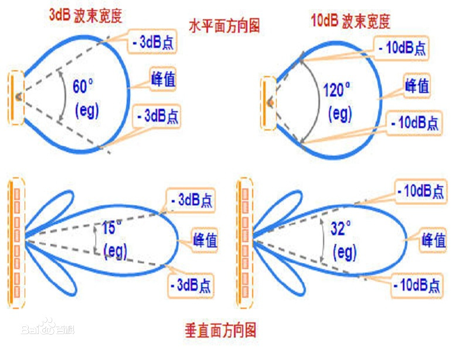
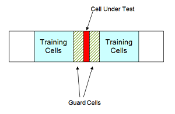
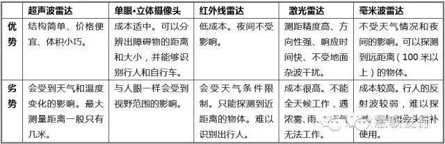
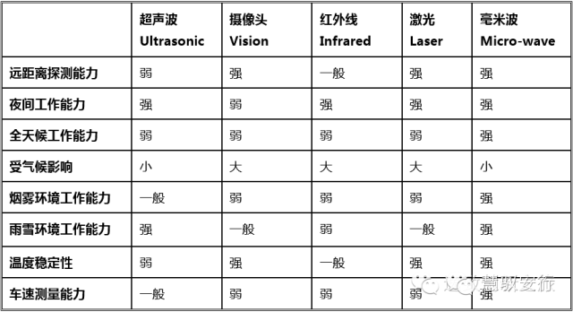

[toc]

[sensor](./sensor_entry.md)

# 波的基本概念

* 按传感器类别区分
    * 微波
        * 定义：频率在300MHz~300KMHz的电磁波(波长1m ~ 1mm）
        * 应用：通常是作为信息传递而用于雷达、通讯技术
    * 超声波
        * 定义：频率高于人的听觉上限（约为20000Hz）的声波（波长1cm ~ 0.001mm左右）
        * 性质：超声波在媒质中的反射、折射、衍射、散射等传播规律，与可听声波的规律并没有本质上的区别；波长很短，通常的障碍物的尺寸要比超声波的波长大好多倍，因此超声波的**衍射本领很差**，它**在均匀介质中能够定向直线传播**。在相同强度下，声波的频率越高，它所具有的功率就越大。由于超声波频率很高，所以超声波与一般声波相比，它的**功率是非常大**的。借功率大的特点，有空化作用。
* 按传输方式区分
    * 地波
        * **沿大地与空气的分界面传播**的电波叫地表面波，简称地波。其传播途径主要取决于地面的电特性。地波在传播过程中，由于能量逐渐被大地吸收，**很快减弱**（波长越短，减弱越快），因而传播距离不远。但地波**不受气候影响，可靠性高**。超长波、长波、中波无线电信号，都是利用地波传播的。短波近距离通信也利用地波传播。
    * 直射波
        * 直射波又称为空间波，是**由发射点从空间直线传播到接收点的无线电波**。直射波传播距离一般限于视距范围。在传播过程中，它的**强度衰减较慢**，**超短波和微波通信就是利用直射波传播的**。在地面进行直射波通信，其接收点的场强由两路组成：一路由发射天线直达接收天线，另一路由地面反射后到达接收天线，**如果天线高度和方向架设不当，容易造成相互干扰**（例如电视的重影）。
    * 天波
        * 天波是由天线向高空辐射的电磁波遇到大气电离层折射后返回地面的无线电波。电离层只对短波波段的电磁波产生反射作用，因此天波传播主要用于短波远距离通信。 
* 波的其他概念
    * 波长与频率
        * 波长与频率的乘积为固定值$\lambda f=c$，其中$c$为波的速度。
        * 波长越长,频率就会越小,穿透力越强(容易绕过障碍物,发生衍射)，频率分辨率越低.
        * 应用举例：红外线望远镜(波长长)能在有雾的地方看得比普通的要远好多,就连窗帘布也能穿过。紫外线照相机(频率高)常用于拍指纹.(用于犯罪侦破)
    * 波束宽度
        * 定义：**在最大辐射方向两侧，辐射功率下降3dB的两个方向的夹角**。与天线增益有关，一般天线增益越大，波束就越窄，探测角分辨率就越高。（Antenna 3dB Beam width is the angle between the half-power of an antenna pattern or beam over which the relative power is at or above 50% of the peak power）

        
        * 计算方法([How to Calculate Antenna 3db Beamwidth](https://www.easycalculation.com/physics/electromagnetism/learn-3db-beamwidth.php))：
            * λ = Wavelength D = Diameter λ = 0.3 / frequency
        $$
            BeamWidth=70\lambda / D 
        $$
* 雷达测距基本原理([雷达的方向测量和定位](https://wenku.baidu.com/view/3bb3962abcd126fff7050b41.html))
    * 振幅法测量
    * 相位法测量

# 雷达基本概念

## CFAR（恒虚警率）

* CFAR
    * 定义： Constant False Alarm Rate (CFAR) Detection。在雷达信号检测中，当外界干扰强度变化时，雷达能自动调整其灵敏度，使雷达的虚警概率保持不变，这种特性称为恒虚警率特性。
* 方法
    * Cell Averaging CFAR Detection
        *  In a cell averaging CFAR detector, noise samples are extracted from both leading and lagging cells (called training cells) around the CUT. 
        *  累加求均值整个训练区域可得到噪音幅值，然后调整灵敏度，并将信号减去噪音后根据预警值判断是否为实际信号

        

        * 参考：[Constant False Alarm Rate (CFAR) Detection](https://www.mathworks.com/help/phased/examples/constant-false-alarm-rate-cfar-detection.html)

### DOA(Direction of arrival estimation)

### 参考

* [Automotive Radar](http://www.iet.unipi.it/m.greco/esami_lab/Radar/automotive_radar.pdf)
* [DOA](https://www.comm.utoronto.ca/~rsadve/Notes/DOA.pdf)

# 毫米波雷达

* 定义
    * 其发射的无线电利用了波长在1-10mm，频率在30G-300GHz的毫米波。
* 应用
    * 汽车毫米波雷达工作频段为21.65-26.65GHz 和76~81GHz。比较常见的汽车毫米波雷达工作频率在24GHz、77GH、79GHz这三个频率附近。
* 典型产品
    * bosch - 中距雷达MPR 76-77GHz 前向探测小于160m，后向探测小于80m，视场150度
    * bosch - 长距雷达LPR 前向：探测距离≤250m，透镜雷达
    * Continental - 短距雷达SRR320
    * Continental - 长距雷达ARS410/ARS430
    * Delphi - ESR
* 特性
    * Radar recv: $s(t)$ -- value of wave signal
    * Radar output: fft2d -- distance and velocity map

# 超声波雷达

# 激光雷达

# 雷达性能比较

* 探测距离和角度
    * 超声波：检测角度小，空气损耗大，传输速度慢（适合近距离，如3米以内）
    * 激光：检测面小，传输速度快（适合远距离）
    * 毫米波：空气损耗低，传输速度快（适合远距离，0.6m接近传感器反应极限）
* 综合
    
    
    
    