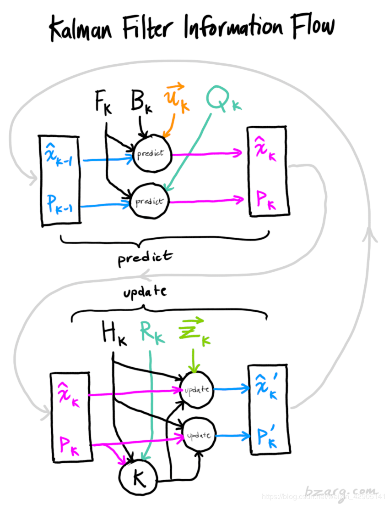

[toc]

[sensor](./sensor_entry.md)

# filter

## 卡尔曼滤波

* 机制
    * 对输入进行加权平均
    * 利用两个正态分布的融合仍是正态分布这一特性进行迭代
* 公式推导
    * 假设：卡尔曼滤波假设两个变量（位置和速度，在这个例子中）都是随机的，并且服从高斯分布。每个变量都有一个均值 μ，表示随机分布的中心（最可能的状态），以及方差，表示不确定性
    * 参数含义：
        * $\hat{x_k}$:$k$时刻估计状态，e.g.$\hat{x_k}=\begin{bmatrix} position \\ velocity \\ \end{bmatrix}$
        * $P_k$:$k$时刻估计状态的协方差矩阵，e.g.$P_k=\begin{bmatrix} \Sigma_{pp} & \Sigma_{pv} \\ \Sigma_{vp} & \Sigma_{vv} \\ \end{bmatrix}$
        * $F_k$:$k$时刻状态转移矩阵，e.g.根据当前时刻速度位置，预测下一时刻，$\hat{x_k} = \begin{bmatrix} 1 & \Delta{t} \\ 0 & 1 \\ \end{bmatrix}\hat{x}_{k-1} = F_k\hat{x}_{k-1}$
        * $B_k$:$k$时刻控制矩阵，e.g.操纵油门，让火车加速，表征外部给的加速度，$B_k=\begin{bmatrix} \frac{\Delta{t}^2}{2} \\ \Delta{t} \\ \end{bmatrix},u_k=a$
        * $u_k$:$k$时刻控制向量
        * $Q_k$:$k$时刻外部扰动，没有被跟踪的干扰当作协方差为的噪声来处理，也假设服从高斯分布
        * $z_k$:$k$时刻测量值，e.g.$\hat{z_k}=\begin{bmatrix} position \\ velocity \\ \end{bmatrix}$
        * $R_k$:$k$时刻传感器的协方差矩阵
        * $H_k$:$k$时刻传感器单位转移矩阵，将跟踪的状态的单位和尺度转移至传感器读取的数据的单位
    * 推导
        * predict:
            $$
                \begin{aligned}
                \hat{x_k} &= F_k\hat{x}_{k-1}+B_ku_k \\
                P_k &= F_kP_{k-1}{F_k}^T+Q_k
                \end{aligned}
            $$
        * estimate:
            $$
                \begin{aligned}
                (u_p, \Sigma_{p}) &= (H_k\hat{x_k}, H_k\hat{P_k}{H_k}^T) \\
                (u_m, \Sigma_{m}) &= (z_k, R_k) \\
                H_k\acute{x_k} &= H_k\hat{x_k} + K(z_k-H_k\hat{x_k}) \\
                H_k\acute{P_k}{H_k}^T &=  H_k\hat{P_k}{H_k}^T-KH_k\hat{P_k}{H_k}^T \\
                K &= H_k\hat{P_k}{H_k}^T(H_k\hat{P_k}{H_k}^T+R_k)^{-1}
                \end{aligned}
            $$
        * simpify:
            $$
                \begin{aligned}
                \acute{x_k} &= \hat{x_k} + \acute{K}(z_k-H_k\hat{x_k}) \\
                \acute{P_k} &=  \hat{P_k}-\acute{K}H_k\hat{P_k} \\
                \acute{K} &= \hat{P_k}{H_k}^T(H_k\hat{P_k}{H_k}^T+R_k)^{-1}
                \end{aligned}
            $$
* 数学背景
    * covriance matrix
    $$
        \begin{aligned}
        Cov(x) &= \Sigma \\
        Cov(Ax) &= A\Sigma A^T
        \end{aligned}
    $$
    * multiple of two gaussian pdf
    $$
        \begin{aligned}
        k &= \frac{\sigma_0^2}{\sigma_0^2+\sigma_1^2} \\
        \acute{u} &= u_0+k(u_1-u_0) \\
        \acute{\sigma^2} &= \sigma_0^2-k\sigma_0^2
        \end{aligned}
    $$
    * matrix form of multiple of two gaussian pdf
    $$
        \begin{aligned}
        K &= \Sigma_0(\Sigma_0+\Sigma_1)^-1 \\
        \acute{u} &= u_0+K(u_1-u_0) \\
        \acute{\Sigma} &= \Sigma_0-K\Sigma_0
        \end{aligned}
    $$
    * 参考：[Products and Convolutions of Gaussian Probability Density Functions](http://www.tina-vision.net/docs/memos/2003-003.pdf)
* 图解
            
    

* 扩展卡尔曼滤波
	* 线性化卡尔曼滤波器与线性卡尔曼滤波器有同样的算法结构，不同样的系统模型；
	* 线性化卡尔曼滤波器会发散，原因在于函数在远于被线性化的点的时候并不接近于非线性函数；
	* 线性化卡尔曼的表现取决于线性化做得好不好。
	* 差异，线性化部分被函数代替，实时计算中通过求偏导得到对应矩阵
* 粒子滤波(particle filter)
    * 理解：撒点，求特征（直方图），根据特征和原始目标相似度计算权值，重新撒点
    * 应用：图像领域的目标跟踪等领域，但基本思想源于此
    * 对比：在非线性和非高斯噪音的前提下能取得更高的性能
    * 参考：
        * [基于粒子滤波的物体跟踪](https://www.cnblogs.com/yangyangcv/archive/2010/05/23/1742263.html)
        * [What is the difference between a particle filter (sequential Monte Carlo) and a Kalman filter?](https://stats.stackexchange.com/questions/2149/what-is-the-difference-between-a-particle-filter-sequential-monte-carlo-and-a)
* 参考
    * [如何通俗并尽可能详细地解释卡尔曼滤波？](https://www.zhihu.com/question/23971601)
    * [卡尔曼滤波器算法](https://blog.csdn.net/weixin_42905141/article/details/99690849)
    * [Understanding the Basis of the Kalman Filter Via a Simple and Intuitive Derivation](http://www2.coe.pku.edu.cn/tpic/2013225103044787.pdf)
    * [初学者的卡尔曼滤波——扩展卡尔曼滤波（一）](https://www.cnblogs.com/ymxiansen/p/5368547.html)