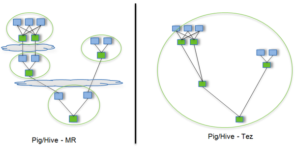
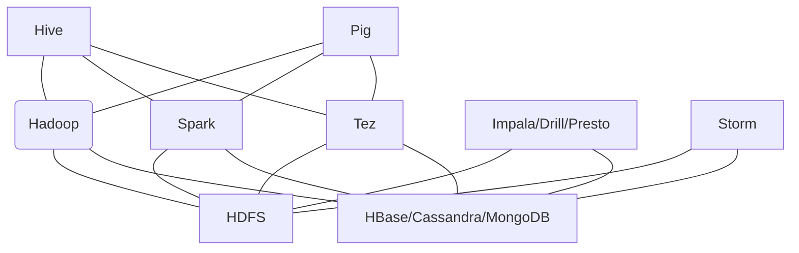
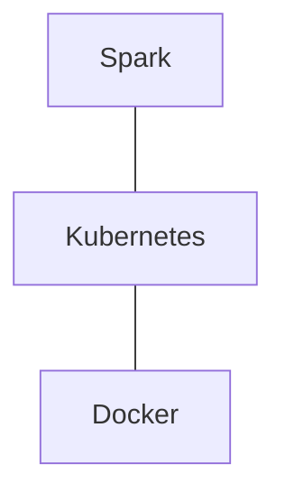

[toc]

[system](./system.md)

# AI嵌入式框架

## caffe

* concept
    * top & bottom
        * forward: bottom -> top
        * backward: top -> bottom
* usage
    * check caffe proto
        * [Netscope Editor](http://ethereon.github.io/netscope/#/editor)
    * set weight init method
        * see include/caffe/filler.hpp
    * iter_size
        * You can change the iter_size in the solver parameters. Caffe accumulates gradients over **iter_size x batch_size** instances in each stochastic gradient descent step. So increasing iter_size can also get more stable gradient when you cannot use large batch_size due to the limited memory.
    * test_iter
        * how many iterations to be executed for a test loop(each iteration calculate a batch of test image)
    * test_interval
        * how often a test is executed, test_interval iterations(each iteration calculate a batch of train image)
    * epoch
        * iteration number needs to iterate all train image number = train image num / batch size
    * lr_policy
        * learning rate policy, usually set to "step"
            * fixed:　　 保持base_lr不变.
            * step: 　　 如果设置为step,则还需要设置一个stepsize,  返回base_lr \* gamma ^ (floor(iter / stepsize)),其中iter表示当前的迭代次数
            * exp:   　　返回base_lr \* gamma ^ iter， iter为当前迭代次数
            * inv:　　    如果设置为inv,还需要设置一个power, 返回base_lr \* (1 + gamma \* iter) ^ (- power)- multistep: 如果设置为multistep,则还需要设置一个stepvalue。这个参数和step很相似，step是均匀等间隔变化，而multistep则是根据                                 stepvalue值变化
            * poly: 　　  学习率进行多项式误差, 返回 base_lr (1 - iter/max_iter) ^ (power)- sigmoid:　学习率进行sigmod衰减，返回 base_lr ( 1/(1 + exp(-gamma \* (iter - stepsize))))
    * display
        * show loss/lr in console in each 'display' iterations


# AI集群框架

## 涉及的问题

* 数据传输带宽
  * 单机内传输
    * PCI-E，NVLINK
  * 多机间传输
    * 以太网，Inifiniband，Omini-Patch Architecture
* 文件读写带宽
  * 随机读写-IOPS，大文件读写-带宽
  * 介质：HDA，SSD，3d xpoint
  * refer [storage performance](./system.md#performance)
* 并行方案
  * 方案
    * 数据并行：计算节点单独进行前向与反向运算，梯度规约之后进行更新
    * 模型并行：不同的计算节点负责网络的一部分运算
    * 混合并行：数据并行+模型并行
  * 常用策略
    * 由于数据并行虽然加速明显，但需要节点间数据传输；因此计算密集型操作可数据并行，数据密集型操作可模型并行。比如conv适合数据并行，fc适合模型并行

# 大数据框架

* 分布式计算框架
  * MapReduce:离线批处理框架
  * Tez:DAG计算框架
  * Spark:迭代/内存计算框架
  * Storm:实时流计算框架
* 技术支撑
  * 一致性算法：Paxos
  * 分布式协同：Apache Zookeeper & Google Chubby
  * 分布式存储：HDFS & HBase
* 概念
    * yarn:Yet Another Resource Negotiator，一种新的 Hadoop 资源管理器
    * spark工作模式：单机/standalone/yarn
    * 流式API：
        * 流水线式处理数据，处理类型为函数式编程中常见的map/sort/reduce/filter等操作
        * 举例
        ```java
        List<String> threeHighCaloricDishNames =
          menu.stream()//从menu获得流
          .filter(d -> d.getCalories() > 300)//筛选热量大于300的
          .map(Dish::getName)//只需要名称
          .limit(3)//限制取3个元素
          .collect(toList());//保存结果到List
        System.out.println(threeHighCaloricDishNames);
        ```

## Hadoop

* 流程
    * map->shuffle->reduce
    * shuffle阶段可理解为对任务的重新分发（详见：[MapReduce Shuffle 和 Spark Shuffle 原理概述](https://www.cnblogs.com/xiaodf/p/10650921.html)）

## Spark

* 参考
    * [与 Hadoop 对比，如何看待 Spark 技术？](https://www.zhihu.com/question/26568496)
* 性能
    * 号称比MR快100倍
* 相对hadoop的改进
    * 抽象层次低，需要手工编写代码来完成，使用上难以上手===>基于RDD的抽象，实数据处理逻辑的代码非常简短。
    * 只提供两个操作，Map和Reduce，表达力欠缺===>提供很多转换和动作，很多基本操作如Join，GroupBy已经在RDD转换和动作中实现。
    * 一个Job只有Map和Reduce两个阶段（Phase），复杂的计算需要大量的Job完成，Job之间的依赖关系是由开发者自己管理的===>一个Job可以包含RDD的多个转换操作，在调度时可以生成多个阶段（Stage），而且如果多个map操作的RDD的分区不变，是可以放在同一个Task中进行。
    * 处理逻辑隐藏在代码细节中，没有整体逻辑===>在Scala中，通过匿名函数和高阶函数，RDD的转换支持流式API，可以提供处理逻辑的整体视图。代码不包含具体操作的实现细节，逻辑更清晰。
    * 中间结果也放在HDFS文件系统中===>中间结果放在内存中，内存放不下了会写入本地磁盘，而不是HDFS。
    * ReduceTask需要等待所有MapTask都完成后才可以开始===>分区相同的转换构成流水线放在一个Task中运行，分区不同的转换需要Shuffle，被划分到不同的Stage中，需要等待前面的Stage完成后才可以开始。
    * 时延高，只适用Batch数据处理，对于交互式数据处理，实时数据处理的支持不够===>通过将流拆成小的batch提供Discretized Stream处理流数据。
    * 对于迭代式数据处理性能比较差===>通过在内存中缓存数据，提高迭代式计算的性能。

## tez

* 性能
    * 号称比MR快100倍
    * 快速的DAG处理方式
        * 去除了连续两个作业之间的写屏障，去除了每个工作流中多余的Map阶段（Stage）
        * 以如下SQL为例

        ```sql
        SELECT a.state, COUNT(*),
        AVERAGE(c.price)
        FROM a
        JOIN b ON (a.id = b.id)
        JOIN c ON (a.itemId = c.itemId)
        GROUP BY a.state
        ```

    

* 和spark的区别
    * 使用场景：**spark**更像是一个通用的计算引擎，提供内存计算，实时流处理，机器学习等多种计算方式，适合迭代计算；**tez**作为一个框架工具，特定为hive和pig提供批量计算
    * 优势：**spark**属于内存计算，支持多种运行模式，可以跑在standalone，yarn上；而tez只能跑在yarn上；虽然spark与yarn兼容，但是spark不适合和其他yarn应用跑在一起；**tez**能够及时的释放资源，重用container，节省调度时间，对内存的资源要求率不高； 而spark如果存在迭代计算时，container一直占用资源；
    * 总结：tez与spark两者并不矛盾，不存在冲突，在实际生产中，如果**数据需要快速处理而且资源充足，则可以选择spark**；如果**资源是瓶颈，则可以使用tez**；可以根据不同场景不同数据层次做出选择；这个总结同样也适合spark与mr的比较；

# 云计算

## 云与大数据的各种框架之间的具体关系

* [如何用形象的比喻描述大数据的技术生态？Hadoop、Hive、Spark 之间是什么关系？](https://www.zhihu.com/question/27974418)
* [openstack，docker，mesos，k8s什么关系？](https://www.zhihu.com/question/62985699)
* [基于Kubernetes来搭建生产用的Hadoop、Spark集群合理吗？会不会有什么坑？](https://www.zhihu.com/question/343585639)
* 关系描述
    * HDFS：（Hadoop Distributed FileSystem）的设计本质上是为了大量的数据能横跨成百上千台机器，但是你看到的是一个文件系统而不是很多文件系统。
    * MapReduce是第一代计算引擎，Tez和Spark是第二代。第二代的Tez和Spark除了内存Cache之类的新feature，本质上来说，是让Map/Reduce模型更通用，让Map和Reduce之间的界限更模糊，数据交换更灵活，更少的磁盘读写，以便更方便地描述复杂算法，取得更高的吞吐量。
    * Pig/Hive：更高层更抽象的语言层来描述算法和数据处理流程。于是就有了Pig和Hive。Pig是接近脚本方式去描述MapReduce，Hive则用的是SQL。
    * Impala，Presto，Drill：MapReduce引擎太慢，因为它太通用，太强壮，太保守，SQL需要更轻量，更激进地获取资源，更专门地对SQL做优化，而且不需要那么多容错性保证
    * Hive on Tez / Spark和SparkSQL：MapReduce慢，但是如果用新一代通用计算引擎Tez或者Spark来跑SQL，就能跑的更快。
    * Storm：流计算平台。流计算的思路是，如果要达到更实时的更新，在数据流进来的时候就处理。解决高速数据处理的要求。
    * Cassandra，HBase，MongoDB：KV Store，快速获取与这个Key绑定的数据
    * Yarn：中央管理，调度系统

* 分布式集群计算年代的计算需求框架



* 云计算年代的计算需求框架
    * 分布式集群的整体框架都可以搭建在Kubernetes上


