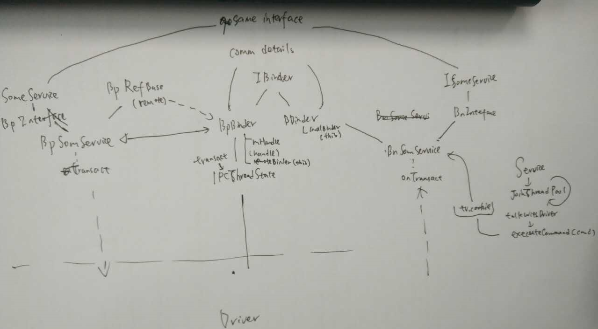
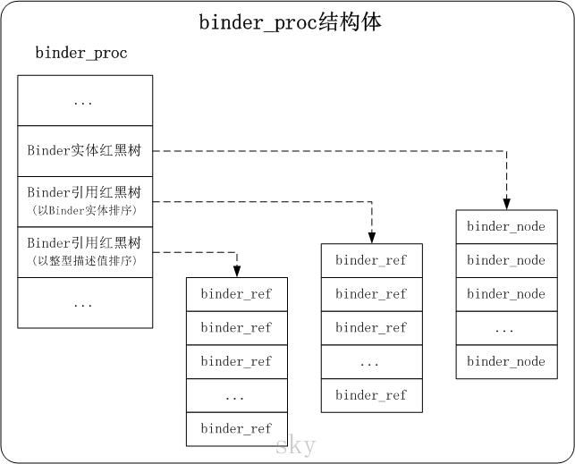
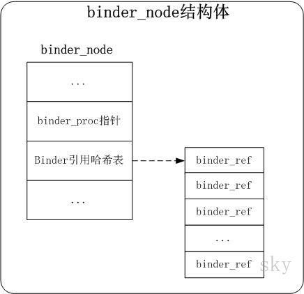
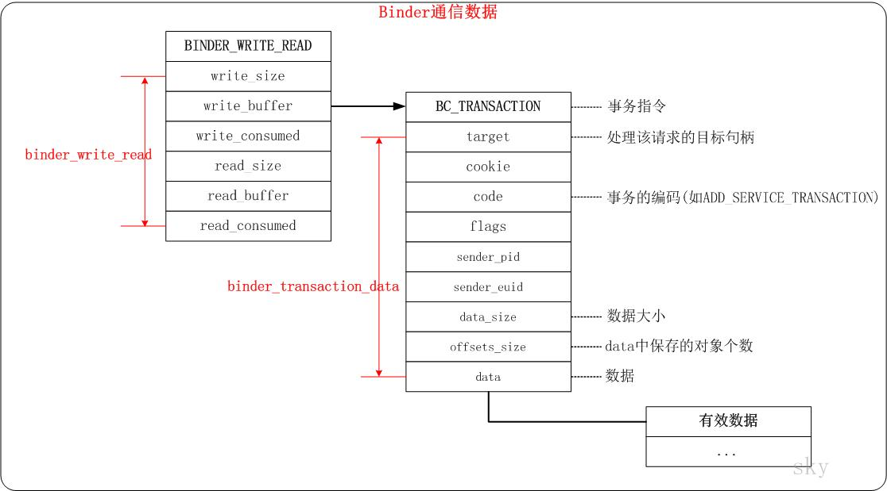

[toc]

[operating system](./operating_system.md)

# logger

* logcat(user space tool)
    * 通过ioctl系统调用与/dev/log/main、/dev/log/events和/dev/log/radio进行交互，从而获取系统日志信息
* logger(kernel space module)
    * misc driver & log_entry & mutex to sync
    * logger与logcat之间通过交互完成通信
* 参考
    * [Android日志系统Logcat源代码简要分析](https://blog.csdn.net/luoshengyang/article/details/6606957)
    * [Android日志系统驱动程序Logger源代码分析](https://blog.csdn.net/luoshengyang/article/details/6595744)

# selinux and seanroid
* SID: security identifiers
* selinux
    * 交互:libselinux通过/sys/fs/selinux内的文件与内核的selinux模块进行交互
    * context与sid:内核并不记忆context，而是保存context对应的sid值，因此在每次查询权限时都会涉及context-sid的转换
* seanroid
    * seandroid其实是selinux的扩展版，但在android系统中
    * 扩展原因：有linux无法表示的apk程序，其context的描述困难
        1. 执行程序
        2. 系统属性，linux中没有property的概率，需要在android中扩充property_contexts
        3. 其他特性，linux同样没有zygote, binder等，需要单独定义
    * [seandroid signflow](./data/android/seandroid-signflow.txt)

# Binder
* 介绍
    * 进程间通信机制
* 设计初衷：
    * 性能：Binder数据拷贝只需要一次，而管道、消息队列、Socket都需要2次，但共享内存方式一次内存拷贝都不需要；从性能角度看，Binder性能仅次于共享内存。
    * 稳定性：Binder是基于C/S架构的，Server端与Client端相对独立，稳定性较好；而共享内存实现方式复杂，没有客户与服务端之别， 需要充分考虑到访问临界资源的并发同步问题，否则可能会出现死锁等问题；
    * 安全性：传统Linux IPC的接收方无法获得对方进程可靠的UID/PID，从而无法鉴别对方身份；Android为每个安装好的应用程序分配了自己的UID。Android系统中对外只暴露Client端，Client端将任务发送给Server端，Server端会根据权限控制策略，判断UID/PID是否满足访问权限，目前权限控制很多时候是通过弹出权限询问对话框，让用户选择是否运行。
* 相比D-Bus
    * 也采用C/S架构的IPC机制，但D-Bus是在用户空间实现的方法，效率低，消息拷贝次数和上下文切换次数都明显多过于Binder。
* 框架细节：
    * binder总体上说，可分为两个部分，底层driver和上层抽象
        * 底层driver类似于unix socket的工作模式，发送数据方将数据流加入service thread的等待队列，唤醒等待的thread，该thread唤醒后将数据上报。相比于unix socket，这种方式的好处是有出色的容错机制
        * 上层抽象则将这种数据流抽象为了标准的RPC方式
    * 上层框架
        * 上层相关代码
            * BSP/android/frameworks/base/include/binder/*
            * BSP/android/frameworks/base/libs/binder/*
        * 结构解析
            * 服务端： 其中BBinder为服务端，其与IPCThreadState进行交互，来完成binder的通信任务，比如talkWithDriver, WaitForResponse等函数均在IPCThreadState中实现，而BnXService则继承了BBinder和BnInterface，及IXService，并实例化对应的结构，最核心的是onTransact，也就是当RPC封装的调用指令和数据来了之后如何进行对应的操作。 一个Binder的Service在开始工作后，势必会先调用JoinThreadPool方法来等待事件的到来
            * 应用端： 同时BpBinder作为应用端，同样与IPCThreadState交互完成通信任务，至于RPC调用，也就是业务逻辑的表达，则由BpInterface和IXService共同承担，最后由它们的共同子类BpXService实例化，最终所有的RPC调用都是通过transact方法发送。
            * ServiceManager： ServiceManager作为一个特殊的Service和其他Service一样，拥有同样的接口特性，但提供的方法为getService和addService，分别由应用端和服务端调用来获取和注册服务。获得ServiceManager的方式为defaultServiceManager，实际创建的应用端对象为new BpServiceManager (new bpbinder(0))，对于一般的service则为new BpSomeService (new bpbinder(handle))，其中handle号为该service的注册号
        
    * 下层框架
        * 下层相关代码
            * BSP/kernel/drivers/staging/android/binder.c
            * BSP/kernel/drivers/staging/android/binder.h
        * 结构解析
            * 主要的思路是，首先进程需要打开/dev/binder设备，该设备是driver虚拟出来的设备，然后通过ioctl进行与driver的交互操作。
        * 实体对象的数据结构包括:
            * 每一个交互的进程有对应的proc，保存在(file)filp->private_data
            * 每一个交互的进程有对应的thread，保存在driver全局的红黑树threads.rb_node中，通过binder_get_thread拿到对应的thread对象
            * 每一个交互的服务有对应的node，结构为binder_node，描述了binder service的状态，以及ptr -> 用户空间地址 cookie -> 用户空间其他信息
            * 每一个交互的应用有对应的ref，结构为binder_ref，描述了使用binder service的某个应用， 有其使用的Node的引用
        * 数据和数据流的结构包括：
            * binder_write_read 既bwr，总体数据
            * binder_transaction_data 事务数据 bwr中的buffer对应binder_transaction_data bt
        * 流程
            * 当应用发送数据到服务端时，将binder_transaction_data t加入到binder_proc的todo list当中
            * 对于binder_transaction函数中的BINDER_TYPE_BINDER 和 BINDER_TYPE_HANDLE分别对应的service端和应用端的发送类型
            * 对于binder_thread_read函数，在等待后进入BINDER_WORK_TRANSACTION_COMPLETE，最后将binder_transaction_data  tr拷贝回用户空间

    

    

    
* 参考
    * [binder.pptx](./data/android/binder.pptx)
    * [binder flow](./data/android/)
    * [为什么 Android 要采用 Binder 作为 IPC 机制？](https://www.zhihu.com/question/39440766)
    * [Android Binder机制(一) Binder的设计和框架](http://wangkuiwu.github.io/2014/09/01/Binder-Introduce/)
    * [Android Binder机制(二) Binder中的数据结构](http://wangkuiwu.github.io/2014/09/02/Binder-Datastruct/)
    * [Android Binder机制(三) ServiceManager守护进程](http://wangkuiwu.github.io/2014/09/03/Binder-ServiceManager-Daemon/)
    * [Android Binder机制(四) defaultServiceManager()的实现](http://wangkuiwu.github.io/2014/09/04/Binder-defaultServiceManager/)

# android ZRAM

[android-zram](./android/zram.md)

