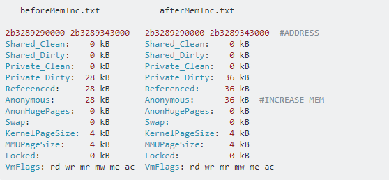

[toc]

[operating system](./operating_system.md)

# 子主题

* [linux_sched](./linux_sched.md)
* [linux_syscall](./linux_syscall.md)
* [linux_mem](./linux_mem.md)
* [linux_fs](./linux_fs.md)

# 发行版

## unix间的区别

||linux|freebsd|solaris|
|---|---|---|---|
|controlled by|community(linus|community|sun|
|license|GPL|freebsd|***|
|support|most platform with latest driver|most platform|sun platform (optimized) and x86|
|侧重点|个人电脑和服务器|服务器端的侧重性<br>ios与freebsd的渊源||
|优势|very ubiquitous, widely supported, huge community support, excellent hardware support|liberal license allows import and development of foreign technologies like ZFS, D-trace and the 'pf' firewall. Technology innovations in SMP performance and storage framework (GEOM).|production-quality mature server OS, home of the ZFS filesystem, services unique to Solaris (kernel-based CIFS + iSCSI). Good performance of ZFS under low-memory conditions.|
|劣势|license obstructs other open source technologies to be imported without technical circumventions|slightly lower hardware compatiblility than Linux, less community support especially to newbies|lowest hardware compatiblility of either three options, company behind it isn't as open-source friendly, unclear future|

参考：[FreeBSD与Linux十个本质上的区别](https://os.51cto.com/art/201012/236797.htm)，[同为开源的类unix系统，为什么FreeBSD远没有Linux流行？](https://www.zhihu.com/question/23713616)

## linux发行版区别

* redhat系列
    * fedora：community驱动，最新，免费
    * centos：redhat当中的某几个稳定版本，community驱动，redhat不提供支持
    * redhat：LTS，redhat发布，稳定，支持需付费
* debian系列
    * debian：used in server
    * ubuntu：used in desktop
* 参考：[The Difference Between Fedora, Redhat, and CentOS](https://danielmiessler.com/study/fedora_redhat_centos/)


# 性能分析和优化

## 诊断分析

### 诊断工具

* perf
    * 可精确查看cache miss/branch miss/cycles/page-fault/context-switch等数据
    * 其利用硬件PMU和内核性能模块进行性能统计
    * 参考：[Perf -- Linux下的系统性能调优工具，第 1 部分](https://www.ibm.com/developerworks/cn/linux/l-cn-perf1/)
    * 参考：[Perf -- Linux下的系统性能调优工具，第 2 部分](https://www.ibm.com/developerworks/cn/linux/l-cn-perf2/)
* vmstat
    * vmstat命令是最常见的Linux/Unix监控工具，可以展现给定时间间隔的服务器的状态值,包括服务器的CPU使用率，内存使用，虚拟内存交换情况,IO读写情况。
    * 参考：[Linux vmstat命令实战详解](http://www.cnblogs.com/ggjucheng/archive/2012/01/05/2312625.html)
* 其他调试命令汇总
    * `slabtop`: check current memory usage by analyzing /proc/slabinfo
    * `pmap`: check memory usage of a process
    * `pgrep`: find process by process name
    * `pidof`: find the pid of a process by process name
    * `ps aHs` & `top -H` check thread sts(tgid(by getpid) = main thread pid, * thread pid(by gettid))
    * `iotop`: check current io busy process
    * `iostat`: get current io status

## 性能优化

### 内存优化

* 内存池(memory pool)
    * To **shorten the time that program allocate memory**. Now I show an example to prove the technology have good efficiency
    * To **avoid memory`s fragment**.
* 内存压缩(无损算法)
    * zram -- linux内核配置
        * 使用场景：交换机等设备变化少，内存增益大
        * 使用LZ0等压缩方式
    * [snappy](http://code.google.com/p/snappy/) -- 压缩库
        * 谷歌内部生产环境中被许多项目使用的压缩库，包括BigTable，MapReduce和RPC
        * 纯文本的压缩率为1.5-1.7，对于HTML是2-4
        * 压缩速度快
    * [FastLZ](http://www.quicklz.com/) -- 压缩库
        * 纯文本压缩率为1.9~2.0
    * [LZO/miniLZO](http://www.oberhumer.com/opensource/lzo/) -- 压缩库
        * 开源的无损压缩C语言库，其优点是压缩和解压缩比较迅速占用内存小
    * 参考：[几个常用快速无损压缩算法性能比较](http://blog.sina.com.cn/s/blog_814e83d801019itv.html)
    * 参考：[huffman coding](../programming/algorithm.md#huffman)

## 故障诊断

### 工具

* **yamd**：查找 C 和 C++ 中动态的、与内存分配有关的问题
* **memwatch**：开放源代码 C 语言内存错误检测工具
* **strace**：显示所有由用户空间程序发出的系统调用
* 参考：[掌握 Linux 调试技术](https://www.ibm.com/developerworks/cn/linux/sdk/l-debug/index.html)

### 内存泄漏

* 查看内存泄漏方法
    * `cat /proc/PID/smaps > befmeminf` 运行时保存内存信息
    * `cat /proc/PID/smaps > aftmeminf` 结束前再次保存
    * `diff befmeminf aftmeminf` 对比差异

    
    
    * 参考：[How can I find a memory leak of a running process?](https://unix.stackexchange.com/questions/36450/how-can-i-find-a-memory-leak-of-a-running-process)
* 分析内存泄漏
    * `memprof` memprof works by pre-loading a library to override the C library’s memory allocation functions and does not require you to recompile your program.

### 日志

* 日志系统
    * 内核日志
        * **printk**: The kernel logs messages (using the `printk()` function) to a ring buffer in kernel space. These messages are made available to user-space applications in two ways: via the `/proc/kmsg` file (provided that /proc is mounted), and via the `sys_syslog` syscall.
        * **get printk msg**: There are two main applications that read (and, to some extent, can control) the kernel's ring buffer: `dmesg(1)` and `klogd(8)`
    * 运行时日志
        * **syslog**: User-space applications normally use the libc function `syslog(3)` to log messages. libc sends these messages to the UNIX domain socket `/dev/log`
    * 参考：[Understand logging in Linux](https://unix.stackexchange.com/questions/205883/understand-logging-in-linux)

# 设备与驱动

## udev

* **what is udev**: It provides a dynamic device directory containing only the files for actually present devices.
    * It creates or removes device node files usually located in the /dev directory, or it renames network interfaces.
    * a udev related file path include:
        * /sbin/udev udev program
        * /etc/udev/* udev config files
        * /etc/hotplug.d/default/udev.hotplug hotplug symlink to udev program
        * /etc/dev.d/* programs invoked by udevudev to automount -- step after udev differs in many ways
* **the general flow** is: kernel -> udev -> dbus -> hal -> gnome-vfs/nautilus (mount) with these work being done:
    * It will automatically mount USB drives on plugin, and shouldn't take much to adapt for Firewire.
    * It uses UDEV, so no monkeying with HAL/DeviceKit/GNOME-Anything.
    * It automatically creates a /media/LABEL directory to mount the device to.
    * 参考：[Automatically mount external drives to /media/LABEL on boot without a user logged in?](https://superuser.com/questions/53978/automatically-mount-external-drives-to-media-label-on-boot-without-a-user-logge)
* **command** use `lsusb` & `dmesg` to check current device info like

# 应用

## 同步问题
<span id="sync-application"></span>

* pthread 同步访问同一资源
    * thread-1

    ```c
    pthread_mutex_lock(&mutex);
    // 设置条件为true
    ... 
    pthread_cond_signal(&cond);  // 条件满足时通知线程二
    pthread_mutex_unlock(&mutex);
    ```

    * thread-2
    
    ```c
    pthread_mutex_lock(&mutex);
    while (条件为false) {
        pthread_cond_wait(&cond, &mutex); // 永久或超时等待线程一通知条件满足
        ... 
    }
    pthread_mutex_unlock(&mutex);
    ```

    * pthread_cond_wait 条件变量
        * pthread_cond_wait()函数一进入wait状态就会自动release mutex.
        * pthread_cond_wait() 一旦wait成功获得cond 条件的时候会自动 lock mutex.
        * 条件变量是用来等待而不是用来上锁的。条件变量用来自动阻塞一个线程，直到某特殊情况发生为止。通常条件变量和互斥锁同时使用。
    * 备注：
        * 1) 第二段代码之所以在pthread_cond_wait外面包含一个while循环不停测试条件是否成立的原因是, 在pthread_cond_wait被唤醒的时候可能该条件已经不成立.参考：[Calling pthread_cond_signal without locking mutex](https://stackoverflow.com/questions/4544234/calling-pthread-cond-signal-without-locking-mutex)
        * 2) pthread_cond_wait调用必须和某一个mutex一起调用, 这个mutex是在外部进行加锁的mutex, 在调用pthread_cond_wait时, 内部的实现将首先将这个mutex解锁, 然后等待条件变量被唤醒, 如果没有被唤醒, 该线程将一直休眠, 也就是说, 该线程将一直阻塞在这个pthread_cond_wait调用中, 而当此线程被唤醒时, 将自动将这个mutex加锁.
    * 参考：[互斥量、条件变量与pthread_cond_wait()函数的使用](https://blog.csdn.net/cnclenovo/article/details/44589221)
* 多进程读写同一文件
    * 概念
        * **两个线程同时write一个文件是不会冲突**。所有的系统调用都是原子性的：All system calls are executed atomically. By this, we mean that the kernel guarantees that all of the steps in a system call are completed as a single operation, without being interrupted by another process of thread。
        * **多个系统调用写文件会冲突，使用文件的O_APPEND解决**。比如以下代码：
        
        ```c
        lseek(fd,0,SEEK_END); //seek to the end of the file
        write(fd,"log message",len); //perform the write
        ```

        * **多个库函数写文件存在冲突**。
            * 如果同时向同一个文件的同一片区域写入，势必出问题，一来写的结果可能被覆盖，二来写操作可能交替进行导致结果不可辨识。
            * 如果同时向同一个文件的不同区域写入，直接使用syscall，不会有问题，因为系统只有该文件的一份cache。
            * 如果同时向同一个文件的不同区域写入，使用运行时库或者其他中间平台提供的api，则结果不可预测，因为可能中间会有额外的cache，cache不一致的直接后果就是结果不可知。
    * 如何加锁
    * **advisory lock -- 若想对文件加锁访问，则使用flock和fcntl**。`flock()`：文件级别的锁，针对整个文件进行加锁。`fcntl()`函数：段级别的锁，能够针对文件的某个部分进行加锁。
    * **mandatory lock**.mandatory file lock need to mount the filesystem with -o option and set special mode of the file you want to lock
        * `mount -oremount,mand / chmod g+s,g-x mandatory.txt`
    * **最复杂完美的方式为类似于Linux日志文件服务**。启动一个logger进程，其他进程向logger发消息，即把数据发送给logger，由logger来写文件，这种方法最安全，但是实现上相对复杂
    * 参考
        * [Is lock-free logging safe?](https://www.jstorimer.com/blogs/workingwithcode/7982047-is-lock-free-logging-safe)
        * [Linux 多进程读写文件 文件锁](http://blog.chinaunix.net/uid-11572501-id-4126870.html)
        * [2 Types of Linux File Locking](https://www.thegeekstuff.com/2012/04/linux-file-locking-types/)
* 各类同步机制区别
    * mutex: 调用进程可以sleep 一个进程进入临界区
    * semaphore: 调用进程可以sleep 多个进程可进入临界区（主要的应用是共享内存方式的进程间通信）
    * spin_lock: 调用进程不可以sleep 针对小资源 一个进程进入临界区
    * 三者在内核中均基于spinlock实现
    * 应用差异
        * **使用cond时，线程间存在依赖关系**。**只使用mutex时，线程间为对等关系**。
        * cond适用于event或者说是edge triggered event或者切换状态，是多个使用者均在等待一个即将出现的资源
        * lock则使用与已有资源，计数等，可以理解为level triggered event，是多个使用者轮番使用某个已有资源。
    * 参考
        * [信号量、互斥体和自旋锁](https://www.cnblogs.com/biyeymyhjob/archive/2012/07/21/2602015.html)
        * [pthread_cond_wait and mutex requirement](https://stackoverflow.com/questions/6312342/pthread-cond-wait-and-mutex-requirement)

<span id="async-safety"></span>

* 可重入&线程安全
    * 可重入
        * 定义：可以被中断；除了使用自己栈上的变量以外不依赖于任何环境（包括static）；可以允许有多个该函数的副本在运行
        * 应用：Linux 中可重入这个概念一般只有在 signal 的场景下有意义，叫 async-signal-safe。
    * 区别
        * async-signal safe is stronger because **two invocations of the function can be in the same thread**.
        * 很多线程安全的函数都是不可重入的，例如 malloc,printf。因此，一个函数不可重入是因为1.使用了全局或静态变量2.调用了malloc/free3.调用了标准I/O函数
        * 可重入的函数一般也是线程安全的，反例：（signal中包含和thread同样的Lock，参见：[异步可重入函数与线程安全函数等价吗？](https://www.zhihu.com/question/21526405)）。
        * Posix中大多数函数都是线程安全的，但只有少数是 async-signal-safe。
    * 影响
        * signal handler中不能写printf，因为printf不是可重入的，如果调用printf的过程中进入signal handler并再次执行printf，此时状态将异常
        * signal handler中也不能加上与程序同样的锁，因为会出现deadlock
    * 参考
        * [C Thread Safe and Reentrant Function Examples](https://www.thegeekstuff.com/2012/07/c-thread-safe-and-reentrant/)
        * [What exactly is a reentrant function?](https://stackoverflow.com/questions/2799023/what-exactly-is-a-reentrant-function)
        * [Signal Handlers and Async-Signal Safety](http://www.shrubbery.net/solaris9ab/SUNWdev/MTP/p37.html)
        * [signal in schedule](./linux_sched.md#signal)
* 各平台线程复位机制
    * 条件变量的置位和复位有两种常用模型：第一种模型是当条件变量置位（signaled）以后，如果当前没有线程在等待，其状态会保持为置位（signaled），直到有等待的线程进入被触发，其状态才会变为复位（unsignaled），这种模型的采用以 Windows 平台上的 Auto-set Event 为代表。其状态变化如图所示：

    

    * 第二种模型则是 Linux 平台的 Pthread 所采用的模型，当条件变量置位（signaled）以后，即使当前没有任何线程在等待，其状态也会恢复为复位（unsignaled）状态。其状态变化如图所示：具体来说，Linux 平台上 Pthread 下的条件变量状态变化模型是这样工作的：调用 pthread_cond_signal() 释放被条件阻塞的线程时，无论存不存在被阻塞的线程，条件都将被重新复位，下一个被条件阻塞的线程将不受影响。而对于 Windows，当调用 SetEvent 触发 Auto-reset 的 Event 条件时，如果没有被条件阻塞的线程，那么条件将维持在触发状态，直到有新的线程被条件阻塞并被释放为止。

    

    * 参考：[Linux 的多线程编程的高效开发经验](https://www.ibm.com/developerworks/cn/linux/l-cn-mthreadps/)
* 惊群效应
    * 什么是惊群效应？
        * 举一个很简单的例子，当你往一群鸽子中间扔一块食物，虽然最终只有一个鸽子抢到食物，但所有鸽子都会被惊动来争夺，没有抢到食物的鸽子只好回去继续睡觉，等待下一块食物到来。这样，每扔一块食物，都会惊动所有的鸽子，即为惊群。对于操作系统来说，多个进程/线程在等待同一资源是，也会产生类似的效果，其结果就是每当资源可用，所有的进程/线程都来竞争资源，造成的后果：
        * 1）系统对用户进程/线程频繁的做无效的调度、上下文切换，系统系能大打折扣。
        * 2）为了确保只有一个线程得到资源，用户必须对资源操作进行加锁保护，进一步加大了系统开销。
    * 示例
        * 最常见的例子就是对于socket描述符的accept操作，当多个用户进程/线程监听在同一个端口上时，由于实际只可能accept一次，因此就会产生惊群现象，当然前面已经说过了，这个问题是一个古老的问题，但目前的内核版本已经修复了这个问题，一个链接过来，内核只会唤醒一个子进程出来accept，这样就不用担心惊群效应了。
        
        ```c
        pthread_mutex_lock(&thrp->pool_mutex);
        while (thrp->cur_work_size == 0) {
        pthread_cond_wait(&thrp->pool_cond, &thrp->pool_mutex);
        }
        pthread_mutex_unlock(&thrp->pool_mutex);
        ```

        * 为什么要使用while循环呢？因为pthread_cond_signal有可能会同时唤醒多个线程，为了让只有一个线程进入临界区，必须添加while进行唤醒后的判断工作
    * 参考：[惊群问题的思考](http://www.cppblog.com/isware/archive/2011/07/20/151470.html)
* 其他链接
    * [futex](./linux_syscall.md#mutex-syscall)

# 其他

* Basic Data Structures and Algorithms in the Linux kernel
	1. [Linked list](https://github.com/torvalds/linux/blob/master/lib/llist.c), [doubly linked list](https://github.com/torvalds/linux/blob/master/include/linux/list.h), [lock-free linked list](https://github.com/torvalds/linux/blob/master/include/linux/llist.h).
	2. [B+ Trees](https://github.com/torvalds/linux/blob/39caa0916ef27cf1da5026eb708a2b8413156f75/lib/btree.c) with comments telling you what you can't find in the textbooks.
	3. [Priority sorted lists](https://github.com/torvalds/linux/blob/master/include/linux/plist.h) used for [mutexes](https://github.com/torvalds/linux/blob/b3a3a9c441e2c8f6b6760de9331023a7906a4ac6/include/linux/rtmutex.h), [drivers](https://github.com/torvalds/linux/blob/f0d55cc1a65852e6647d4f5d707c1c9b5471ce3c/drivers/powercap/intel_rapl.c), etc.
	4. [Red-Black trees](https://github.com/torvalds/linux/blob/master/include/linux/rbtree.h) are used for scheduling, virtual memory management, to track file descriptors and directory entries,etc.
	5. [Interval trees](https://github.com/torvalds/linux/blob/master/include/linux/interval_tree.h)
	6. [Radix trees](https://github.com/torvalds/linux/blob/master/include/linux/radix-tree.h), are used for [memory management](https://lwn.net/Articles/175432/), NFS related lookups and networking related functionality. A common use of the radix tree is to store pointers to struct pages;
	7. [Priority heap](https://github.com/torvalds/linux/blob/b3a3a9c441e2c8f6b6760de9331023a7906a4ac6/include/linux/prio_heap.h), which is literally, a textbook implementation, used in the [control group system](https://github.com/torvalds/linux/blob/42a2d923cc349583ebf6fdd52a7d35e1c2f7e6bd/include/linux/cgroup.h). Simple insertion-only static-sized priority heap containing pointers, based on CLR, chapter 7
	8. [Hash functions](https://github.com/torvalds/linux/blob/b3a3a9c441e2c8f6b6760de9331023a7906a4ac6/include/linux/hash.h), with a reference to Knuth and to a paper.
	9.  [Hash tables](https://github.com/torvalds/linux/blob/master/include/linux/hashtable.h) used to implement [inodes](https://github.com/torvalds/linux/blob/42a2d923cc349583ebf6fdd52a7d35e1c2f7e6bd/fs/inode.c), [file system integrity checks](https://github.com/torvalds/linux/blob/ff812d724254b95df76b7775d1359d856927a840/fs/btrfs/check-integrity.c) etc.
	11. [Bit arrays](https://github.com/torvalds/linux/blob/master/include/linux/bitmap.h), which are used for dealing with flags, interrupts, etc. and are featured in Knuth Vol. 4.
	12. [Semaphores](https://github.com/torvalds/linux/blob/master/include/linux/semaphore.h) and [spin locks](https://github.com/torvalds/linux/blob/master/include/linux/spinlock.h)
	13. [Binary search](https://github.com/torvalds/linux/blob/master/lib/bsearch.c) is used for [interrupt handling](https://github.com/torvalds/linux/blob/b3a3a9c441e2c8f6b6760de9331023a7906a4ac6/drivers/sh/intc/chip.c), [register cache lookup](https://github.com/torvalds/linux/blob/10d0c9705e80bbd3d587c5fad24599aabaca6688/drivers/base/regmap/regcache.c), etc.
	14. [Binary search with B-trees](https://github.com/torvalds/linux/blob/b3a3a9c441e2c8f6b6760de9331023a7906a4ac6/fs/befs/btree.c)
	15. [Depth first search](https://github.com/torvalds/linux/blob/a9238741987386bb549d61572973c7e62b2a4145/drivers/acpi/acpica/nswalk.c) and variant used in [directory configuration](https://github.com/torvalds/linux/blob/b3a3a9c441e2c8f6b6760de9331023a7906a4ac6/fs/configfs/dir.c).
	16. [Breadth first search](https://github.com/torvalds/linux/blob/4fbf888accb39af423f271111d44e8186f053723/kernel/locking/lockdep.c) is used to check correctness of locking at runtime.
	17. [Merge sort](https://github.com/torvalds/linux/blob/master/lib/list_sort.c) on linked lists is used for [garbage collection](https://github.com/torvalds/linux/blob/42a2d923cc349583ebf6fdd52a7d35e1c2f7e6bd/fs/ubifs/gc.c), [file system management](https://github.com/torvalds/linux/blob/ff812d724254b95df76b7775d1359d856927a840/fs/btrfs/raid56.c), etc.
	18. [Bubble sort](https://github.com/torvalds/linux/blob/b3a3a9c441e2c8f6b6760de9331023a7906a4ac6/drivers/media/common/saa7146/saa7146_hlp.c) is amazingly implemented too, in a driver library.
	19. [Knuth-Morris-Pratt string matching](https://github.com/torvalds/linux/blob/b3a3a9c441e2c8f6b6760de9331023a7906a4ac6/lib/ts_kmp.c)
	20.  [Boyer-Moore pattern matching](https://github.com/torvalds/linux/blob/b3a3a9c441e2c8f6b6760de9331023a7906a4ac6/lib/ts_bm.c) with references and recommendations for when to prefer the alternative.
* linux内核发展
    * 现在的 Linux 内核和 Linux 2.6 的内核有多大区别？
        * 版本
            * 2.6 时代跨度非常大，从2.6.0 (2003年12月发布[36]) 到 2.6.39(2011年5月发布), 跨越了 40 个大版本。
            * 3.0(原计划的 2.6.40, 2011年7月发布) 到 3.19（2015年2月发布）。
            * 4.0（2015年4月发布）到4.2（2015年8月底发布）。
        * 调度
            * 抢占支持(preemption)。可抢占性，对一个系统的调度延时具有重要意义。2.6 之前，一个进程进入内核态后，别的进程无法抢占，只能等其完成或退出内核态时才能抢占, 这带来严重的延时问题，2.6 开始支持内核态抢占。
                * 为什么需要内核抢占：实时操作系统的需求。此外，如果内核处于相对耗时的操作中, 比如文件系统或者内存管理相关的任务, 内核代替特定的进程执行相当长的时间, 而其他进程无法执行, 无法调度。比如如果多媒体应用长时间无法得到CPU, 则可能发生视频和音频漏失现象.
            * 完全公平的调度器(CFS)。新调度器的核心同样是完全公平性, 即平等地看待所有普通进程，让它们自身行为彼此区分开来，从而指导调度器进行下一个执行进程的选举。CFS 的测试性能比 RSDS 好，并得到更多的开发者支持，所以它最终替代了 RSDL 在 2.6.23 进入内核，一直使用到现在。
            * SCHED_BATCH调度。适用于CPU密集型任务。
        * 内存
            * 按需预读(On-demand Readahead) 2.6.23(2007年10月发布)。固定的128 KB预读方案显然不是最优的. 它没有考虑系统内存使用状况和进程读取情况. 当内存紧张时, 过度的预读其实是浪费, 预读的页面可能还没被访问就被踢出去了. 还有, 进程如果访问得凶猛的话, 且内存也足够宽裕的话, 128KB又显得太小家子气了.
            * 大内存页支持。虚拟地址的翻译要经过页表的翻译, CPU为了支持快速的翻译操作, 引入了TLB的概念它本质就是一个页表翻译地址结果的缓存, 每次页表翻译后的结果会缓存其中, 下一次翻译时会优先查看TLB, 如果存在, 则称为TLB hit; 否则称为TLB miss, 就要从访问内存, 从页表中翻译. 由于这是一个CPU内机构, 决定了它的尺寸是有限的, 好在由于程序的局部性原理, TLB 中缓存的结果很大可能又会在近期使用.但 TLB 空间依然局限, 4KB大小的页面捉襟见肘。
                * HUGETLB支持，系统启动时, 按照用户指定需求的最大大页个数, 每个页的大小. 预留如此多个数的大. 用户在程序中可以使用 mmap() 系统调用或共享内存的方式访问这些大页。参考官方文档:[hugetlbpage.txt](https://lwn.net/Articles/375098/) ，[Huge pages part 2: Interfaces](https://lwn.net/Articles/375096/)
                * 透明大页的支持 2.6.38(2011年3月发布)。在缺页中断中, 内核会尝试分配一个大页, 如果失败(比如找不到这么大一片连续物理页面), 就还是回退到之前的做法: 分配一个小页. 在系统内存紧张需要交换出页面时, 由于前面所说的根植内核的4KB页面大小的因, MM 会透明地把大页分割成小页再交换出去.
            * 内存控制组(Memory Cgroup)支持 2.6.25(2008年4月发布)。是资源隔离的基础，用于docker等。
            * ZRAM 3.14(2014年3月发布)
* 参考
    * [操作系统内核具体实现中比较巧妙的思想有哪些？](https://www.zhihu.com/question/27943222)
    * [现在的 Linux 内核和 Linux 2.6 的内核有多大区别？](https://www.zhihu.com/question/35484429)
