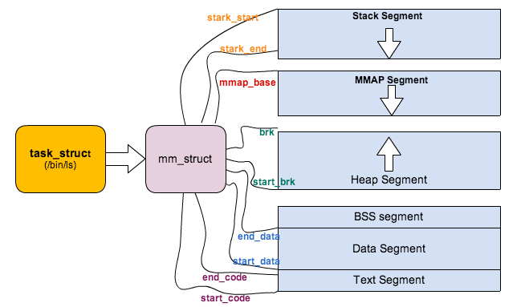
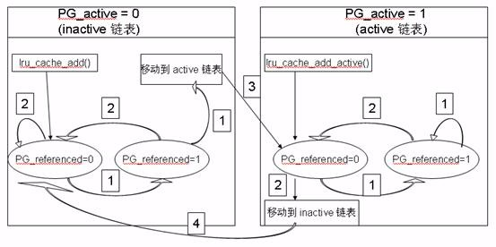

[toc]

[operating system](./operating_system.md)

# 发行版

## unix间的区别

||linux|freebsd|solaris|
|---|---|---|---|
|controlled by|community(linus|community|sun|
|license|GPL|freebsd|***|
|support|most platform with latest driver|most platform|sun platform (optimized) and x86|
|侧重点|个人电脑和服务器|服务器端的侧重性<br>ios与freebsd的渊源||
|优势|very ubiquitous, widely supported, huge community support, excellent hardware support|liberal license allows import and development of foreign technologies like ZFS, D-trace and the 'pf' firewall. Technology innovations in SMP performance and storage framework (GEOM).|production-quality mature server OS, home of the ZFS filesystem, services unique to Solaris (kernel-based CIFS + iSCSI). Good performance of ZFS under low-memory conditions.|
|劣势|license obstructs other open source technologies to be imported without technical circumventions|slightly lower hardware compatiblility than Linux, less community support especially to newbies|lowest hardware compatiblility of either three options, company behind it isn't as open-source friendly, unclear future|

参考：[FreeBSD与Linux十个本质上的区别](https://os.51cto.com/art/201012/236797.htm)，[同为开源的类unix系统，为什么FreeBSD远没有Linux流行？](https://www.zhihu.com/question/23713616)

## linux发行版区别

* redhat系列
    * fedora：community驱动，最新，免费
    * centos：redhat当中的某几个稳定版本，community驱动，redhat不提供支持
    * redhat：LTS，redhat发布，稳定，支持需付费
* debian系列
    * debian：used in server
    * ubuntu：used in desktop
* 参考：[The Difference Between Fedora, Redhat, and CentOS](https://danielmiessler.com/study/fedora_redhat_centos/)


# 性能分析和优化

## 诊断分析

### 诊断工具

* perf
    * 可精确查看cache miss/branch miss/cycles/page-fault/context-switch等数据
    * 其利用硬件PMU和内核性能模块进行性能统计
    * 参考：[Perf -- Linux下的系统性能调优工具，第 1 部分](https://www.ibm.com/developerworks/cn/linux/l-cn-perf1/)
    * 参考：[Perf -- Linux下的系统性能调优工具，第 2 部分](https://www.ibm.com/developerworks/cn/linux/l-cn-perf2/)
* vmstat
    * vmstat命令是最常见的Linux/Unix监控工具，可以展现给定时间间隔的服务器的状态值,包括服务器的CPU使用率，内存使用，虚拟内存交换情况,IO读写情况。
    * 参考：[Linux vmstat命令实战详解](http://www.cnblogs.com/ggjucheng/archive/2012/01/05/2312625.html)
* 其他调试命令汇总
    * `slabtop`: check current memory usage by analyzing /proc/slabinfo
    * `pmap`: check memory usage of a process
    * `pgrep`: find process by process name
    * `pidof`: find the pid of a process by process name
    * `ps aHs` & `top -H` check thread sts(tgid(by getpid) = main thread pid, * thread pid(by gettid))
    * `iotop`: check current io busy process
    * `iostat`: get current io status

## 性能优化

### 内存优化

* 内存池(memory pool)
    * To **shorten the time that program allocate memory**. Now I show an example to prove the technology have good efficiency
    * To **avoid memory`s fragment**.
* 内存压缩(无损算法)
    * zram -- linux内核配置
        * 使用场景：交换机等设备变化少，内存增益大
        * 使用LZ0等压缩方式
    * [snappy](http://code.google.com/p/snappy/) -- 压缩库
        * 谷歌内部生产环境中被许多项目使用的压缩库，包括BigTable，MapReduce和RPC
        * 纯文本的压缩率为1.5-1.7，对于HTML是2-4
        * 压缩速度快
    * [FastLZ](http://www.quicklz.com/) -- 压缩库
        * 纯文本压缩率为1.9~2.0
    * [LZO/miniLZO](http://www.oberhumer.com/opensource/lzo/) -- 压缩库
        * 开源的无损压缩C语言库，其优点是压缩和解压缩比较迅速占用内存小
    * 参考：[几个常用快速无损压缩算法性能比较](http://blog.sina.com.cn/s/blog_814e83d801019itv.html)
    * 参考：[huffman coding](../programming/algorithm.md#huffman)

## 故障诊断

### 工具

* **yamd**：查找 C 和 C++ 中动态的、与内存分配有关的问题
* **memwatch**：开放源代码 C 语言内存错误检测工具
* **strace**：显示所有由用户空间程序发出的系统调用
* 参考：[掌握 Linux 调试技术](https://www.ibm.com/developerworks/cn/linux/sdk/l-debug/index.html)

### 日志

* 日志系统
    * 内核日志
        * **printk**: The kernel logs messages (using the `printk()` function) to a ring buffer in kernel space. These messages are made available to user-space applications in two ways: via the `/proc/kmsg` file (provided that /proc is mounted), and via the `sys_syslog` syscall.
        * **get printk msg**: There are two main applications that read (and, to some extent, can control) the kernel's ring buffer: `dmesg(1)` and `klogd(8)`
    * 运行时日志
        * **syslog**: User-space applications normally use the libc function `syslog(3)` to log messages. libc sends these messages to the UNIX domain socket `/dev/log`
    * 参考：[Understand logging in Linux](https://unix.stackexchange.com/questions/205883/understand-logging-in-linux)

# 系统调用

* [各平台系统调用指令](http://man7.org/linux/man-pages/man2/syscall.2.html)
* [mprotect](http://man7.org/linux/man-pages/man2/mprotect.2.html)
    * changes the access protections for the calling process's memory pages containing any part of the address range in the interval
    * 用处：动态设置某个mmap的memory区域为可执行
    * 用法:
        * 1.run code in executable heap:
            * get page size: `sysconf(_SC_PAGE_SIZE)`
            * create a heap region: `memalign(PAGESIZE * x)`
            * set it to executable: `mprotect(ptr, 4 * pagesize, PROT_READ | PROT_WRITE | PROT_EXEC) == -1`
        * 2.run code in a executable vma:
            * `void* mptr = mmap(0,4096,PROT_READ|PROT_WRITE|PROT_EXEC,MAP_PRIVATE|MAP_ANON,-1,0);`
* pread
    * Pread() works just like read() but reads from the specified position in the file without modifying the file pointer.
* `siglongjmp` & `sigsetjmp`  `getcontext` & `setcontext`
    * [`siglongjmp`](http://man7.org/linux/man-pages/man3/siglongjmp.3.html) & `sigsetjmp`
        * The setjmp() function saves various information about the calling environment
        *  The longjmp() function uses the information saved in env to transfer control back to the point where setjmp() was called and to restore ("rewind") the stack to its state at the time of the setjmp() call.
    * [`getcontext`](http://man7.org/linux/man-pages/man3/getcontext.3.html) & `setcontext`
        * The setcontext() function restores the user context pointed to by ucp. A successful call to setcontext() does not return; program execution resumes at the point specified by the ucp argument passed to setcontext().
    * 比较：两者成对出现，具体说明可以参见libc或者bionic，用于保存上下文状态，siglongjmp一组更多用于signal的处理，但两者的用途都是一样的。其中android平台并不支持getcontext。
    * 演进过程： `setjmp` & `longjmp` ---> `siglongjmp` & `sigsetjmp` --->  `getcontext` & `setcontext`
    * 参考：[setcontext wiki](https://en.wikipedia.org/wiki/Setcontext)
    * 参考代码：
        ```
        ~/repo_44/android/bionic/libc/kernel/arch-arm/asm/user.h
        ~/repo_44/android/bionic/libc/kernel/arch-arm/asm/ptrace.h
        ~/repo_44/android/bionic/libc/arch-arm/bionic/syscall.S
        ~/repo_44/android/bionic/libc/include/sys/syscall.h
        ~/repo_44/kernel/kernel/ptrace.c
        ~/repo_44/kernel/arch/arm/kernel/ptrace.c
        ~/repo_44/kernel/arch/arm/include/uapi/asm/ptrace.h
        ~/repo_44/android/bionic/libc/arch-arm/include/machine/setjmp.h
        ```
<span id="mutex-syscall"></span>

* semop & [futex](http://man7.org/linux/man-pages/man2/futex.2.html)
    * 锁机制概述
        * Mutex provide mutual exclusion by having a memory area which can toggle between locked and unlocked atomically. The memory resides in user space but the toggling happens through a system call inside the kernel. The reason why the system call is required (and hence heavy weight) is because:
            * WAKE - The kernel has to schedule the next thread in the wait queue
            * WAIT - All accesses to the lock are guarded and queued through a single point of synchronization - the kernel.
    * semop
        * 传统的SystemV IPC(inter process communication)进程间同步机制都是通过内核对象来实现的，以 semaphore 为例，当进程间要同步的时候，必须通过系统调用semop(2)进入内核进行PV操作。系统调用的缺点是开销很大，需要从user mode切换到kernel mode、保存寄存器状态、从user stack切换到kernel stack、等等，通常要消耗上百条指令。
    * futex
        * futex (fast userspace mutex) 是Linux的一个基础组件，可以用来构建各种更高级别的同步机制，比如锁或者信号量等等，POSIX信号量就是基于futex构建的。大多数时候编写应用程序并不需要直接使用futex，一般用基于它所实现的系统库就够了。
        * futex的解决思路是：**在无竞争的情况下操作完全在user space进行，不需要系统调用，仅在发生竞争的时候进入内核去完成相应的处理(wait 或者 wake up)**。所以说，futex是一种user mode和kernel mode混合的同步机制，需要两种模式合作才能完成，futex变量必须位于user space，而不是内核对象，futex的代码也分为user mode和kernel mode两部分，无竞争的情况下在user mode，发生竞争时则通过sys_futex系统调用进入kernel mode进行处理
        * Futex isn't the same as mutex. It provides **a wait queue technique accessible in the user space**. **Pthread Mutex** in the latest Linux distributions are implemented through Futex logic.
        * futex代码示例
        ```c
        pthread_mutex_lock
            if mutex type is MUTEX_TYPE_NORMAL -> _normal_lock
                if (__atomic_cmpxchg(shared|0, shared|1, &mutex->value ) != 0) {  -->如果value不为0(unlock)，进入下一步，如果value为0，把value设置为1（lock）
                while (__atomic_swap(shared|2, &mutex->value ) != (shared|0))  -->将value设置为2（contend），返回值为过去的value，如果不为0继续睡，注意当被唤醒后value依旧被设置为2
                        __futex_wait_ex(&mutex->value, shared, shared|2, 0);   -->等待被唤醒，如果value为2(contend)，则继续睡
            ANDROID_MEMBAR_FULL(); --> do { __asm__ __volatile__ ("mfence" ::: "memory"); } while (0) sync和reload所有的cache
        ```
            
        ```c
        pthread_mutex_unlock
        ANDROID_MEMBAR_FULL
        if (__atomic_dec(&mutex->value) != (shared|1)) {  -->对value进行减1操作，并将过去的value值与1（lock）比较，如果存在竞态，需要进一步唤醒在sleep的竞争者
            mutex->value = shared;  -->设置value为0, 与lock的while循环判断条件对应
            __futex_wake_ex(&mutex->value, shared, 1);  -->唤醒
        ```

        ```c
        pthread_cond_wait
        pthread_mutex_unlock(mutex);
        status = __futex_wait_ex(&cond->value, COND_IS_SHARED(cond), oldvalue, reltime);
        pthread_mutex_lock(mutex);
        由于futex可能会被误唤醒，所以唤醒后需要添加判断条件以确保被正确唤醒
        pthread_mutex_lock
        while(cond not come)  pthread_cond_wait
        pthread_mutex_unlock
        ```

        * `__atomic_cmpxchg`在arm中是通过`ldrex`和`strex`独占指令实现的，可参见[arm读写指令](./soc.md#ldr-str)，具体实现可参见src：[pthread.c](https://android.googlesource.com/platform/bionic/+/10ce969/libc/bionic/pthread.c),[bionic_atomic_arm.h](https://android.googlesource.com/platform/bionic/+/e31bfae2baa96742f998155ee26e56c826a8ce3a/libc/private/bionic_atomic_arm.h)
        * 总的来说，当前大多数用户态的锁都是通过futex系统调用实现的，目前的分工是：**用户态负责维护lock state**(like the value of futex is waiting, 0 for no contend, 1 for locked, 2 for contended)；而**内核则只负责维护process waiter queue**
        * 此外，用户态在实现锁操作时，在wait and check中一般会有retry机制，也就是上文中的：这种机制保证了checkpoint时虽然只保存了用户态锁状态，但当restart时，thread在从signal handler返回到kernel后，会立马返回到user space携带EINTR,且等待条件不满足，因而继续wait，调用futex，内核态waiter queue得以建立。

        ```c
        while (__atomic_swap(shared|2, &mutex->value ) != (shared|0)) -->将value设置为2（contend），返回值为过去的value，如果不为0继续睡，注意当被唤醒后value依旧被设置为2
            __futex_wait_ex(&mutex->value, shared, shared|2, 0); -->等待被唤醒，如果value为2(contend)，则继续睡
        ```

    * 参考：[How different is a futex from mutex - conceptually and also implementation wise?](https://www.quora.com/How-different-is-a-futex-from-mutex-conceptually-and-also-implementation-wise)
    * 参考：futex在android pthread中的应用，[同步应用](#sync-application)
    * 参考：pthread相关代码实现
        ```
        ~/repo_ics/android/bionic/libc/arch-arm/bionic/clone.S
        ~/repo_ics/android/bionic/libc/arch-arm/syscalls/_exit_thread.S
        ~/repo_ics/android/bionic/libc/arch-arm/syscalls/__set_tls.S
        ~/repo_ics/android/bionic/libc/bionic/pthread.c
        ~/repo_44/kernel/arch/arm/kernel/ptrace.c
        ~/repo_44/kernel/arch/arm/kernel/calls.S
        ~/repo_44/kernel/kernel/fork.c
        ~/repo_44/kernel/arch/arm/kernel/process.c
        ~/repo_44/kernel/arch/arm/include/asm/thread_info.h
        ~/repo_44/kernel/arch/arm/include/linux/sched.h
        ~/repo_44/kernel/arch/arm/include/asm/processor.h
        ~/repo_44/kernel/arch/arm/include/asm/ptrace.h
        ~/repo_44/kernel/arch/arm/include/asm/tls.h
        ~/repo_44/kernel/include/linux/regset.h
        ```
* exec
    * execve为内核级系统调用，其他（execl，execle，execlp，execv，execvp）都是调用execve的库函数
    * exec系列中，**e代表指定环境变量**，**v指代参数list**,**p指代PATH**
        * The `execv()`, `execvp()`, and `execvpe()` functions provide an array of pointers to **null-terminated strings that represent the argument list** available to the new program.
            * The first argument, by convention, should point to the filename associated with the file being executed. The array of pointers must be terminated by a NULL pointer.
        * The `execle()` and `execvpe()` functions allow the caller to **specify the environment** of the executed program via the argumentenvp.
        * The `execlp()`, `execvp()`, and `execvpe()` functions duplicate the actions of the shell in searching for an executable file if the specified filename does not contain a slash (/) character. The file is sought in the colon-separated list of directory pathnames specified **in the PATH environment variable**.
    * execlp中不能使用重定向(why can't use output redirection in execlp)
        * 比如`execl("/usr/bin/hexdump", "hexdump", "/dev/input/mice", ">", "/dev/ttyS0", (char*) NULL);`
        * 因为execl中没有shell的环境(as execl input has no shell system or environment, if what to redirect, you could)，以下方法可以解决：
            * `system("command > output terminal")`
            * `exel("/system/bin/sh", "sh", "command", ">", "output terminal")` to invoke shell to work
            * use dup to redirect Output redirection using fork() and execl()  execl() + redirecting output to text files
* [chrt](http://man7.org/linux/man-pages/man1/chrt.1.html)
    * chrt change the real-time attributes of a process(priority, schedule type, etc)

<span id="setuid"></span>

* [setuid](http://man7.org/linux/man-pages/man2/setuid.2.html)
    * uid/gid：真实的用户、组（uid、gid）：进程的真正所有者。每当用户在shell终端登录时，都会将登录用户作为登录进程的真正所有者。
    * euid/egid：有效的用户、组（euid、egid）：进程的有效用户、组。进程所执行各种操作所允许的权限（process credentials）是依据进程的有效用户来判断的
    * situation of euid=0(root)
        * `setuid` will permanently changes the uid
        * `seteuid` temporarily changes uid and then use `setuid(0)` to change it back
    * situation of euid>0(not root)
        * `setuid/seteuid` changes its effective uid to only its original euid uid or suid
    * 参考：[sudo&su](../tool/shell.md#sudo-su)，[特殊权限](../tool/shell.md#specialperm)
* sigpending
    * sigpending() user space has interface of pending signals and record it
    * returns the set of signals that are pending for delivery to the calling thread
* prctl
    * get process name
    * prctl() is called with a first argument describing what to do (with values defined in \<linux/prctl.h\>), and further arguments with a significance depending on the first one
* [ptrace](http://man7.org/linux/man-pages/man2/ptrace.2.html)
    * The `ptrace()` system call provides a means by which one process (the "tracer") may observe and control the execution of another process (the "tracee"), and examine and change the tracee's memory and registers.  It is primarily used to implement breakpoint debugging and system call tracing.
    * strace就是使用了ptrace系统调用实现的工具，可使用ptrace实现一个简易的strace工具，参考[Write yourself an strace in 70 lines of code](https://blog.nelhage.com/2010/08/write-yourself-an-strace-in-70-lines-of-code/)
    
    ```c
    int main(int argc, char **argv) {
        if (argc < 2) {
            fprintf(stderr, "Usage: %s prog args\n", argv[0]);
            exit(1);
        }

        pid_t child = fork();
        if (child == 0) {
            return do_child(argc-1, argv+1);
        } else {
            return do_trace(child);
        }
    }

    int do_child(int argc, char **argv) {
        char *args [argc+1];
        memcpy(args, argv, argc * sizeof(char*));
        args[argc] = NULL;

        ptrace(PTRACE_TRACEME);
        kill(getpid(), SIGSTOP);
        return execvp(args[0], args);
    }

    int wait_for_syscall(pid_t child);

    int do_trace(pid_t child) {
        int status, syscall, retval;
        waitpid(child, &status, 0);
        ptrace(PTRACE_SETOPTIONS, child, 0, PTRACE_O_TRACESYSGOOD);
        while(1) {
            if (wait_for_syscall(child) != 0) break;

            syscall = ptrace(PTRACE_PEEKUSER, child, sizeof(long)*ORIG_EAX);
            fprintf(stderr, "syscall(%d) = ", syscall);

            if (wait_for_syscall(child) != 0) break;

            retval = ptrace(PTRACE_PEEKUSER, child, sizeof(long)*EAX);
            fprintf(stderr, "%d\n", retval);
        }
        return 0;
    }

    int wait_for_syscall(pid_t child) {
        int status;
        while (1) {
            ptrace(PTRACE_SYSCALL, child, 0, 0);
            waitpid(child, &status, 0);
            if (WIFSTOPPED(status) && WSTOPSIG(status) & 0x80)
                return 0;
            if (WIFEXITED(status))
                return 1;
        }
    }
    ```

* [waitpid](http://linux.die.net/man/2/waitpid)
    * All of these system calls are used to wait for state changes in a child of the calling process, and obtain information about the child whose state has changed. A state change is considered to be: the child terminated; **the child was stopped by a signal; or the child was resumed by a signal**. In the case of a terminated child, performing a wait allows the system to release the resources associated with the child; **if a wait is not performed, then the terminated child remains in a "zombie" state** (see NOTES below).
    * options(wait意味着wait所有的子孙且处于阻塞状态)
        * < -1 meaning wait for any child process whose process group ID is equal to the absolute value of pid.
        * -1 meaning wait for any child process.
        * 0 meaning wait for any child process whose process group ID is equal to that of the calling process.
        * \> 0 meaning wait for the child whose process ID is equal to the value of pid.
* [sigaction](http://man7.org/linux/man-pages/man2/sigaction.2.html)
    * The sigaction() system call is used to change the action taken by a process on receipt of a specific signal.
    
    ```c
    struct sigaction act;
    memset(&act, 0, sizeof(act));
    act.sa_handler = sigchld_handler;
    act.sa_flags = SA_NOCLDSTOP;
    sigaction(SIGCHLD, &act, 0);
    ```
* socketpair
    * socketpair创建了一对无名的套接字描述符（只能在AF_UNIX域中使用），描述符存储于一个二元数组,eg. s[2] .这对套接字可以进行双工通信，每一个描述符既可以读也可以写。 这和pipe有一定的区别，pipe是单工通信，一端要么是读端要么是写端，而socketpair实现了双工套接字，也就没有所谓的读端和写端的区分
* [fcntl](http://man7.org/linux/man-pages/man2/fcntl.2.html)
    * performs one of the operations described below on the open file descriptor fd. The operation is determined by cmd. 
        * F_SETFD Set the file descriptor flags to the value specified by arg. 
        * F_SETFL Set the file status flags to the value specified by arg. File access mode
            * `fcntl(fd, F_SETFD, FD_CLOEXEC) == -1)` FD_CLOEXEC It marks the file descriptor so that it will be close()d automatically when the process or any children it fork()s calls one of the exec*() family of functions. This is useful to keep from leaking your file descriptors to random programs run by e.g. system(). 参考：[What does the FD_CLOEXEC fcntl() flag do?](https://stackoverflow.com/questions/6125068/what-does-the-fd-cloexec-fcntl-flag-do)
* [inotify](http://man7.org/linux/man-pages/man7/inotify.7.html)
    * The inotify API provides a mechanism for monitoring filesystem events.  Inotify can be used to monitor individual files, or to monitor directories.  When a directory is monitored, inotify will return events for the directory itself, and for files inside the directory.

# 文件系统

## 临时文件系统

* ramfs
    * Introduction: very simple filesystem that exports Linux's disk caching mechanisms (the page cache and dentry cache) as a dynamically resizable RAM-based filesystem.
    * Key feature
        * **no backing store**(the pages are never marked clean, so they can't be freed by the VM when it's looking to recycle memory.)
        * **no size limits** and only **root can write**
* tmpfs
    * Introduction: One downside of ramfs is you can keep writing data into it until you fill up all memory, and the VM can't free it because the VM thinks that files should get written to backing store
    * Key feature
        * add **size limits**
        * the ability to **write the data to swap space**
* rootfs
    * Introduction: Rootfs is a special instance of ramfs. The root filesystem should **generally be small**, since it contains very critical files and a small, infrequently modified filesystem has a better chance of not getting corrupted. The root directory generally doesn't contain any files, except perhaps on older systems where the standard boot image for the system
    * used only by root
    * what rootfs contains
        * /bin : Commands needed during bootup that might be used by normal users (probably after bootup).
        * /sbin : Like /bin, but the commands are not intended for normal users, although they may use them if necessary and allowed. /sbin is not usually in the default path of normal users, but will be in root's default path.
        * /etc : Configuration files specific to the machine.
        * /root : The home directory for user root. This is usually not accessible to other users on the system
        * /lib : Shared libraries needed by the programs on the root filesystem.
        * /lib/modules : Loadable kernel modules, especially those that are needed to boot the system when recovering from disasters (e.g., network and filesystem drivers).
        * /dev : Device files. These are special files that help the user interface with the various devices on the system.
        * /tmp : Temporary files. As the name suggests, programs running often store temporary files in here.
        * /boot : Files used by the bootstrap loader, e.g., LILO or GRUB. Kernel images are often kept here instead of in the root directory. If there are many kernel images, the directory can easily grow rather big, and it might be better to keep it in a separate filesystem. Another reason would be to make sure the kernel images are within the first 1024 cylinders of an IDE disk. This 1024 cylinder limit is no longer true in most cases. With modern BIOSes and later versions of LILO (the LInux LOader) the 1024 cylinder limit can be passed with logical block addressing (LBA). See the lilo manual page for more details.
        * /mnt : Mount point for temporary mounts by the system administrator. Programs aren't supposed to mount on /mnt automatically. /mntmight be divided into subdirectories (e.g., /mnt/dosa might be the floppy drive using an MS-DOS filesystem, and /mnt/exta might be the same with an ext2 filesystem).
        * /proc, /usr, /var, /home : Mount points for the other filesystems. Although /proc does not reside on any disk in reality it is still mentioned here. See the section about /proc later in the chapter.
* 参考：[ramfs, rootfs and initramfs](https://www.kernel.org/doc/Documentation/filesystems/ramfs-rootfs-initramfs.txt), [The root filesystem](http://www.tldp.org/LDP/sag/html/root-fs.html)

## 典型文件系统

* ZFS & btrfs & ext4  btrfs
    * four key advantages over ext4 file system 1.data integrity 2.pooled storage 3.performance 4.easy to operate(no more partition format operation, ZFS&btrfs are binding to disk rather than partition)

## 系统启动流程

* linux启动时的文件系统变化（[How does a kernel mount the root partition?](https://unix.stackexchange.com/questions/9944/how-does-a-kernel-mount-the-root-partition)）
    1. Linux initially **boots with a ramdisk** (called an initrd, for "INITial RamDisk") as `/`.
    2. This disk has just enough on it to be able to **find the real root partition** (including any driver and filesystem modules required).
    3. It **mounts the root partition onto a temporary mount point** on the initrd, then invokes `pivot_root`(8) to **swap the root and temporary mount points**, leaving the initrd in a position to be umounted and the actual root filesystem on `/`.

## 文件系统实现详解

* 文件系统典型概念
    * VFS
        * VFS就是定义了一个通用文件系统的接口层和适配层，一方面为用户进程提供了一组统一的访问文件，目录和其他对象的统一方法，另一方面又要和不同的底层文件系统进行适配。
        
        

    <span id="fs_struct"></span>

    * 内核数据结构关联
        * 超级块（super_block），用于保存一个文件系统的所有元数据，相当于这个文件系统的信息库，为其他的模块提供信息。因此一个超级块可代表一个文件系统。文件系统的任意元数据修改都要修改超级块。超级块对象是常驻内存并被缓存的。(A superblock object represents a mounted filesystem.)
            
            ```c
            struct super_operations {
                struct inode *(*alloc_inode)(struct super_block *sb);
                void (*destroy_inode)(struct inode *);
                void (*dirty_inode) (struct inode *, int flags);
                int (*write_inode) (struct inode *, int);
                void (*drop_inode) (struct inode *);
                void (*delete_inode) (struct inode *);
                void (*put_super) (struct super_block *);
                int (*sync_fs)(struct super_block *sb, int wait);
                int (*freeze_fs) (struct super_block *);
                int (*unfreeze_fs) (struct super_block *);
                int (*statfs) (struct dentry *, struct kstatfs *);
                int (*remount_fs) (struct super_block *, int *, char *);
                void (*clear_inode) (struct inode *);
                void (*umount_begin) (struct super_block *);
                int (*show_options)(struct seq_file *, struct dentry *);
                ssize_t (*quota_read)(struct super_block *, int, char *, size_t, loff_t);
                ssize_t (*quota_write)(struct super_block *, int, const char *, size_t, loff_t);
                int (*nr_cached_objects)(struct super_block *);
                void (*free_cached_objects)(struct super_block *, int);
            };
            ```
        * 目录项模块(struct dentry)，管理路径的目录项。比如一个路径 /home/foo/hello.txt，那么目录项有home, foo, hello.txt。目录项的块，存储的是这个目录下的所有的文件的inode号和文件名等信息。其内部是树形结构，操作系统检索一个文件，都是从根目录开始，按层次解析路径中的所有目录，直到定位到文件。
        
            ```c
            struct dentry_operations {
                int (*d_revalidate)(struct dentry *, unsigned int);
                int (*d_weak_revalidate)(struct dentry *, unsigned int);
                int (*d_hash)(const struct dentry *, struct qstr *);
                int (*d_compare)(const struct dentry *, unsigned int, const char *, const struct qstr *);
                int (*d_delete)(const struct dentry *);
                int (*d_init)(struct dentry *);
                void (*d_release)(struct dentry *);
                void (*d_iput)(struct dentry *, struct inode *);
                char *(*d_dname)(struct dentry *, char *, int);
                struct vfsmount *(*d_automount)(struct path *);
                int (*d_manage)(const struct path *, bool);
                struct dentry *(*d_real)(struct dentry *, const struct inode *);
            };
            ```

        * inode模块，管理一个具体的文件，是**文件的唯一标识，一个文件对应一个inode**。通过inode可以方便的找到文件在磁盘扇区的位置。同时inode模块可链接到address_space模块，方便查找自身文件数据是否已经缓存。（一个inode可以被多个dentry映射，参考[Overview of the Linux Virtual File System](https://www.kernel.org/doc/Documentation/filesystems/vfs.txt)）
        
            ```c
            struct inode_operations {
                int (*create) (struct inode *,struct dentry *, umode_t, bool);
                struct dentry * (*lookup) (struct inode *,struct dentry *, unsigned int);
                int (*link) (struct dentry *,struct inode *,struct dentry *);
                int (*unlink) (struct inode *,struct dentry *);
                int (*symlink) (struct inode *,struct dentry *,const char *);
                int (*mkdir) (struct inode *,struct dentry *,umode_t);
                int (*rmdir) (struct inode *,struct dentry *);
                int (*mknod) (struct inode *,struct dentry *,umode_t,dev_t);
                int (*rename) (struct inode *, struct dentry *, struct inode *, struct dentry *, unsigned int);
                int (*readlink) (struct dentry *, char __user *,int);
                const char *(*get_link) (struct dentry *, struct inode *, struct delayed_call *);
                int (*permission) (struct inode *, int);
                int (*get_acl)(struct inode *, int);
                int (*setattr) (struct dentry *, struct iattr *);
                int (*getattr) (const struct path *, struct kstat *, u32, unsigned int);
                ssize_t (*listxattr) (struct dentry *, char *, size_t);
                void (*update_time)(struct inode *, struct timespec *, int);
                int (*atomic_open)(struct inode *, struct dentry *, struct file *, unsigned open_flag, umode_t create_mode);
                int (*tmpfile) (struct inode *, struct dentry *, umode_t);
            };
            ```
        
        * 打开文件列表模块，包含所有内核已经打开的文件。已经打开的文件对象由open系统调用在内核中创建，也叫文件句柄。打开文件列表模块中包含一个列表，**每个列表表项是一个结构体struct file**，结构体中的信息用来表示打开的一个文件的各种状态参数。
        * file_operations模块。这个模块中维护一个数据结构，是一系列函数指针的集合，其中包含所有可以使用的系统调用函数，例如open、read、write、mmap等。每个打开文件（打开文件列表模块的一个表项）都可以连接到file_operations模块，从而对任何已打开的文件，通过系统调用函数，实现各种操作。

            ```c
            struct file_operations {
                struct module *owner;
                loff_t (*llseek) (struct file *, loff_t, int);
                ssize_t (*read) (struct file *, char __user *, size_t, loff_t *);
                ssize_t (*write) (struct file *, const char __user *, size_t, loff_t *);
                ssize_t (*read_iter) (struct kiocb *, struct iov_iter *);
                ssize_t (*write_iter) (struct kiocb *, struct iov_iter *);
                int (*iopoll)(struct kiocb *kiocb, bool spin);
                int (*iterate) (struct file *, struct dir_context *);
                int (*iterate_shared) (struct file *, struct dir_context *);
                __poll_t (*poll) (struct file *, struct poll_table_struct *);
                long (*unlocked_ioctl) (struct file *, unsigned int, unsigned long);
                long (*compat_ioctl) (struct file *, unsigned int, unsigned long);
                int (*mmap) (struct file *, struct vm_area_struct *);
                int (*open) (struct inode *, struct file *);
                int (*flush) (struct file *, fl_owner_t id);
                int (*release) (struct inode *, struct file *);
                int (*fsync) (struct file *, loff_t, loff_t, int datasync);
                int (*fasync) (int, struct file *, int);
                int (*lock) (struct file *, int, struct file_lock *);
                ssize_t (*sendpage) (struct file *, struct page *, int, size_t, loff_t *, int);
                unsigned long (*get_unmapped_area)(struct file *, unsigned long, unsigned long, unsigned long, unsigned long);
                int (*check_flags)(int);
                int (*flock) (struct file *, int, struct file_lock *);
                ssize_t (*splice_write)(struct pipe_inode_info *, struct file *, loff_t *, size_t, unsigned int);
                ssize_t (*splice_read)(struct file *, loff_t *, struct pipe_inode_info *, size_t, unsigned int);
                int (*setlease)(struct file *, long, struct file_lock **, void **);
                long (*fallocate)(struct file *file, int mode, loff_t offset, loff_t len);
                void (*show_fdinfo)(struct seq_file *m, struct file *f);
                ssize_t (*copy_file_range)(struct file *, loff_t, struct file *, loff_t, size_t, unsigned int);
                loff_t (*remap_file_range)(struct file *file_in, loff_t pos_in, struct file *file_out, loff_t pos_out, loff_t len, unsigned int remap_flags);
                int (*fadvise)(struct file *, loff_t, loff_t, int);
            };
            ```

        * address_space模块，它表示一个**文件在页缓存中已经缓存了的物理页**。它是页缓存和外部设备中文件系统的桥梁。如果将文件系统可以理解成数据源，那么address_space可以说关联了内存系统和文件系统。
            
            ```c
            struct address_space_operations {
                int (*writepage)(struct page *page, struct writeback_control *wbc);
                int (*readpage)(struct file *, struct page *);
                int (*writepages)(struct address_space *, struct writeback_control *);
                int (*set_page_dirty)(struct page *page);
                int (*readpages)(struct file *filp, struct address_space *mapping, struct list_head *pages, unsigned nr_pages);
                int (*write_begin)(struct file *, struct address_space *mapping, loff_t pos, unsigned len, unsigned flags, struct page **pagep, void **fsdata);
                int (*write_end)(struct file *, struct address_space *mapping, loff_t pos, unsigned len, unsigned copied, struct page *page, void *fsdata);
                sector_t (*bmap)(struct address_space *, sector_t);
                void (*invalidatepage) (struct page *, unsigned int, unsigned int);
                int (*releasepage) (struct page *, int);
                void (*freepage)(struct page *);
                ssize_t (*direct_IO)(struct kiocb *, struct iov_iter *iter);
                /* isolate a page for migration */
                bool (*isolate_page) (struct page *, isolate_mode_t);
                /* migrate the contents of a page to the specified target */
                int (*migratepage) (struct page *, struct page *);
                /* put migration-failed page back to right list */
                void (*putback_page) (struct page *);
                int (*launder_page) (struct page *);
                int (*is_partially_uptodate) (struct page *, unsigned long,
                                unsigned long);
                void (*is_dirty_writeback) (struct page *, bool *, bool *);
                int (*error_remove_page) (struct mapping *mapping, struct page *page);
                int (*swap_activate)(struct file *);
                int (*swap_deactivate)(struct file *);
            };
            ```

        

    * I/O缓存区
        * buffer & cache
            * buffer和cache是两个不同的概念：cache是高速缓存，用于CPU和内存之间的缓冲；buffer是I/O缓存，用于内存和硬盘的缓冲；简单的说，cache是加速“读”，而buffer是缓冲“写”，前者解决读的问题，保存从磁盘上读出的数据，后者是解决写的问题，保存即将要写入到磁盘上的数据。
        * Buffer Cache & Page Cache
            * buffer cache和page cache都是为了处理设备和内存交互时高速访问的问题。buffer cache可称为块缓冲器，page cache可称为页缓冲器。
            * buffer cache和page cache两者最大的区别是缓存的粒度。buffer cache面向的是文件系统的块。而内核的内存管理组件采用了比文件系统的块更高级别的抽象：页page，其处理的性能更高。因此和内存管理交互的缓存组件，都使用页缓存。
            * "Buffers" represent how much portion of RAM is dedicated to cache disk blocks. "Cached" is similar like "Buffers", only this time it caches pages from file reading.
            * 参考：[What is the difference between buffer vs cache memory in Linux?](https://stackoverflow.com/questions/6345020/what-is-the-difference-between-buffer-vs-cache-memory-in-linux)
        * 页缓存实际上就是采用了一个基数树结构将一个文件的内容组织起来存放在物理内存struct page中。一个文件inode对应一个地址空间address_space。而一个address_space对应一个页缓存基数树。

        

* 读写文件流程
    * 读文件
        * 1、进程调用库函数向内核发起读文件请求；
        * 2、内核通过检查进程的文件描述符定位到虚拟文件系统的已打开文件列表表项
        * 3、调用该文件可用的系统调用函数read()，read()函数通过文件表项链接到目录项模块，根据传入的文件路径，在目录项模块中检索，找到该文件的inode；
        * 4、在inode中，通过文件内容偏移量计算出要读取的页；
        * 5、通过inode找到文件对应的address_space；
        * 6、在address_space中访问该文件的页缓存树，查找对应的页缓存结点：
            * （1）如果页缓存命中，那么直接返回文件内容；
            * （2）如果页缓存缺失，那么产生一个页缺失异常，创建一个页缓存页，同时通过inode找到文件该页的磁盘地址，读取相应的页填充该缓存页；重新进行第6步查找页缓存；
        * 7、文件内容读取成功。
    * 写文件
        * 前5步和读文件一致，在address_space中查询对应页的页缓存是否存在：
        * 6、如果页缓存命中，直接把文件内容修改更新在页缓存的页中。写文件就结束了。这时候文件修改位于页缓存，并没有写回到磁盘文件中去。
        * 7、如果页缓存缺失，那么产生一个页缺失异常，创建一个页缓存页，同时通过inode找到文件该页的磁盘地址，读取相应的页填充该缓存页。此时缓存页命中，进行第6步。
        * 8、一个页缓存中的页如果被修改，那么会被标记成脏页。脏页需要写回到磁盘中的文件块。有两种方式可以把脏页写回磁盘：
            * （1）手动调用sync()或者fsync()系统调用把脏页写回
            * （2）pdflush进程会定时把脏页写回到磁盘
            * 同时注意，脏页不能被置换出内存，如果脏页正在被写回，那么会被设置写回标记，这时候该页就被上锁，其他写请求被阻塞直到锁释放。

* 文件预读
    * 意义：无论是HDD/SSD，其顺序读写速度均远远快于随机读写速度，因此预读对于各类storage均有指导意义。
    * 操作：
        * 手工：Linux为我们提供了三个API接口：posix_fadvise(2), readahead(2), madvise(2)。
        * 自动：不过真正使用上述预读API的应用程序并不多见：因为一般情况下，内核中的启发式算法工作的很好。
    * 关键点：
        * **批量**，也就是把小I/O聚集为大I/O，以改善磁盘的利用率，提升系统的吞吐量。
        * **提前**，也就是对应用程序隐藏磁盘的I/O延迟，以加快程序运行。
        * **预测**，这是预读算法的核心任务。当前包括Linux、FreeBSD和Solaris等主流操作系统都遵循了一个简单有效的原则：把读模式分为随机读和顺序读两大类，并只对顺序读进行预读。这一原则相对保守，但是可以保证很高的预读命中率，同时有效率/覆盖率也很好。因为顺序读是最简单而普遍的，而随机读在内核来说也确实是难以预测的。
    * 机制：
        * read-around算法适用于那些以mmap方式访问的程序代码和数据，它们具有很强的局域性(locality of reference)特征。当有缺页事件发生时，它以当前页面为中心，往前往后预取共计128KB页面。
        * read-ahead算法主要针对read()系统调用，它们一般都具有很好的顺序特性。但是随机和非典型的读取模式也大量存在，因而readahead算法必须具有很好的智能和适应性。

        


* 参考
    * [从内核文件系统看文件读写过程](https://www.cnblogs.com/huxiao-tee/p/4657851.html)
    * [Linux内核的文件预读](https://blog.csdn.net/weixin_34054931/article/details/91795677)
    * [Overview of the Linux Virtual File System](https://www.kernel.org/doc/Documentation/filesystems/vfs.txt)

## mount

* what is mount
    * Mounting is the act of associating a storage device(may not be physical) to a particular location in the directory tree.
    * e.g. You must mount the CD-ROM on a location in the directory tree. Let's say the CD-ROM device is /dev/cdrom and the chosen mount point is /media/cdrom.
        * `mount /dev/cdrom /media/cdrom`
    * 参考：[What is meant by mounting a device in Linux?](https://unix.stackexchange.com/questions/3192/what-is-meant-by-mounting-a-device-in-linux)
* bind mount
    * A bind mount instead takes an existing directory tree and replicates it under a different point. The directories and files in the bind mount are the same as the original.
    * Any modification on one side is immediately reflected on the other side
    * 参考：[What is a bind mount?](https://unix.stackexchange.com/questions/198590/what-is-a-bind-mount)

## 重定向

* 如何实现重定向功能([Redirecting exec output to a buffer or file](https://stackoverflow.com/questions/2605130/redirecting-exec-output-to-a-buffer-or-file))
    * sending the output to another file

    ```c
    if (fork() == 0)
    {
        // child
        int fd = open(file, O_RDWR | O_CREAT, S_IRUSR | S_IWUSR);
        dup2(fd, 1);   // make stdout go to file
        dup2(fd, 2);   // make stderr go to file - you may choose to not do this
                    // or perhaps send stderr to another file
        close(fd);     // fd no longer needed - the dup'ed handles are sufficient
        exec(...);
    }
    ```

    * sending the output to a pipe so you can then read the output into a buffer

    ```c
    int pipefd[2];
    pipe(pipefd);
    if (fork() == 0)
    {
        close(pipefd[0]);    // close reading end in the child
        dup2(pipefd[1], 1);  // send stdout to the pipe
        dup2(pipefd[1], 2);  // send stderr to the pipe
        close(pipefd[1]);    // this descriptor is no longer needed
        exec(...);
    }
    else
    {
        // parent
        char buffer[1024];
        close(pipefd[1]);  // close the write end of the pipe in the parent
        while (read(pipefd[0], buffer, sizeof(buffer)) != 0){}
    }
    ```

# 内存管理

## 数据结构

* **address_space**
    * is mainly about page cache operations, it may be invoked of file operations like read / write

    ```c
    struct address_space {
        struct list_head        clean_pages; // pages need no synchronisation with backing stoarge
        struct list_head        dirty_pages; // pages need synchronisation with backing storage;
        struct list_head        locked_pages;   
        unsigned long           nrpages;        
        struct address_space_operations *a_ops; 
        struct inode            *host;          
        struct vm_area_struct   *i_mmap; // list of private mappings using this address_space;
        struct vm_area_struct   *i_mmap_shared; // list of VMAs which share mappings in this address_space;
        spinlock_t              i_shared_lock;  
        int                     gfp_mask;       
    };
    ```

* **mm_struct**
    * contains numbers of address space.
    * The process address space is described by the mm_struct struct meaning that only one exists for each process and is shared between userspace threads.

    ```c
    struct mm_struct {
        struct vm_area_struct * mmap;
        rb_root_t mm_rb;
        struct vm_area_struct * mmap_cache;
        pgd_t * pgd;
        atomic_t mm_users;
        atomic_t mm_count;
        int map_count;
        struct rw_semaphore mmap_sem;
        spinlock_t page_table_lock;
        struct list_head mmlist;
        unsigned long start_code, end_code, start_data, end_data;
        unsigned long start_brk, brk, start_stack;
        unsigned long arg_start, arg_end, env_start, env_end;
        unsigned long rss, total_vm, locked_vm;
        unsigned long def_flags;
        unsigned long cpu_vm_mask;
        unsigned long swap_address;
        unsigned dumpable:1;
        /* Architecture-specific MM context */
        mm_context_t context;
    };
    ```

    

    * 其中bbs表示的所有没有初始化的全局变量，这样只需要将它们匿名映射为‘零页’，而不用在程序load过程中从磁盘文件显示的mapping，这样既减少了elf二进制文件的大小，也提高了程序加载的效率。

* **vm_area_struct**
    * Each address space consists of a number of page-aligned regions of memory that are in use. They never overlap and represent a set of addresses which contain pages that are **related to each other in terms of protection and purpose**.
        * If a region is **backed by a file**, its `vm_file` field will be set. By traversing `vm_file→f_dentry→d_inode→i_mapping`, the associated `address_space` for the region may be obtained. The `address_space` has all the filesystem specific information required to perform page-based operations on disk.

    ```c
    struct vm_area_struct {
        struct mm_struct * vm_mm;
        unsigned long vm_start;
        unsigned long vm_end;
        /* linked list of VM areas per task, sorted by address */
        struct vm_area_struct *vm_next;
        pgprot_t vm_page_prot;
        unsigned long vm_flags;
        rb_node_t vm_rb;
        struct vm_area_struct *vm_next_share;
        struct vm_area_struct **vm_pprev_share;
        /* Function pointers to deal with this struct. */
        struct vm_operations_struct * vm_ops;
        /* Information about our backing store: */
        unsigned long vm_pgoff;
        struct file * vm_file;
        unsigned long vm_raend;
        void * vm_private_data;
    };
    struct vm_operations_struct {
        void (*open)(struct vm_area_struct * area);
        void (*close)(struct vm_area_struct * area);
        struct page * (*nopage)(struct vm_area_struct * area, unsigned long address, int unused);
    };
    ```

    

    

* 参考
    * [Address Space Operations](https://www.cise.ufl.edu/~jnw/FileSystemsfa02/Lectures/21.html)
    * [Process Address Space](https://www.kernel.org/doc/gorman/html/understand/understand007.html)
    * [pagemap, from the userspace perspective](https://www.kernel.org/doc/Documentation/vm/pagemap.txt)
    * [文件系统中的内核数据结构](#fs_struct)

## 内存分配和回收

### 分配

* 内存管理器目的
    * 1. 最小化管理内存所需的时间
    * 2. 最大化用于一般应用的可用内存（最小化管理开销）
    * 可以开发一种使用少量内存进行管理的算法，但是要花费更多时间来管理可用内存。也可以开发一个算法来有效地管理内存，但却要使用更多的内存。
* 内存管理器类别
    * first-fit（在堆中搜索到的第一个满足请求的内存块 ），快但碎片大
    * best-fit（使用堆中满足请求的最合适的内存块），碎片小但慢。
        * 比如，buddy memory allocation，将内存划分为 2 的幂次方个分区，并使用 best-fit 方法来分配内存请求。当用户释放内存时，就会检查 buddy 块，查看其相邻的内存块是否也已经被释放。如果是的话，将合并内存块以最小化内存碎片。
* 内核管理方式
    * 小内存管理：slab
    * 大内存管理：LRU
* SLAB内存管理器
    * 设计思想：内核会为有限的对象集（例如文件描述符和其他常见结构）分配大量内存，同时，这些对象的**初始化所需的时间超过了对其进行分配和释放所需的时间**。因此，不应该将内存释放回一个全局的内存池，而是将内存保持为针对特定目而初始化的状态。
        * 举例：如果内存被分配给了一个互斥锁，那么只需在为互斥锁首次分配内存时执行一次互斥锁初始化函数（mutex_init）即可。后续的内存分配不需要执行这个初始化函数，因为从上次释放和调用析构之后，它已经处于所需的状态中了。
    * 结构
        * cache_chain 的每个元素都是一个 kmem_cache 结构的引用（称为一个 cache）。它定义了一个要管理的给定大小的对象池。
        * 每个缓存都包含了一个 slabs 列表，这是一段连续的内存块（通常都是页面）。存在 3 种 slab：slabs_full完全分配的slab，slabs_partial部分分配的，slabslabs_empty空slab，或者没有对象被分配
        
        

    * 参考：[Linux slab 分配器剖析](https://www.ibm.com/developerworks/cn/linux/l-linux-slab-allocator/index.html)

### 回收

* 哪些页面可以被回收
    * 文件读写操作过程中用于缓冲数据的页面（page cache in address_space）
    * 用户地址空间中用于文件内存映射的页面
    * 匿名页面：进程用户模式下的堆栈或者是使用 mmap 匿名映射的内存区
    * 特殊的用于 slab 分配器的缓存，比如用于缓存文件目录结构 dentry 的 cache，以及用于缓存索引节点 inode 的 cache
* 进行页面回收的时机
    * 周期性的检查：这是由后台运行的守护进程 kswapd 完成的。该进程定期检查当前系统的内存使用情况，当发现系统内空闲的物理页面数目少于特定的阈值时，该进程就会发起页面回收的操作。-->`balance_pgdat()` 
    * “内存严重不足”事件的触发：在某些情况下，当时系统中的内存没有办法提供足够多的物理内存以满足内存请求，操作系统就必须尽快进行页面回收操作，以便释放出一些内存空间从而满足上述的内存请求。这种页面回收方式也被称作“直接页面回收”。-->`try_to_free_pages()`
    * OOM( out of memory )killer：在进行了上述操作后仍缺内存，OOM从系统中挑选一个最合适的进程杀死它，并释放该进程所占用的所有页面。
    * 流程

        

        * 如果在特定的循环次数内没有能够成功释放一定量的页面，那么页面回收会调用 OOM killer 选择并杀死一个进程，然后释放它占用的所有页面。
* 关键指标
    * pages_min区域的预留页面数目，如果空闲物理页面的数目低于 pages_min，那么系统的压力会比较大，此时，内存区域中急需空闲的物理页面，页面回收的需求非常紧迫。
    * pages_low控制进行页面回收的最小阈值，如果空闲物理页面的数目低于pages_low，那么操作系统内核会开始进行页面回收。
    * pages_high控制进行页面回收的最大阈值，如果空闲物理页面的数目多于 pages_high，则内存区域的状态是理想的。
* 回收算法
    * LRU链表
        * 基本思路
            * LRU 的实现主要是基于一对双向链表：active 链表和 inactive 链表。常被访问的处于活跃状态的页面会被放在 active 链表上，而那些虽然可能关联到一个或者多个进程，但是并不经常使用的页面则会被放到 inactive 链表上。页面会在这两个双向链表中移动，操作系统会根据页面的活跃程度来判断应该把页面放到哪个链表上。这种转移并不是每次页面访问都会发生，页面的这种转移发生的间隔有可能比较长。那些最近最少使用的页面会被逐个放到 inactive 链表的尾部。进行页面回收的时候，Linux 操作系统会从 inactive 链表的尾部开始进行回收。
        * 页面标志符
            * **PG_active**和**PG_referenced**用于标识页面的活跃程度
            * PG_active 用于表示页面当前是否是活跃的，如果该位被置位，则表示该页面是活跃的。
            * PG_referenced 用于表示页面最近是否被访问过，每次页面被访问，该位都会被置位。
        * 状态机
            * 如果页面被认为是活跃的，则将该页的 PG_active 置位；否则，不置位。
            * 当页面被访问时，检查该页的 PG_referenced 位，若未被置位，则置位之；若发现该页的 PG_referenced 已经被置位了，则意味着该页经常被访问，这时，若该页在 inactive 链表上，则置位其 PG_active 位，将其移动到 active 链表上去，并清除其 PG_referenced 位的设置；如果页面的 PG_referenced 位被置位了一段时间后，该页面没有被再次访问，那么 Linux 操作系统会清除该页面的 PG_referenced 位，因为这意味着这个页面最近这段时间都没有被访问。
            * PG_referenced 位同样也可以用于页面从 active 链表移动到 inactive 链表。对于某个在 active 链表上的页面来说，其 PG_active 位被置位，如果 PG_referenced 位未被置位，给定一段时间之后，该页面如果还是没有被访问，那么该页面会被清除其 PG_active 位，挪到 inactive 链表上去。

            

            * 1 表示函数 mark_page_accessed()，2 表示函数 page_referenced()，3 表示函数 activate_page()，4 表示函数 shrink_active_list()。

            

            * 什么时候启动kswapd
                * kswapd并不是一段时间一段时间去执行的 (这是以前的作法)现在改成有人去呼叫wake_all_kswapd()，以致于kswapd喚醒了
                    * 情形一：page fault
                        
                        ```c
                        ret_from_exception() -> do_page_fault() -> handle_mm_fault()  -> __alloc_pages_nodemask() -> __alloc_pages_slowpath() -> wake_all_kswapd()
                        ```

                    * 情形二：NUMA的 alloc_pages()
                    
                        ```c
                        alloc_pages() -> -> alloc_pages_current() -> __alloc_pages_nodemask() -> __alloc_pages_slowpath() -> wake_all_kswapd()
                        ```
                    
                    * 情形三：UMA的alloc_pages()
                    
                        ```c
                        alloc_pages() -> alloc_pages_node() -> __alloc_pages() -> __alloc_pages_nodemask->  __alloc_pages_slowpath() -> wake_all_kswapd()
                        ```

* 内存回收代码流程
    ```
    alloc_pages
    alloc_pages_vma or alloc_pages_current
    __alloc_pages_nodemask
    __alloc_pages_slowpath
    1-if (!(gfp_mask & __GFP_NO_KSWAPD))
    wake_all_kswapd
        wakeup_kswapd
        kswapd
                            * for kswapd scan_control is different, must follow the flow, nr_to_reclaim=ULONG_MAX
        balance_pgdat         
                            * if (nr_slab == 0 && !zone_reclaimable(zone)) -->(return zone->pages_scanned < zone_reclaimable_pages(zone) * 6;)
                            *   zone->all_unreclaimable = 1;
                            *all_unreclaimable-->zone_balanced-->pgdat_balanced  this means no reclaimable page
            1-this is a loop based on (sc.priority-- conduct to scan pages increase, until 1, all zone in water_mark_high, 2, no reclaimable page left) 
            2-mem_cgroup_soft_limit_reclaim
                mem_cgroup_soft_limit_reclaim
                    mem_cgroup_shrink_node_zone
                            shrink_lruvec
            3-shrink_slab
                do_shrinker_shrink
                    android_low_memory_killer
            4-shrink_zone
                shrink_lruvec
                            * nr[0] = anon inactive pages to scan; nr[1] = anon active pages to scan
                            * nr[2] = file inactive pages to scan; nr[3] = file active pages to scan
                            anon_prio = vmscan_swappiness(sc);
                            file_prio = 200 - anon_prio;
                            size = get_lru_size(lruvec, lru);
                            scan = size >> sc->priority;
                            scan = div64_u64(scan * fraction[file], denominator);
                            nr[lru] = scan;
                1-get_scan_count(get scan page count according to vm.swappiness)
                2-shrink_list
                                when lru file page list(active pages > inactive pages) or in anon page list(inactive pages = 0) shrink active list
                                scan nr_scan pages, move not PG_referenced pages to inactive list
                    1-shrink_active_list
                            1-loop
                            2-page_referenced
                            3-list_add(&page->lru, &l_active) if referenced 
                            4-list_add(&page->lru, &l_inactive); ClearPageActive if not referenced
                            5-move_active_pages_to_lru(lruvec, &l_active, &l_hold, lru);
                            6-move_active_pages_to_lru(lruvec, &l_inactive, &l_hold, lru - LRU_ACTIVE);
                    2-shrink_inactive_list              
                        1-isolate_lru_pages(get page list from inactive lru, number is min（nr_to_scan， SWAP_CLUSTER_MAX）)
                        2-shrink_page_list (shrink page, return reclaimed page number)
                                1-if (PageAnon(page) && !PageSwapCache(page))
                                add_to_swap(page, page_list)
                                2-if (page_mapped(page) && mapping)
                                try_to_unmap(page, ttu_flags)              
                                3-if (PageDirty(page))
                                    if (page_is_file_cache(page))
                                        inc_zone_page_state(page, NR_VMSCAN_IMMEDIATE);
                                        SetPageReclaim(page);
                                    switch (pageout(page, mapping, sc))
                                        mapping->a_ops->writepage(page, &wbc);
                                            swap_writepage
                                                    try_to_free_swap(page)
                                                frontswap_store(page)
                                                    __swap_writepage(page, wbc, end_swap_bio_write);
                                                        bio = get_swap_bio(GFP_NOIO, page, end_write_func);
                                                        set_page_writeback(page);
                                                        unlock_page(page);
                                                        submit_bio(rw, bio);
                        3-putback_inactive_pages(lruvec, &page_list)(put not reclaimed pages to in active list again)
                        4-free_hot_cold_page_list(&page_list, 1) (free reclaimed pages)
                                free_hot_cold_page
    2-get_page_from_freelist(try to get a page after kswapd wakes)
    3-__alloc_pages_direct_compact(compact and try to get a page)
            * If we failed to make any progress reclaiming, then we are running out of options and have to consider going OOM
            * for direct reclaim scan_control is different, after get enough pages, it quits, nr_to_reclaim=SWAP_CULSTER_MAX 32
    4-__alloc_pages_direct_reclaim(direct reclaim and try to get a page)
            __perform_reclaim
                do_try_to_free_pages
                    1-loop sc.priority increase scan number until get pages you want
                    2-shrink_zones       
                            shrink_zone
                    3-shrink_slab
                    4-wakeup_flusher_threads write to disk cache
                    
    5-if (!did_some_progress) {

        if ((gfp_mask & __GFP_FS) && !(gfp_mask & __GFP_NORETRY)) {
            if (oom_killer_disabled)
                goto nopage;
            page = __alloc_pages_may_oom(gfp_mask, order,
                            zonelist, high_zoneidx, nodemask, preferred_zone, migratetype);
    ```
* 参考
    * [Linux 2.6 中的页面回收与反向映射](https://www.ibm.com/developerworks/cn/linux/l-cn-pagerecycle/)

## 内存映射

* ZONE
    * Each node is divided up into a number of blocks called zones which represent ranges within memory. A zone is described by a struct zone_t and each one is one of ZONE_DMA, ZONE_NORMAL or ZONE_HIGHMEM. Each is suitable for a different type of usage.
    * **ZONE_DMA** is memory in the lower physical memory ranges which certain ISA devices require.
    * Memory within **ZONE_NORMAL** be directly mapped by the kernel in the upper region of the linear address space which is discussed further

    
    
    

    * 可以看出ZONE_NORMAL区域进行了直接映射到linux kernel space

    

    * why ZONE_NORMAL is 896MiB and why kernel can just search 1G directly?
        * The region required for vmalloc(), kmap() and the fixed virtual address mapping is what limits the size of ZONE_NORMAL. As the running kernel needs these functions, a region of at least VMALLOC_RESERVE will be reserved at the top of the address space. VMALLOC_RESERVE is architecture specific but on the x86, it is defined as 128MiB. This is why ZONE_NORMAL is generally referred to being only 896MiB in size; it is the 1GiB of the upper potion of the linear address space minus the minimum 128MiB that is reserved for the vmalloc region.
    * difference between kmap & kmalloc & vmalloc
        * `kmalloc()`：用于申请较小的、连续的物理内存，永久和临时映射都是映射的连续物理内存
        * `vmalloc()`：用于申请较大的内存空间，虚拟内存是连续的，非连续内存分配为常用分配方式
        * `kmap()`：用于内核内存永久映射，当需要使用到内核的时候就需要kmap，比如在read & write时，要涉及到page cache的数据和user space之间进行交换
        * vmalloc比kmalloc要慢
* user space and kernel space
    * The kernel treats the userspace portion of the address space very differently to the kernel portion. For example, **allocations for the kernel are satisfied immediately** and are visible globally no matter what process is on the CPU. With a process, space is simply reserved in the linear address space by pointing a page table entry to a read-only globally visible page filled with zeros. On writing, a page fault is triggered which results in a new page being allocated, filled with zeros, placed in the page table entry and marked writable.
    * The **userspace portion is not trusted or presumed to be constant**. After each context switch, the **userspace portion of the linear address space can potentially change except when a lazy Translation Lookaside Buffer (TLB) switch**. As a result of this, the kernel must be prepared to catch all exception and addressing errors raised from userspace
* mmap
    * 总结：mmap则是用于建立vma，创建对应的虚拟地址区域，当访问pte无效时，mmu触发page fault，分配page。
    * 构建快：在内存映射的过程中，并没有实际的数据拷贝，文件没有被载入内存，只是逻辑上被放入了内存，具体到代码，就是建立并初始化了相关的数据结构（struct address_space），这个过程有系统调用mmap()实现，所以建立内存映射的效率很高。设计mmap()系统调用的本意是提高文件操作的效率。通过mmap(),进程可以把一个文件的内容映射到它的虚存空间并以访问内存的方式实现文件的读写操作,这为文件读写提供了极大的方便。
    * mmap构建VMA：The do_mmap()function is used by the kernel to create a new linear address interval. Saying that this function creates a new VMA is not technically correct, because if the created address interval is adjacent to an existing address interval, and if they share the same permissions, the two intervals are merged into one.
    * mmap **file backed** or not：The file parameter can be NULL and offset can be zero, in which case the mapping will not be backed by a file. In that case, this is called an anonymous mapping. If a file and offset are provided, the mapping is called a file-backed mapping.
* 参考
    * [剖析程序的内存布局](https://blog.csdn.net/yuntongsf/article/details/8075412)
    * [mmap-system-calls-work-in-the-Linux-kernel](http://www.quora.com/How-do-the-brk-and-mmap-system-calls-work-in-the-Linux-kernel)
    * [Optimizing Linux Memory Management for Low-latency High-throughput Databases](https://engineering.linkedin.com/performance/optimizing-linux-memory-management-low-latency-high-throughput-databases)


## 缺页流程

* 主流程

    

    * 查看是否已经存在：The first stage of the decision is to check if the PTE is marked not present or if it has been allocated with which is checked by pte_present() and pte_none().
        * `do_no_page()`:不存在，分配 If no PTE has been allocated (pte_none() returned true), do_no_page() is called which handles Demand Allocation.
        * `do_swap_page()`:存在，交换出 a page that has been swapped out to disk and do_swap_page() performs Demand Paging
        * `do_wp_page()`: COW page，多进程共享，一进程在写。if the page is being written to. If the PTE is write protected, then do_wp_page() is called as the page is a Copy-On-Write (COW) page. A COW page is one which is shared between multiple processes until a write occurs after which **a private copy is made for the writing process**. A COW page is recognised because the VMA for the region is marked writable even though the individual PTE is not. If it is **not a COW page, the page is simply marked dirty** as it has been written to.

        

* 参考：[Process Address Space](https://www.kernel.org/doc/gorman/html/understand/understand007.html)

## 内核配置和应用

* [overcommit_memory](https://serverfault.com/questions/606185/how-does-vm-overcommit-memory-work)
    * Memory Overcommit的意思是操作系统承诺给进程的内存大小超过了实际可用的内存。
    * config in /proc/sys/vm
        * 0: heuristic overcommit (this is the default)
        * 1: always overcommit, never check
        * 2: always check, never overcommit
* free pagecaches/dentries/inodes
    * To free pagecache: `echo 1 > /proc/sys/vm/drop_caches`
    * To free dentries and inodes: `echo 2 > /proc/sys/vm/drop_caches`
    * To free pagecache, dentries and inodes: `echo 3 > /proc/sys/vm/drop_caches`
* other sts
    * `/proc/meminfo` check to see memory info
    * `/proc/zoneinfo` check to see how many zones in a device, for PrimaII, ZONE_DMA--0-256M ZONE_NORMAL 256-512M
    * `/proc/sys/vm/min_free_kbytes` the watermark of memory level
    * `/proc/sys/vm/overcommit_memory`
    * `/proc/sys/vm/overcmmit_ratio`

## 答疑

* page的类型有哪几种，匿名页，共享文件页，共享内存页，然后呢？
    * file backed mapping, file backed not mapping, anon mapping
* swap操作究竟会swap哪几种类型的page？
    * anon page only
* LRU在对page cache和swap cache换入换出时的机制是什么？ 也就是在vmscan.c中get_scan_count操作的后续操作
    * get_scan_count根据swappiness拿到需要扫描的inactive/active-anon/file-page的数目，然后kswapd扫描inactive list的中的这部分数量的page，并对符合条件的page做出reclaim操作
* wake_all_kswapd中是对process检索还是对zone检索，zone的含义是什么？
    * 对zone进行检索，zone由pg_data_t描述，本设备中共有两个zone，ZONE_DMA & ZONE_NORMAL
* 什么样的page被回收 是否有anon_vma reference怎么算
    * 三种类型的page被回收
        * 1. anon page 
        * 2. no referenced file page 
        * 3. dirty page
        * 此外private page满足一定条件也会被回收。referenced的计算可以通过遍历和这个mapping对应的anon_vma或者vma，来求取list中的数目
* direct free/kswapd的区别？
    * 比较复杂，总的来说策略不一样，direct reclaim更强调速度，因为通常这不是一个后台操作，kswapd做为后台操作，更强调彻底做好自己的工作。所以
        * 1.dirty page。
            * direct reclaim不回收，因为要向BDI回写
            * kswapd就没有这样的顾虑
        * 2.nr_to_reclaim 期待回收的数目。
            * kswapd置为ULONG_MAX，这意味着在shrink_lruvec函数中，nr_scan_list必须全部扫描完才会退出；
            * direct recliam则相反，置为SWAP_CLUSTER_MAX 通常为32，通常意味着达到这个值，扫描就结束了，节约的时间
        * 3.后台与非后台
              在进入slowpath的时候，系统首先会唤醒kswapd去工作，于此同时系统继续向前运行。其流程是`kswapd->get page->get page in high priority->direct reclaim->get page`.前一项失败get page将进入后一项运行。如果有大量的page fault请求，此时kswapd还在active状态，正在工作无法再次唤醒。这时，系统会继续向后运行，调用high priority和direct reclaim去获取page。通过打印log可以发现时序对这个模块的逻辑影响巨大。
* vma & address_space区别
    * a single file may be represented by 10 vm_area_struct structures, but the file has only one address_space structure

# 调度管理

## 概念

* 进程切换
    * [user thread & kernel thread](https://stackoverflow.com/questions/12911841/kernel-stack-and-user-space-stack)
        * User threads become kernel threads when they invoke a system call in modern operating system like Linux.
        * each thread has its own kernel stack (and, in fact, its own user stack as well).
    * [how long it takes for a context switch](http://blog.tsunanet.net/2010/11/how-long-does-it-take-to-make-context.html)
        * 结论：最轻量级的切换开销大约为2000ns=2us，最大可达50000ns=50us
        * 测试方式：使用futex，陷入系统调用，进行ping-pong switch
        * 影响因素：除了切换开销之外，cache的迁移开销也很大，这也是最小开销和最大开销的差别来源
        * 实验结果：（working set size就是破坏cache，使得切换时开销变大的方法）
        
        
* zombie process & orphan process & subreaper process
    * Zombie process
        * zombie process isn't really a process. It's only entry in the process table, so the parent process can do wait() syscall.
        * It's a process that has been completely deallocated but still exists in the process table. Contrast this with an orphan process, whose parent has died but is still executing.
        * kill -9 gives a process no chance to 1. shut down socket connections 2. clean up temp files 3. inform its children that it is going away 4. reset its terminal characteristics and so on
    * subreaper process([What is a “subreaper” process?](https://unix.stackexchange.com/questions/250153/what-is-a-subreaper-process))
        * when a process become subreaper process, it's not init (PID 1) that will become the parent of orphaned child processes, instead the nearest living grandparent that is marked as a subreaper will become the new parent.
        * The reason to implement this mechanism was that userspace service managers/supervisors (like upstart, systemd) need to track their started services.(如果不设置，通过double fork，会默认被init进程管理)
        * A process can define itself as a subreaper with `prctl(PR_SET_CHILD_SUBREAPER)`

## 进程调度

* 进程状态
    * TASK_INTERRUPTABLE
    * TASK_UNINTERRUPTABLE
    * TASK_KILLABLE

# 设备与驱动

## udev

* **what is udev**: It provides a dynamic device directory containing only the files for actually present devices.
    * It creates or removes device node files usually located in the /dev directory, or it renames network interfaces.
    * a udev related file path include:
        * /sbin/udev udev program
        * /etc/udev/* udev config files
        * /etc/hotplug.d/default/udev.hotplug hotplug symlink to udev program
        * /etc/dev.d/* programs invoked by udevudev to automount -- step after udev differs in many ways
* **the general flow** is: kernel -> udev -> dbus -> hal -> gnome-vfs/nautilus (mount) with these work being done:
    * It will automatically mount USB drives on plugin, and shouldn't take much to adapt for Firewire.
    * It uses UDEV, so no monkeying with HAL/DeviceKit/GNOME-Anything.
    * It automatically creates a /media/LABEL directory to mount the device to.
    * 参考：[Automatically mount external drives to /media/LABEL on boot without a user logged in?](https://superuser.com/questions/53978/automatically-mount-external-drives-to-media-label-on-boot-without-a-user-logge)
* **command** use `lsusb` & `dmesg` to check current device info like

# 应用

## 同步问题
<span id="sync-application"></span>

* pthread 同步访问同一资源
    * thread-1

    ```c
    pthread_mutex_lock(&mutex);
    // 设置条件为true
    ... 
    pthread_cond_signal(&cond);  // 条件满足时通知线程二
    pthread_mutex_unlock(&mutex);
    ```

    * thread-2
    
    ```c
    pthread_mutex_lock(&mutex);
    while (条件为false) {
        pthread_cond_wait(&cond, &mutex); // 永久或超时等待线程一通知条件满足
        ... 
    }
    pthread_mutex_unlock(&mutex);
    ```

    * pthread_cond_wait 条件变量
        * pthread_cond_wait()函数一进入wait状态就会自动release mutex.
        * pthread_cond_wait() 一旦wait成功获得cond 条件的时候会自动 lock mutex.
        * 条件变量是用来等待而不是用来上锁的。条件变量用来自动阻塞一个线程，直到某特殊情况发生为止。通常条件变量和互斥锁同时使用。
    * 备注：
        * 1) 第二段代码之所以在pthread_cond_wait外面包含一个while循环不停测试条件是否成立的原因是, 在pthread_cond_wait被唤醒的时候可能该条件已经不成立.参考：[Calling pthread_cond_signal without locking mutex](https://stackoverflow.com/questions/4544234/calling-pthread-cond-signal-without-locking-mutex)
        * 2) pthread_cond_wait调用必须和某一个mutex一起调用, 这个mutex是在外部进行加锁的mutex, 在调用pthread_cond_wait时, 内部的实现将首先将这个mutex解锁, 然后等待条件变量被唤醒, 如果没有被唤醒, 该线程将一直休眠, 也就是说, 该线程将一直阻塞在这个pthread_cond_wait调用中, 而当此线程被唤醒时, 将自动将这个mutex加锁.
    * 参考：[互斥量、条件变量与pthread_cond_wait()函数的使用](https://blog.csdn.net/cnclenovo/article/details/44589221)
* 多进程读写同一文件
    * 概念
        * **两个线程同时write一个文件是不会冲突**。所有的系统调用都是原子性的：All system calls are executed atomically. By this, we mean that the kernel guarantees that all of the steps in a system call are completed as a single operation, without being interrupted by another process of thread。
        * **多个系统调用写文件会冲突，使用文件的O_APPEND解决**。比如以下代码：
        
        ```c
        lseek(fd,0,SEEK_END); //seek to the end of the file
        write(fd,"log message",len); //perform the write
        ```

        * **多个库函数写文件存在冲突**。
            * 如果同时向同一个文件的同一片区域写入，势必出问题，一来写的结果可能被覆盖，二来写操作可能交替进行导致结果不可辨识。
            * 如果同时向同一个文件的不同区域写入，直接使用syscall，不会有问题，因为系统只有该文件的一份cache。
            * 如果同时向同一个文件的不同区域写入，使用运行时库或者其他中间平台提供的api，则结果不可预测，因为可能中间会有额外的cache，cache不一致的直接后果就是结果不可知。
    * 如何加锁
    * **advisory lock -- 若想对文件加锁访问，则使用flock和fcntl**。`flock()`：文件级别的锁，针对整个文件进行加锁。`fcntl()`函数：段级别的锁，能够针对文件的某个部分进行加锁。
    * **mandatory lock**.mandatory file lock need to mount the filesystem with -o option and set special mode of the file you want to lock
        * `mount -oremount,mand / chmod g+s,g-x mandatory.txt`
    * **最复杂完美的方式为类似于Linux日志文件服务**。启动一个logger进程，其他进程向logger发消息，即把数据发送给logger，由logger来写文件，这种方法最安全，但是实现上相对复杂
    * 参考
        * [Is lock-free logging safe?](https://www.jstorimer.com/blogs/workingwithcode/7982047-is-lock-free-logging-safe)
        * [Linux 多进程读写文件 文件锁](http://blog.chinaunix.net/uid-11572501-id-4126870.html)
        * [2 Types of Linux File Locking](https://www.thegeekstuff.com/2012/04/linux-file-locking-types/)
* 各类同步机制区别
    * mutex: 调用进程可以sleep 一个进程进入临界区
    * semaphore: 调用进程可以sleep 多个进程可进入临界区（主要的应用是共享内存方式的进程间通信）
    * spin_lock: 调用进程不可以sleep 针对小资源 一个进程进入临界区
    * 三者在内核中均基于spinlock实现
    * 应用差异
        * **使用cond时，线程间存在依赖关系**。**只使用mutex时，线程间为对等关系**。
        * cond适用于event或者说是edge triggered event或者切换状态，是多个使用者均在等待一个即将出现的资源
        * lock则使用与已有资源，计数等，可以理解为level triggered event，是多个使用者轮番使用某个已有资源。
    * 参考
        * [信号量、互斥体和自旋锁](https://www.cnblogs.com/biyeymyhjob/archive/2012/07/21/2602015.html)
        * [pthread_cond_wait and mutex requirement](https://stackoverflow.com/questions/6312342/pthread-cond-wait-and-mutex-requirement)
* 可重入&线程安全
    * 可重入
        * 定义：可以被中断；除了使用自己栈上的变量以外不依赖于任何环境（包括static）；可以允许有多个该函数的副本在运行
        * 应用：Linux 中可重入这个概念一般只有在 signal 的场景下有意义，叫 async-signal-safe。
    * 区别
        * async-signal safe is stronger because **two invocations of the function can be in the same thread**.
        * 很多线程安全的函数都是不可重入的，例如 malloc,printf。因此，一个函数不可重入是因为1.使用了全局或静态变量2.调用了malloc/free3.调用了标准I/O函数
        * 可重入的函数一般也是线程安全的，反例：（signal中包含和thread同样的Lock，参见：[异步可重入函数与线程安全函数等价吗？](https://www.zhihu.com/question/21526405)）。
        * Posix中大多数函数都是线程安全的，但只有少数是 async-signal-safe。
    * 参考
        * [C Thread Safe and Reentrant Function Examples](https://www.thegeekstuff.com/2012/07/c-thread-safe-and-reentrant/)
        * [What exactly is a reentrant function?](https://stackoverflow.com/questions/2799023/what-exactly-is-a-reentrant-function)
* 各平台线程复位机制
    * 条件变量的置位和复位有两种常用模型：第一种模型是当条件变量置位（signaled）以后，如果当前没有线程在等待，其状态会保持为置位（signaled），直到有等待的线程进入被触发，其状态才会变为复位（unsignaled），这种模型的采用以 Windows 平台上的 Auto-set Event 为代表。其状态变化如图所示：

    

    * 第二种模型则是 Linux 平台的 Pthread 所采用的模型，当条件变量置位（signaled）以后，即使当前没有任何线程在等待，其状态也会恢复为复位（unsignaled）状态。其状态变化如图所示：具体来说，Linux 平台上 Pthread 下的条件变量状态变化模型是这样工作的：调用 pthread_cond_signal() 释放被条件阻塞的线程时，无论存不存在被阻塞的线程，条件都将被重新复位，下一个被条件阻塞的线程将不受影响。而对于 Windows，当调用 SetEvent 触发 Auto-reset 的 Event 条件时，如果没有被条件阻塞的线程，那么条件将维持在触发状态，直到有新的线程被条件阻塞并被释放为止。

    

    * 参考：[Linux 的多线程编程的高效开发经验](https://www.ibm.com/developerworks/cn/linux/l-cn-mthreadps/)
* 惊群效应
    * 什么是惊群效应？
        * 举一个很简单的例子，当你往一群鸽子中间扔一块食物，虽然最终只有一个鸽子抢到食物，但所有鸽子都会被惊动来争夺，没有抢到食物的鸽子只好回去继续睡觉，等待下一块食物到来。这样，每扔一块食物，都会惊动所有的鸽子，即为惊群。对于操作系统来说，多个进程/线程在等待同一资源是，也会产生类似的效果，其结果就是每当资源可用，所有的进程/线程都来竞争资源，造成的后果：
        * 1）系统对用户进程/线程频繁的做无效的调度、上下文切换，系统系能大打折扣。
        * 2）为了确保只有一个线程得到资源，用户必须对资源操作进行加锁保护，进一步加大了系统开销。
    * 示例
        * 最常见的例子就是对于socket描述符的accept操作，当多个用户进程/线程监听在同一个端口上时，由于实际只可能accept一次，因此就会产生惊群现象，当然前面已经说过了，这个问题是一个古老的问题，但目前的内核版本已经修复了这个问题，一个链接过来，内核只会唤醒一个子进程出来accept，这样就不用担心惊群效应了。
        
        ```c
        pthread_mutex_lock(&thrp->pool_mutex);
        while (thrp->cur_work_size == 0) {
        pthread_cond_wait(&thrp->pool_cond, &thrp->pool_mutex);
        }
        pthread_mutex_unlock(&thrp->pool_mutex);
        ```

        * 为什么要使用while循环呢？因为pthread_cond_signal有可能会同时唤醒多个线程，为了让只有一个线程进入临界区，必须添加while进行唤醒后的判断工作
    * 参考：[惊群问题的思考](http://www.cppblog.com/isware/archive/2011/07/20/151470.html)
* 其他链接
    * [futex](#mutex-syscall)