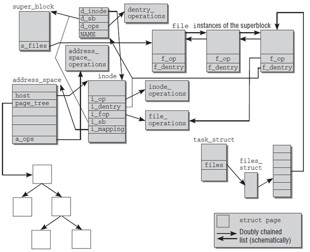

[toc]

[linux](./linux.md)


# 文件系统

## 临时文件系统

* ramfs
    * Introduction: very simple filesystem that exports Linux's disk caching mechanisms (the page cache and dentry cache) as a dynamically resizable RAM-based filesystem.
    * Key feature
        * **no backing store**(the pages are never marked clean, so they can't be freed by the VM when it's looking to recycle memory.)
        * **no size limits** and only **root can write**
* tmpfs
    * Introduction: One downside of ramfs is you can keep writing data into it until you fill up all memory, and the VM can't free it because the VM thinks that files should get written to backing store
    * Key feature
        * add **size limits**
        * the ability to **write the data to swap space**
* rootfs
    * Introduction: Rootfs is a special instance of ramfs. The root filesystem should **generally be small**, since it contains very critical files and a small, infrequently modified filesystem has a better chance of not getting corrupted. The root directory generally doesn't contain any files, except perhaps on older systems where the standard boot image for the system
    * used only by root
    * what rootfs contains
        * /bin : Commands needed during bootup that might be used by normal users (probably after bootup).
        * /sbin : Like /bin, but the commands are not intended for normal users, although they may use them if necessary and allowed. /sbin is not usually in the default path of normal users, but will be in root's default path.
        * /etc : Configuration files specific to the machine.
        * /root : The home directory for user root. This is usually not accessible to other users on the system
        * /lib : Shared libraries needed by the programs on the root filesystem.
        * /lib/modules : Loadable kernel modules, especially those that are needed to boot the system when recovering from disasters (e.g., network and filesystem drivers).
        * /dev : Device files. These are special files that help the user interface with the various devices on the system.
        * /tmp : Temporary files. As the name suggests, programs running often store temporary files in here.
        * /boot : Files used by the bootstrap loader, e.g., LILO or GRUB. Kernel images are often kept here instead of in the root directory. If there are many kernel images, the directory can easily grow rather big, and it might be better to keep it in a separate filesystem. Another reason would be to make sure the kernel images are within the first 1024 cylinders of an IDE disk. This 1024 cylinder limit is no longer true in most cases. With modern BIOSes and later versions of LILO (the LInux LOader) the 1024 cylinder limit can be passed with logical block addressing (LBA). See the lilo manual page for more details.
        * /mnt : Mount point for temporary mounts by the system administrator. Programs aren't supposed to mount on /mnt automatically. /mntmight be divided into subdirectories (e.g., /mnt/dosa might be the floppy drive using an MS-DOS filesystem, and /mnt/exta might be the same with an ext2 filesystem).
        * /proc, /usr, /var, /home : Mount points for the other filesystems. Although /proc does not reside on any disk in reality it is still mentioned here. See the section about /proc later in the chapter.
* 参考：[ramfs, rootfs and initramfs](https://www.kernel.org/doc/Documentation/filesystems/ramfs-rootfs-initramfs.txt), [The root filesystem](http://www.tldp.org/LDP/sag/html/root-fs.html)

## 典型文件系统

* ZFS & btrfs & ext4  btrfs
    * four key advantages over ext4 file system 1.data integrity 2.pooled storage 3.performance 4.easy to operate(no more partition format operation, ZFS&btrfs are binding to disk rather than partition)

## 系统启动流程

* linux启动时的文件系统变化（[How does a kernel mount the root partition?](https://unix.stackexchange.com/questions/9944/how-does-a-kernel-mount-the-root-partition)）
    1. Linux initially **boots with a ramdisk** (called an initrd, for "INITial RamDisk") as `/`.
    2. This disk has just enough on it to be able to **find the real root partition** (including any driver and filesystem modules required).
    3. It **mounts the root partition onto a temporary mount point** on the initrd, then invokes `pivot_root`(8) to **swap the root and temporary mount points**, leaving the initrd in a position to be umounted and the actual root filesystem on `/`.

## 文件系统实现详解

* 文件系统典型概念
    * VFS
        * VFS就是定义了一个通用文件系统的接口层和适配层，一方面为用户进程提供了一组统一的访问文件，目录和其他对象的统一方法，另一方面又要和不同的底层文件系统进行适配。
        
        

    <span id="fs_struct"></span>

    * 内核数据结构关联
        * 超级块（super_block），用于保存一个文件系统的所有元数据，相当于这个文件系统的信息库，为其他的模块提供信息。因此一个超级块可代表一个文件系统。文件系统的任意元数据修改都要修改超级块。超级块对象是常驻内存并被缓存的。(A superblock object represents a mounted filesystem.)
            
            ```c
            struct super_operations {
                struct inode *(*alloc_inode)(struct super_block *sb);
                void (*destroy_inode)(struct inode *);
                void (*dirty_inode) (struct inode *, int flags);
                int (*write_inode) (struct inode *, int);
                void (*drop_inode) (struct inode *);
                void (*delete_inode) (struct inode *);
                void (*put_super) (struct super_block *);
                int (*sync_fs)(struct super_block *sb, int wait);
                int (*freeze_fs) (struct super_block *);
                int (*unfreeze_fs) (struct super_block *);
                int (*statfs) (struct dentry *, struct kstatfs *);
                int (*remount_fs) (struct super_block *, int *, char *);
                void (*clear_inode) (struct inode *);
                void (*umount_begin) (struct super_block *);
                int (*show_options)(struct seq_file *, struct dentry *);
                ssize_t (*quota_read)(struct super_block *, int, char *, size_t, loff_t);
                ssize_t (*quota_write)(struct super_block *, int, const char *, size_t, loff_t);
                int (*nr_cached_objects)(struct super_block *);
                void (*free_cached_objects)(struct super_block *, int);
            };
            ```
        * 目录项模块(struct dentry)，管理路径的目录项。比如一个路径 /home/foo/hello.txt，那么目录项有home, foo, hello.txt。目录项的块，存储的是这个目录下的所有的文件的inode号和文件名等信息。其内部是树形结构，操作系统检索一个文件，都是从根目录开始，按层次解析路径中的所有目录，直到定位到文件。
        
            ```c
            struct dentry_operations {
                int (*d_revalidate)(struct dentry *, unsigned int);
                int (*d_weak_revalidate)(struct dentry *, unsigned int);
                int (*d_hash)(const struct dentry *, struct qstr *);
                int (*d_compare)(const struct dentry *, unsigned int, const char *, const struct qstr *);
                int (*d_delete)(const struct dentry *);
                int (*d_init)(struct dentry *);
                void (*d_release)(struct dentry *);
                void (*d_iput)(struct dentry *, struct inode *);
                char *(*d_dname)(struct dentry *, char *, int);
                struct vfsmount *(*d_automount)(struct path *);
                int (*d_manage)(const struct path *, bool);
                struct dentry *(*d_real)(struct dentry *, const struct inode *);
            };
            ```

        * inode模块，管理一个具体的文件，是**文件的唯一标识，一个文件对应一个inode**。通过inode可以方便的找到文件在磁盘扇区的位置。同时inode模块可链接到address_space模块，方便查找自身文件数据是否已经缓存。（一个inode可以被多个dentry映射，参考[Overview of the Linux Virtual File System](https://www.kernel.org/doc/Documentation/filesystems/vfs.txt)）
        
            ```c
            struct inode_operations {
                int (*create) (struct inode *,struct dentry *, umode_t, bool);
                struct dentry * (*lookup) (struct inode *,struct dentry *, unsigned int);
                int (*link) (struct dentry *,struct inode *,struct dentry *);
                int (*unlink) (struct inode *,struct dentry *);
                int (*symlink) (struct inode *,struct dentry *,const char *);
                int (*mkdir) (struct inode *,struct dentry *,umode_t);
                int (*rmdir) (struct inode *,struct dentry *);
                int (*mknod) (struct inode *,struct dentry *,umode_t,dev_t);
                int (*rename) (struct inode *, struct dentry *, struct inode *, struct dentry *, unsigned int);
                int (*readlink) (struct dentry *, char __user *,int);
                const char *(*get_link) (struct dentry *, struct inode *, struct delayed_call *);
                int (*permission) (struct inode *, int);
                int (*get_acl)(struct inode *, int);
                int (*setattr) (struct dentry *, struct iattr *);
                int (*getattr) (const struct path *, struct kstat *, u32, unsigned int);
                ssize_t (*listxattr) (struct dentry *, char *, size_t);
                void (*update_time)(struct inode *, struct timespec *, int);
                int (*atomic_open)(struct inode *, struct dentry *, struct file *, unsigned open_flag, umode_t create_mode);
                int (*tmpfile) (struct inode *, struct dentry *, umode_t);
            };
            ```
        
        * 打开文件列表模块，包含所有内核已经打开的文件。已经打开的文件对象由open系统调用在内核中创建，也叫文件句柄。打开文件列表模块中包含一个列表，**每个列表表项是一个结构体struct file**，结构体中的信息用来表示打开的一个文件的各种状态参数。
        * file_operations模块。这个模块中维护一个数据结构，是一系列函数指针的集合，其中包含所有可以使用的系统调用函数，例如open、read、write、mmap等。每个打开文件（打开文件列表模块的一个表项）都可以连接到file_operations模块，从而对任何已打开的文件，通过系统调用函数，实现各种操作。

            ```c
            struct file_operations {
                struct module *owner;
                loff_t (*llseek) (struct file *, loff_t, int);
                ssize_t (*read) (struct file *, char __user *, size_t, loff_t *);
                ssize_t (*write) (struct file *, const char __user *, size_t, loff_t *);
                ssize_t (*read_iter) (struct kiocb *, struct iov_iter *);
                ssize_t (*write_iter) (struct kiocb *, struct iov_iter *);
                int (*iopoll)(struct kiocb *kiocb, bool spin);
                int (*iterate) (struct file *, struct dir_context *);
                int (*iterate_shared) (struct file *, struct dir_context *);
                __poll_t (*poll) (struct file *, struct poll_table_struct *);
                long (*unlocked_ioctl) (struct file *, unsigned int, unsigned long);
                long (*compat_ioctl) (struct file *, unsigned int, unsigned long);
                int (*mmap) (struct file *, struct vm_area_struct *);
                int (*open) (struct inode *, struct file *);
                int (*flush) (struct file *, fl_owner_t id);
                int (*release) (struct inode *, struct file *);
                int (*fsync) (struct file *, loff_t, loff_t, int datasync);
                int (*fasync) (int, struct file *, int);
                int (*lock) (struct file *, int, struct file_lock *);
                ssize_t (*sendpage) (struct file *, struct page *, int, size_t, loff_t *, int);
                unsigned long (*get_unmapped_area)(struct file *, unsigned long, unsigned long, unsigned long, unsigned long);
                int (*check_flags)(int);
                int (*flock) (struct file *, int, struct file_lock *);
                ssize_t (*splice_write)(struct pipe_inode_info *, struct file *, loff_t *, size_t, unsigned int);
                ssize_t (*splice_read)(struct file *, loff_t *, struct pipe_inode_info *, size_t, unsigned int);
                int (*setlease)(struct file *, long, struct file_lock **, void **);
                long (*fallocate)(struct file *file, int mode, loff_t offset, loff_t len);
                void (*show_fdinfo)(struct seq_file *m, struct file *f);
                ssize_t (*copy_file_range)(struct file *, loff_t, struct file *, loff_t, size_t, unsigned int);
                loff_t (*remap_file_range)(struct file *file_in, loff_t pos_in, struct file *file_out, loff_t pos_out, loff_t len, unsigned int remap_flags);
                int (*fadvise)(struct file *, loff_t, loff_t, int);
            };
            ```

        * address_space模块，它表示一个**文件在页缓存中已经缓存了的物理页**。它是页缓存和外部设备中文件系统的桥梁。如果将文件系统可以理解成数据源，那么address_space可以说关联了内存系统和文件系统。
            
            ```c
            struct address_space_operations {
                int (*writepage)(struct page *page, struct writeback_control *wbc);
                int (*readpage)(struct file *, struct page *);
                int (*writepages)(struct address_space *, struct writeback_control *);
                int (*set_page_dirty)(struct page *page);
                int (*readpages)(struct file *filp, struct address_space *mapping, struct list_head *pages, unsigned nr_pages);
                int (*write_begin)(struct file *, struct address_space *mapping, loff_t pos, unsigned len, unsigned flags, struct page **pagep, void **fsdata);
                int (*write_end)(struct file *, struct address_space *mapping, loff_t pos, unsigned len, unsigned copied, struct page *page, void *fsdata);
                sector_t (*bmap)(struct address_space *, sector_t);
                void (*invalidatepage) (struct page *, unsigned int, unsigned int);
                int (*releasepage) (struct page *, int);
                void (*freepage)(struct page *);
                ssize_t (*direct_IO)(struct kiocb *, struct iov_iter *iter);
                /* isolate a page for migration */
                bool (*isolate_page) (struct page *, isolate_mode_t);
                /* migrate the contents of a page to the specified target */
                int (*migratepage) (struct page *, struct page *);
                /* put migration-failed page back to right list */
                void (*putback_page) (struct page *);
                int (*launder_page) (struct page *);
                int (*is_partially_uptodate) (struct page *, unsigned long,
                                unsigned long);
                void (*is_dirty_writeback) (struct page *, bool *, bool *);
                int (*error_remove_page) (struct mapping *mapping, struct page *page);
                int (*swap_activate)(struct file *);
                int (*swap_deactivate)(struct file *);
            };
            ```

        

    * I/O缓存区
        * buffer & cache
            * buffer和cache是两个不同的概念：cache是高速缓存，用于CPU和内存之间的缓冲；buffer是I/O缓存，用于内存和硬盘的缓冲；简单的说，cache是加速“读”，而buffer是缓冲“写”，前者解决读的问题，保存从磁盘上读出的数据，后者是解决写的问题，保存即将要写入到磁盘上的数据。
        * Buffer Cache & Page Cache
            * buffer cache和page cache都是为了处理设备和内存交互时高速访问的问题。buffer cache可称为块缓冲器，page cache可称为页缓冲器。
            * buffer cache和page cache两者最大的区别是缓存的粒度。buffer cache面向的是文件系统的块。而内核的内存管理组件采用了比文件系统的块更高级别的抽象：页page，其处理的性能更高。因此和内存管理交互的缓存组件，都使用页缓存。
            * "Buffers" represent how much portion of RAM is dedicated to cache disk blocks. "Cached" is similar like "Buffers", only this time it caches pages from file reading.
            * 参考：[What is the difference between buffer vs cache memory in Linux?](https://stackoverflow.com/questions/6345020/what-is-the-difference-between-buffer-vs-cache-memory-in-linux)
        * 页缓存实际上就是采用了一个基数树结构将一个文件的内容组织起来存放在物理内存struct page中。一个文件inode对应一个地址空间address_space。而一个address_space对应一个页缓存基数树。

        

* 读写文件流程
    * 读文件
        * 1、进程调用库函数向内核发起读文件请求；
        * 2、内核通过检查进程的文件描述符定位到虚拟文件系统的已打开文件列表表项
        * 3、调用该文件可用的系统调用函数read()，read()函数通过文件表项链接到目录项模块，根据传入的文件路径，在目录项模块中检索，找到该文件的inode；
        * 4、在inode中，通过文件内容偏移量计算出要读取的页；
        * 5、通过inode找到文件对应的address_space；
        * 6、在address_space中访问该文件的页缓存树，查找对应的页缓存结点：
            * （1）如果页缓存命中，那么直接返回文件内容；
            * （2）如果页缓存缺失，那么产生一个页缺失异常，创建一个页缓存页，同时通过inode找到文件该页的磁盘地址，读取相应的页填充该缓存页；重新进行第6步查找页缓存；
        * 7、文件内容读取成功。
    * 写文件
        * 前5步和读文件一致，在address_space中查询对应页的页缓存是否存在：
        * 6、如果页缓存命中，直接把文件内容修改更新在页缓存的页中。写文件就结束了。这时候文件修改位于页缓存，并没有写回到磁盘文件中去。
        * 7、如果页缓存缺失，那么产生一个页缺失异常，创建一个页缓存页，同时通过inode找到文件该页的磁盘地址，读取相应的页填充该缓存页。此时缓存页命中，进行第6步。
        * 8、一个页缓存中的页如果被修改，那么会被标记成脏页。脏页需要写回到磁盘中的文件块。有两种方式可以把脏页写回磁盘：
            * （1）手动调用sync()或者fsync()系统调用把脏页写回
            * （2）pdflush进程会定时把脏页写回到磁盘
            * 同时注意，脏页不能被置换出内存，如果脏页正在被写回，那么会被设置写回标记，这时候该页就被上锁，其他写请求被阻塞直到锁释放。

* 文件预读
    * 意义：无论是HDD/SSD，其顺序读写速度均远远快于随机读写速度，因此预读对于各类storage均有指导意义。
    * 操作：
        * 手工：Linux为我们提供了三个API接口：posix_fadvise(2), readahead(2), madvise(2)。
        * 自动：不过真正使用上述预读API的应用程序并不多见：因为一般情况下，内核中的启发式算法工作的很好。
    * 关键点：
        * **批量**，也就是把小I/O聚集为大I/O，以改善磁盘的利用率，提升系统的吞吐量。
        * **提前**，也就是对应用程序隐藏磁盘的I/O延迟，以加快程序运行。
        * **预测**，这是预读算法的核心任务。当前包括Linux、FreeBSD和Solaris等主流操作系统都遵循了一个简单有效的原则：把读模式分为随机读和顺序读两大类，并只对顺序读进行预读。这一原则相对保守，但是可以保证很高的预读命中率，同时有效率/覆盖率也很好。因为顺序读是最简单而普遍的，而随机读在内核来说也确实是难以预测的。
    * 机制：
        * read-around算法适用于那些以mmap方式访问的程序代码和数据，它们具有很强的局域性(locality of reference)特征。当有缺页事件发生时，它以当前页面为中心，往前往后预取共计128KB页面。
        * read-ahead算法主要针对read()系统调用，它们一般都具有很好的顺序特性。但是随机和非典型的读取模式也大量存在，因而readahead算法必须具有很好的智能和适应性。

        


* 参考
    * [从内核文件系统看文件读写过程](https://www.cnblogs.com/huxiao-tee/p/4657851.html)
    * [Linux内核的文件预读](https://blog.csdn.net/weixin_34054931/article/details/91795677)
    * [Overview of the Linux Virtual File System](https://www.kernel.org/doc/Documentation/filesystems/vfs.txt)

## mount

* what is mount
    * Mounting is the act of associating a storage device(may not be physical) to a particular location in the directory tree.
    * e.g. You must mount the CD-ROM on a location in the directory tree. Let's say the CD-ROM device is /dev/cdrom and the chosen mount point is /media/cdrom.
        * `mount /dev/cdrom /media/cdrom`
    * 参考：[What is meant by mounting a device in Linux?](https://unix.stackexchange.com/questions/3192/what-is-meant-by-mounting-a-device-in-linux)
* bind mount
    * A bind mount instead takes an existing directory tree and replicates it under a different point. The directories and files in the bind mount are the same as the original.
    * Any modification on one side is immediately reflected on the other side
    * bind_mount是在dentry之上覆盖了一层dentry(也就是你通过这个dentry访问inode的时候，你再也访问不到原来的inode了，它指向了被你bind_mount的对象的inode)
    * 参考：[What is a bind mount?](https://unix.stackexchange.com/questions/198590/what-is-a-bind-mount)

## 重定向

* 如何实现重定向功能([Redirecting exec output to a buffer or file](https://stackoverflow.com/questions/2605130/redirecting-exec-output-to-a-buffer-or-file))
    * sending the output to another file

    ```c
    if (fork() == 0)
    {
        // child
        int fd = open(file, O_RDWR | O_CREAT, S_IRUSR | S_IWUSR);
        dup2(fd, 1);   // make stdout go to file
        dup2(fd, 2);   // make stderr go to file - you may choose to not do this
                    // or perhaps send stderr to another file
        close(fd);     // fd no longer needed - the dup'ed handles are sufficient
        exec(...);
    }
    ```

    * sending the output to a pipe so you can then read the output into a buffer

    ```c
    int pipefd[2];
    pipe(pipefd);
    if (fork() == 0)
    {
        close(pipefd[0]);    // close reading end in the child
        dup2(pipefd[1], 1);  // send stdout to the pipe
        dup2(pipefd[1], 2);  // send stderr to the pipe
        close(pipefd[1]);    // this descriptor is no longer needed
        exec(...);
    }
    else
    {
        // parent
        char buffer[1024];
        close(pipefd[1]);  // close the write end of the pipe in the parent
        while (read(pipefd[0], buffer, sizeof(buffer)) != 0){}
    }
    ```

