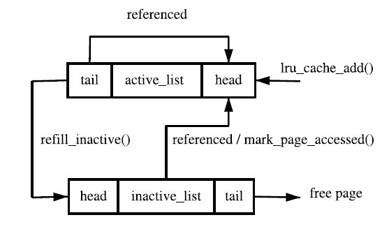

[toc]

[linux](./linux.md)

# 高速缓存

* write through & write back 以及多核下的状态机
    * write through: 直接写内存
    * write back: 写cache，设置dirty
    * write-back:write-back相对于write-through而言是一种更精炼的方法，采用write-back策略，CPU在改写了cache line后，并不是马上把其写回内存，而是将该cache line标志为dirty。只有当cache中发生一次cache miss，其他的数据要占用该cache line时，CPU才会把其写回内存。在实现write-back策略时，有一个重要的问题是需要被考虑到的，当多个处理器访问同一内存时，必须保证所有处理器所看到的内存内容是相同的，也就是一致性的问题。当一个cache line被一个处理器设置为dirty后，另一个处理器要访问同一内存，那么显然，该处理器真正需要的数据是前者的cache里的数据，而不是内存中还未更新的数据


    

    * 上图状态机对应的状态转移列表如下

| 当前状态           | 事件           | 行为                                                                       | 下一个状态 |
|----------------|--------------|--------------------------------------------------------------------------|-------|
| I(Invalid)   | Local Read   | 如果其它Cache没有这份数据，本Cache从内存中取数据，Cache line状态变成E；                           | E/S   |
|                |              | 如果其它Cache有这份数据，且状态为M，则将数据更新到内存，本Cache再从内存中取数据，2个Cache 的Cache line状态都变成S； |       |
|                |              | 如果其它Cache有这份数据，且状态为S或者E，本Cache从内存中取数据，这些Cache 的Cache line状态都变成S          |       |
|                | Local Write  | 从内存中取数据，在Cache中修改，状态变成M；                                                 | M     |
|                |              | 如果其它Cache有这份数据，且状态为M，则要先将数据更新到内存；                                        |       |
|                |              | 如果其它Cache有这份数据，则其它Cache的Cache line状态变成I                                  |       |
|                | Remote Read  | 既然是Invalid，别的核的操作与它无关                                                    | I     |
|                | Remote Write | 既然是Invalid，别的核的操作与它无关                                                    | I     |
| E(Exclusive) | Local Read   | 从Cache中取数据，状态不变                                                          | E     |
|                | Local Write  | 修改Cache中的数据，状态变成M                                                        | M     |
|                | Remote Read  | 数据和其它核共用，状态变成了S                                                          | S     |
|                | Remote Write | 数据被修改，本Cache line不能再使用，状态变成I                                             | I     |
| S(Shared)    | Local Read   | 从Cache中取数据，状态不变                                                          | S     |
|                | Local Write  | 修改Cache中的数据，状态变成M，                                                       | M     |
|                |              | 其它核共享的Cache line状态变成I                                                    |       |
|                | Remote Read  | 状态不变                                                                     | S     |
|                | Remote Write | 数据被修改，本Cache line不能再使用，状态变成I                                             | I     |
| M(Modified)  | Local Read   | 从Cache中取数据，状态不变                                                          | M     |
|                | Local Write  | 修改Cache中的数据，状态不变                                                         | M     |
|                | Remote Read  | 这行数据被写到内存中，使其它核能使用到最新的数据，状态变成S                                           | S     |
|                | Remote Write | 这行数据被写到内存中，使其它核能使用到最新的数据，由于其它核会修改这行数据，状态变成I                              | I     |


# 内存管理

## 数据结构

* **address_space**
    * is mainly about page cache operations, it may be invoked of file operations like read / write

    ```c
    struct address_space {
        struct list_head        clean_pages; // pages need no synchronisation with backing stoarge
        struct list_head        dirty_pages; // pages need synchronisation with backing storage;
        struct list_head        locked_pages;   
        unsigned long           nrpages;        
        struct address_space_operations *a_ops; 
        struct inode            *host;          
        struct vm_area_struct   *i_mmap; // list of private mappings using this address_space;
        struct vm_area_struct   *i_mmap_shared; // list of VMAs which share mappings in this address_space;
        spinlock_t              i_shared_lock;  
        int                     gfp_mask;       
    };
    ```

* **mm_struct**
    * contains numbers of address space.
    * The process address space is described by the mm_struct struct meaning that only one exists for each process and is shared between userspace threads.

    ```c
    struct mm_struct {
        struct vm_area_struct * mmap;
        rb_root_t mm_rb;
        struct vm_area_struct * mmap_cache;
        pgd_t * pgd;
        atomic_t mm_users;
        atomic_t mm_count;
        int map_count;
        struct rw_semaphore mmap_sem;
        spinlock_t page_table_lock;
        struct list_head mmlist;
        unsigned long start_code, end_code, start_data, end_data;
        unsigned long start_brk, brk, start_stack;
        unsigned long arg_start, arg_end, env_start, env_end;
        unsigned long rss, total_vm, locked_vm;
        unsigned long def_flags;
        unsigned long cpu_vm_mask;
        unsigned long swap_address;
        unsigned dumpable:1;
        /* Architecture-specific MM context */
        mm_context_t context;
    };
    ```

    

    * 其中bbs表示的所有没有初始化的全局变量，这样只需要将它们匿名映射为‘零页’，而不用在程序load过程中从磁盘文件显示的mapping，这样既减少了elf二进制文件的大小，也提高了程序加载的效率。

* **vm_area_struct**
    * Each address space consists of a number of page-aligned regions of memory that are in use. They never overlap and represent a set of addresses which contain pages that are **related to each other in terms of protection and purpose**.
        * If a region is **backed by a file**, its `vm_file` field will be set. By traversing `vm_file→f_dentry→d_inode→i_mapping`, the associated `address_space` for the region may be obtained. The `address_space` has all the filesystem specific information required to perform page-based operations on disk.

    ```c
    struct vm_area_struct {
        struct mm_struct * vm_mm;
        unsigned long vm_start;
        unsigned long vm_end;
        /* linked list of VM areas per task, sorted by address */
        struct vm_area_struct *vm_next;
        pgprot_t vm_page_prot;
        unsigned long vm_flags;
        rb_node_t vm_rb;
        struct vm_area_struct *vm_next_share;
        struct vm_area_struct **vm_pprev_share;
        /* Function pointers to deal with this struct. */
        struct vm_operations_struct * vm_ops;
        /* Information about our backing store: */
        unsigned long vm_pgoff;
        struct file * vm_file;
        unsigned long vm_raend;
        void * vm_private_data;
    };
    struct vm_operations_struct {
        void (*open)(struct vm_area_struct * area);
        void (*close)(struct vm_area_struct * area);
        struct page * (*nopage)(struct vm_area_struct * area, unsigned long address, int unused);
    };
    ```

    

    

* 参考
    * [Address Space Operations](https://www.cise.ufl.edu/~jnw/FileSystemsfa02/Lectures/21.html)
    * [Process Address Space](https://www.kernel.org/doc/gorman/html/understand/understand007.html)
    * [pagemap, from the userspace perspective](https://www.kernel.org/doc/Documentation/vm/pagemap.txt)
    * [文件系统中的内核数据结构](./linux_fs.md#fs_struct)


## 内存分配和回收

### 分配

* 内存管理器目的
    * 1. 最小化管理内存所需的时间
    * 2. 最大化用于一般应用的可用内存（最小化管理开销）
    * 可以开发一种使用少量内存进行管理的算法，但是要花费更多时间来管理可用内存。也可以开发一个算法来有效地管理内存，但却要使用更多的内存。
* 内存管理器类别
    * first-fit（在堆中搜索到的第一个满足请求的内存块 ），快但碎片大
    * best-fit（使用堆中满足请求的最合适的内存块），碎片小但慢。
        * 比如，buddy memory allocation，将内存划分为 2 的幂次方个分区，并使用 best-fit 方法来分配内存请求。当用户释放内存时，就会检查 buddy 块，查看其相邻的内存块是否也已经被释放。如果是的话，将合并内存块以最小化内存碎片。
* 内核管理方式
    * 小内存管理：slab
    * 大内存管理：LRU
* SLAB内存管理器
    * 设计思想：内核会为有限的对象集（例如文件描述符和其他常见结构）分配大量内存，同时，这些对象的**初始化所需的时间超过了对其进行分配和释放所需的时间**。因此，不应该将内存释放回一个全局的内存池，而是将内存保持为针对特定目而初始化的状态。
        * 举例：如果内存被分配给了一个互斥锁，那么只需在为互斥锁首次分配内存时执行一次互斥锁初始化函数（mutex_init）即可。后续的内存分配不需要执行这个初始化函数，因为从上次释放和调用析构之后，它已经处于所需的状态中了。
    * 结构
        * cache_chain 的每个元素都是一个 kmem_cache 结构的引用（称为一个 cache）。它定义了一个要管理的给定大小的对象池。
        * 每个缓存都包含了一个 slabs 列表，这是一段连续的内存块（通常都是页面）。存在 3 种 slab：slabs_full完全分配的slab，slabs_partial部分分配的，slabslabs_empty空slab，或者没有对象被分配
        
        

    * 参考：[Linux slab 分配器剖析](https://www.ibm.com/developerworks/cn/linux/l-linux-slab-allocator/index.html)

### 缺页流程

* 主流程

    

    * 查看是否已经存在：The first stage of the decision is to check if the PTE is marked not present or if it has been allocated with which is checked by pte_present() and pte_none().
        * `do_no_page()`:不存在，分配 If no PTE has been allocated (pte_none() returned true), do_no_page() is called which handles Demand Allocation.
        * `do_swap_page()`:存在，交换出 a page that has been swapped out to disk and do_swap_page() performs Demand Paging
        * `do_wp_page()`: COW page，多进程共享，一进程在写。if the page is being written to. If the PTE is write protected, then do_wp_page() is called as the page is a Copy-On-Write (COW) page. A COW page is one which is shared between multiple processes until a write occurs after which **a private copy is made for the writing process**. A COW page is recognised because the VMA for the region is marked writable even though the individual PTE is not. If it is **not a COW page, the page is simply marked dirty** as it has been written to.

        

* 参考：[Process Address Space](https://www.kernel.org/doc/gorman/html/understand/understand007.html)

### 回收

* 哪些页面可以被回收
    * 文件读写操作过程中用于缓冲数据的页面（page cache in address_space）
    * 用户地址空间中用于文件内存映射的页面
    * 匿名页面：进程用户模式下的堆栈或者是使用 mmap 匿名映射的内存区
    * 特殊的用于 slab 分配器的缓存，比如用于缓存文件目录结构 dentry 的 cache，以及用于缓存索引节点 inode 的 cache
* 进行页面回收的时机
    * 周期性的检查：这是由后台运行的守护进程 kswapd 完成的。该进程定期检查当前系统的内存使用情况，当发现系统内空闲的物理页面数目少于特定的阈值时，该进程就会发起页面回收的操作。-->`balance_pgdat()` 
    * “内存严重不足”事件的触发：在某些情况下，当时系统中的内存没有办法提供足够多的物理内存以满足内存请求，操作系统就必须尽快进行页面回收操作，以便释放出一些内存空间从而满足上述的内存请求。这种页面回收方式也被称作“直接页面回收”。-->`try_to_free_pages()`
    * OOM( out of memory )killer：在进行了上述操作后仍缺内存，OOM从系统中挑选一个最合适的进程杀死它，并释放该进程所占用的所有页面。
    * 流程

        

        * 如果在特定的循环次数内没有能够成功释放一定量的页面，那么页面回收会调用 OOM killer 选择并杀死一个进程，然后释放它占用的所有页面。
* 关键指标
    * pages_min区域的预留页面数目，如果空闲物理页面的数目低于 pages_min，那么系统的压力会比较大，此时，内存区域中急需空闲的物理页面，页面回收的需求非常紧迫。
    * pages_low控制进行页面回收的最小阈值，如果空闲物理页面的数目低于pages_low，那么操作系统内核会开始进行页面回收。
    * pages_high控制进行页面回收的最大阈值，如果空闲物理页面的数目多于 pages_high，则内存区域的状态是理想的。
* 回收算法
    * LRU链表
        * 基本思路
            * LRU 的实现主要是基于一对双向链表：active 链表和 inactive 链表。常被访问的处于活跃状态的页面会被放在 active 链表上，而那些虽然可能关联到一个或者多个进程，但是并不经常使用的页面则会被放到 inactive 链表上。页面会在这两个双向链表中移动，操作系统会根据页面的活跃程度来判断应该把页面放到哪个链表上。这种转移并不是每次页面访问都会发生，页面的这种转移发生的间隔有可能比较长。那些最近最少使用的页面会被逐个放到 inactive 链表的尾部。进行页面回收的时候，Linux 操作系统会从 inactive 链表的尾部开始进行回收。
        * 页面标志符
            * **PG_active**和**PG_referenced**用于标识页面的活跃程度
            * PG_active 用于表示页面当前是否是活跃的，如果该位被置位，则表示该页面是活跃的。
            * PG_referenced 用于表示页面最近是否被访问过，每次页面被访问，该位都会被置位。
        * 状态机
            * 如果页面被认为是活跃的，则将该页的 PG_active 置位；否则，不置位。
            * 当页面被访问时，检查该页的 PG_referenced 位，若未被置位，则置位之；若发现该页的 PG_referenced 已经被置位了，则意味着该页经常被访问，这时，若该页在 inactive 链表上，则置位其 PG_active 位，将其移动到 active 链表上去，并清除其 PG_referenced 位的设置；如果页面的 PG_referenced 位被置位了一段时间后，该页面没有被再次访问，那么 Linux 操作系统会清除该页面的 PG_referenced 位，因为这意味着这个页面最近这段时间都没有被访问。
            * PG_referenced 位同样也可以用于页面从 active 链表移动到 inactive 链表。对于某个在 active 链表上的页面来说，其 PG_active 位被置位，如果 PG_referenced 位未被置位，给定一段时间之后，该页面如果还是没有被访问，那么该页面会被清除其 PG_active 位，挪到 inactive 链表上去。

            

            * 1 表示函数 mark_page_accessed()，2 表示函数 page_referenced()，3 表示函数 activate_page()，4 表示函数 shrink_active_list()。

            

            * 什么时候启动kswapd
                * kswapd并不是一段时间一段时间去执行的 (这是以前的作法)现在改成有人去呼叫wake_all_kswapd()，以致于kswapd喚醒了
                    * 情形一：page fault
                        
                        ```c
                        ret_from_exception() -> do_page_fault() -> handle_mm_fault()  -> __alloc_pages_nodemask() -> __alloc_pages_slowpath() -> wake_all_kswapd()
                        ```

                    * 情形二：NUMA的 alloc_pages()
                    
                        ```c
                        alloc_pages() -> -> alloc_pages_current() -> __alloc_pages_nodemask() -> __alloc_pages_slowpath() -> wake_all_kswapd()
                        ```
                    
                    * 情形三：UMA的alloc_pages()
                    
                        ```c
                        alloc_pages() -> alloc_pages_node() -> __alloc_pages() -> __alloc_pages_nodemask->  __alloc_pages_slowpath() -> wake_all_kswapd()
                        ```

* 内存回收代码流程
    ```
    alloc_pages
    alloc_pages_vma or alloc_pages_current
    __alloc_pages_nodemask
    __alloc_pages_slowpath
    1-if (!(gfp_mask & __GFP_NO_KSWAPD))
    wake_all_kswapd
        wakeup_kswapd
        kswapd
                            * for kswapd scan_control is different, must follow the flow, nr_to_reclaim=ULONG_MAX
        balance_pgdat         
                            * if (nr_slab == 0 && !zone_reclaimable(zone)) -->(return zone->pages_scanned < zone_reclaimable_pages(zone) * 6;)
                            *   zone->all_unreclaimable = 1;
                            *all_unreclaimable-->zone_balanced-->pgdat_balanced  this means no reclaimable page
            1-this is a loop based on (sc.priority-- conduct to scan pages increase, until 1, all zone in water_mark_high, 2, no reclaimable page left) 
            2-mem_cgroup_soft_limit_reclaim
                mem_cgroup_soft_limit_reclaim
                    mem_cgroup_shrink_node_zone
                            shrink_lruvec
            3-shrink_slab
                do_shrinker_shrink
                    android_low_memory_killer
            4-shrink_zone
                shrink_lruvec
                            * nr[0] = anon inactive pages to scan; nr[1] = anon active pages to scan
                            * nr[2] = file inactive pages to scan; nr[3] = file active pages to scan
                            anon_prio = vmscan_swappiness(sc);
                            file_prio = 200 - anon_prio;
                            size = get_lru_size(lruvec, lru);
                            scan = size >> sc->priority;
                            scan = div64_u64(scan * fraction[file], denominator);
                            nr[lru] = scan;
                1-get_scan_count(get scan page count according to vm.swappiness)
                2-shrink_list
                                when lru file page list(active pages > inactive pages) or in anon page list(inactive pages = 0) shrink active list
                                scan nr_scan pages, move not PG_referenced pages to inactive list
                    1-shrink_active_list
                            1-loop
                            2-page_referenced
                            3-list_add(&page->lru, &l_active) if referenced 
                            4-list_add(&page->lru, &l_inactive); ClearPageActive if not referenced
                            5-move_active_pages_to_lru(lruvec, &l_active, &l_hold, lru);
                            6-move_active_pages_to_lru(lruvec, &l_inactive, &l_hold, lru - LRU_ACTIVE);
                    2-shrink_inactive_list              
                        1-isolate_lru_pages(get page list from inactive lru, number is min（nr_to_scan， SWAP_CLUSTER_MAX）)
                        2-shrink_page_list (shrink page, return reclaimed page number)
                                1-if (PageAnon(page) && !PageSwapCache(page))
                                add_to_swap(page, page_list)
                                2-if (page_mapped(page) && mapping)
                                try_to_unmap(page, ttu_flags)              
                                3-if (PageDirty(page))
                                    if (page_is_file_cache(page))
                                        inc_zone_page_state(page, NR_VMSCAN_IMMEDIATE);
                                        SetPageReclaim(page);
                                    switch (pageout(page, mapping, sc))
                                        mapping->a_ops->writepage(page, &wbc);
                                            swap_writepage
                                                    try_to_free_swap(page)
                                                frontswap_store(page)
                                                    __swap_writepage(page, wbc, end_swap_bio_write);
                                                        bio = get_swap_bio(GFP_NOIO, page, end_write_func);
                                                        set_page_writeback(page);
                                                        unlock_page(page);
                                                        submit_bio(rw, bio);
                        3-putback_inactive_pages(lruvec, &page_list)(put not reclaimed pages to in active list again)
                        4-free_hot_cold_page_list(&page_list, 1) (free reclaimed pages)
                                free_hot_cold_page
    2-get_page_from_freelist(try to get a page after kswapd wakes)
    3-__alloc_pages_direct_compact(compact and try to get a page)
            * If we failed to make any progress reclaiming, then we are running out of options and have to consider going OOM
            * for direct reclaim scan_control is different, after get enough pages, it quits, nr_to_reclaim=SWAP_CULSTER_MAX 32
    4-__alloc_pages_direct_reclaim(direct reclaim and try to get a page)
            __perform_reclaim
                do_try_to_free_pages
                    1-loop sc.priority increase scan number until get pages you want
                    2-shrink_zones       
                            shrink_zone
                    3-shrink_slab
                    4-wakeup_flusher_threads write to disk cache
                    
    5-if (!did_some_progress) {

        if ((gfp_mask & __GFP_FS) && !(gfp_mask & __GFP_NORETRY)) {
            if (oom_killer_disabled)
                goto nopage;
            page = __alloc_pages_may_oom(gfp_mask, order,
                            zonelist, high_zoneidx, nodemask, preferred_zone, migratetype);
    ```
* 参考
    * [Linux 2.6 中的页面回收与反向映射](https://www.ibm.com/developerworks/cn/linux/l-cn-pagerecycle/)

## 内存映射

### 内存地址区域

* ZONE
    * Each node is divided up into a number of blocks called zones which represent ranges within memory. A zone is described by a struct zone_t and each one is one of ZONE_DMA, ZONE_NORMAL or ZONE_HIGHMEM. Each is suitable for a different type of usage.
    * **ZONE_DMA** is memory in the lower physical memory ranges which certain ISA devices require.
    * Memory within **ZONE_NORMAL** be directly mapped by the kernel in the upper region of the linear address space which is discussed further

    
    
    

    * 可以看出ZONE_NORMAL区域进行了直接映射到linux kernel space

    

    * why ZONE_NORMAL is 896MiB and why kernel can just search 1G directly?
        * The region required for vmalloc(), kmap() and the fixed virtual address mapping is what limits the size of ZONE_NORMAL. As the running kernel needs these functions, a region of at least VMALLOC_RESERVE will be reserved at the top of the address space. VMALLOC_RESERVE is architecture specific but on the x86, it is defined as 128MiB. This is why ZONE_NORMAL is generally referred to being only 896MiB in size; it is the 1GiB of the upper potion of the linear address space minus the minimum 128MiB that is reserved for the vmalloc region.
    * difference between kmap & kmalloc & vmalloc
        * `kmalloc()`：用于申请较小的、连续的物理内存，永久和临时映射都是映射的连续物理内存
        * `vmalloc()`：用于申请较大的内存空间，虚拟内存是连续的，非连续内存分配为常用分配方式
        * `kmap()`：用于内核内存永久映射，当需要使用到内核的时候就需要kmap，比如在read & write时，要涉及到page cache的数据和user space之间进行交换
        * vmalloc比kmalloc要慢
* user space and kernel space
    * The kernel treats the userspace portion of the address space very differently to the kernel portion. For example, **allocations for the kernel are satisfied immediately** and are visible globally no matter what process is on the CPU. With a process, space is simply reserved in the linear address space by pointing a page table entry to a read-only globally visible page filled with zeros. On writing, a page fault is triggered which results in a new page being allocated, filled with zeros, placed in the page table entry and marked writable.
    * The **userspace portion is not trusted or presumed to be constant**. After each context switch, the **userspace portion of the linear address space can potentially change except when a lazy Translation Lookaside Buffer (TLB) switch**. As a result of this, the kernel must be prepared to catch all exception and addressing errors raised from userspace
* mmap
    * 总结：mmap则是用于建立vma，创建对应的虚拟地址区域，当访问pte无效时，mmu触发page fault，分配page。
    * 构建快：在内存映射的过程中，并没有实际的数据拷贝，文件没有被载入内存，只是逻辑上被放入了内存，具体到代码，就是建立并初始化了相关的数据结构（struct address_space），这个过程有系统调用mmap()实现，所以建立内存映射的效率很高。设计mmap()系统调用的本意是提高文件操作的效率。通过mmap(),进程可以把一个文件的内容映射到它的虚存空间并以访问内存的方式实现文件的读写操作,这为文件读写提供了极大的方便。
    * mmap构建VMA：The do_mmap()function is used by the kernel to create a new linear address interval. Saying that this function creates a new VMA is not technically correct, because if the created address interval is adjacent to an existing address interval, and if they share the same permissions, the two intervals are merged into one.
    * mmap **file backed** or not：The file parameter can be NULL and offset can be zero, in which case the mapping will not be backed by a file. In that case, this is called an anonymous mapping. If a file and offset are provided, the mapping is called a file-backed mapping.
* TLB
    *  什么是TLB？页表一般都很大，并且存放在内存中，所以处理器引入MMU后，读取指令、数据需要访问两次内存：首先通过查询页表得到物理地址，然后访问该物理地址读取指令、数据。为了减少因为MMU导致的处理器性能下降，引入了TLB，TLB是Translation Lookaside Buffer的简称，可翻译为“地址转换后援缓冲器”，也可简称为“快表”。简单地说，TLB就是页表的Cache，其中存储了当前最可能被访问到的页表项，其内容是部分页表项的一个副本。只有在TLB无法完成地址翻译任务时，才会到内存中查询页表，这样就减少了页表查询导致的处理器性能下降。
    *  TLB与进程切换？进程切换后TLB也需要跟着切换。这样势必会造成进程执行初期的TLB miss严重的问题。解决办法包括：1.内核空间共享TLB，2.使用ASID（address space ID）技术，容纳多个task的tlb entry（arm v8使用了该方案）。
* 参考
    * [剖析程序的内存布局](https://blog.csdn.net/yuntongsf/article/details/8075412)
    * [mmap-system-calls-work-in-the-Linux-kernel](http://www.quora.com/How-do-the-brk-and-mmap-system-calls-work-in-the-Linux-kernel)
    * [Optimizing Linux Memory Management for Low-latency High-throughput Databases](https://engineering.linkedin.com/performance/optimizing-linux-memory-management-low-latency-high-throughput-databases)
    * [进程切换分析（2）：TLB处理](https://blog.csdn.net/zdy0_2004/article/details/54956787)

### tmpfs/shmem

* 什么是tmpfs/shmem
    * tmpfs是一套虚拟的文件系统，在其中创建的文件都是基于内存的，机器重启即消失。
    * shmem是一套ipc，通过相应的ipc系统调用shmget能够以指定key创建一块的共享内存。需要使用这块内存的进程可以通过shmat系统调用来获得它。
    * 虽然是两套不同的接口，但是在内核里面的实现却是同一套。shmem内部挂载了一个tmpfs分区（用户不可见），shmget就是在该分区下获取名为"SYSV${key}"的文件。然后shmat就相当于mmap这个文件。
* tmpfs/shmem特性
    * 有文件属性，类似于backed file，有page cache和自己的inode
    * 有匿名内存的属性。由于没有像磁盘这样的外部存储介质，内核在内存紧缺时不能简单的将page从它们的page cache中丢弃，而需要swap-out

    

## 内核配置和应用

* [overcommit_memory](https://serverfault.com/questions/606185/how-does-vm-overcommit-memory-work)
    * Memory Overcommit的意思是操作系统承诺给进程的内存大小超过了实际可用的内存。
    * config in /proc/sys/vm
        * 0: heuristic overcommit (this is the default)
        * 1: always overcommit, never check
        * 2: always check, never overcommit
* free pagecaches/dentries/inodes
    * To free pagecache: `echo 1 > /proc/sys/vm/drop_caches`
    * To free dentries and inodes: `echo 2 > /proc/sys/vm/drop_caches`
    * To free pagecache, dentries and inodes: `echo 3 > /proc/sys/vm/drop_caches`
* other sts
    * `/proc/meminfo` check to see memory info
    * `/proc/zoneinfo` check to see how many zones in a device, for PrimaII, ZONE_DMA--0-256M ZONE_NORMAL 256-512M
    * `/proc/sys/vm/min_free_kbytes` the watermark of memory level
    * `/proc/sys/vm/overcommit_memory`
    * `/proc/sys/vm/overcmmit_ratio`

## 答疑

* page的类型有哪几种，匿名页，共享文件页，共享内存页，然后呢？
    * file backed mapping, file backed not mapping, anon mapping
* swap操作究竟会swap哪几种类型的page？
    * anon page only
* LRU在对page cache和swap cache换入换出时的机制是什么？ 也就是在vmscan.c中get_scan_count操作的后续操作
    * get_scan_count根据swappiness拿到需要扫描的inactive/active-anon/file-page的数目，然后kswapd扫描inactive list的中的这部分数量的page，并对符合条件的page做出reclaim操作
* wake_all_kswapd中是对process检索还是对zone检索，zone的含义是什么？
    * 对zone进行检索，zone由pg_data_t描述，本设备中共有两个zone，ZONE_DMA & ZONE_NORMAL
* 什么样的page被回收 是否有anon_vma reference怎么算
    * 三种类型的page被回收
        * 1. anon page 
        * 2. no referenced file page 
        * 3. dirty page
        * 此外private page满足一定条件也会被回收。referenced的计算可以通过遍历和这个mapping对应的anon_vma或者vma，来求取list中的数目
* direct free/kswapd的区别？
    * 比较复杂，总的来说策略不一样，direct reclaim更强调速度，因为通常这不是一个后台操作，kswapd做为后台操作，更强调彻底做好自己的工作。所以
        * 1.dirty page。
            * direct reclaim不回收，因为要向BDI回写
            * kswapd就没有这样的顾虑
        * 2.nr_to_reclaim 期待回收的数目。
            * kswapd置为ULONG_MAX，这意味着在shrink_lruvec函数中，nr_scan_list必须全部扫描完才会退出；
            * direct recliam则相反，置为SWAP_CLUSTER_MAX 通常为32，通常意味着达到这个值，扫描就结束了，节约的时间
        * 3.后台与非后台
              在进入slowpath的时候，系统首先会唤醒kswapd去工作，于此同时系统继续向前运行。其流程是`kswapd->get page->get page in high priority->direct reclaim->get page`.前一项失败get page将进入后一项运行。如果有大量的page fault请求，此时kswapd还在active状态，正在工作无法再次唤醒。这时，系统会继续向后运行，调用high priority和direct reclaim去获取page。通过打印log可以发现时序对这个模块的逻辑影响巨大。
* vma & address_space区别
    * a single file may be represented by 10 vm_area_struct structures, but the file has only one address_space structure
