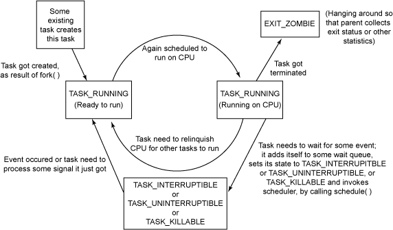

[toc]

[linux](./linux.md)

# 调度管理

## 概念

* 进程切换
    * [user thread & kernel thread](https://stackoverflow.com/questions/12911841/kernel-stack-and-user-space-stack)
        * User threads become kernel threads when they invoke a system call in modern operating system like Linux.
        * each thread has its own kernel stack (and, in fact, its own user stack as well).
    * [how long it takes for a context switch](http://blog.tsunanet.net/2010/11/how-long-does-it-take-to-make-context.html)
        * 结论：最轻量级的切换开销大约为2000ns=2us，最大可达50000ns=50us
        * 测试方式：使用futex，陷入系统调用，进行ping-pong switch
        * 影响因素：除了切换开销之外，cache的迁移开销也很大，这也是最小开销和最大开销的差别来源
        * 实验结果：（working set size就是破坏cache，使得切换时开销变大的方法）
        
        
* zombie process & orphan process & subreaper process
    * Zombie process
        * zombie process isn't really a process. It's only entry in the process table, so the parent process can do wait() syscall.
        * It's a process that has been completely deallocated but still exists in the process table. Contrast this with an orphan process, whose parent has died but is still executing.
        * kill -9 gives a process no chance to 1. shut down socket connections 2. clean up temp files 3. inform its children that it is going away 4. reset its terminal characteristics and so on
    * subreaper process([What is a “subreaper” process?](https://unix.stackexchange.com/questions/250153/what-is-a-subreaper-process))
        * when a process become subreaper process, it's not init (PID 1) that will become the parent of orphaned child processes, instead the nearest living grandparent that is marked as a subreaper will become the new parent.
        * The reason to implement this mechanism was that userspace service managers/supervisors (like upstart, systemd) need to track their started services.(如果不设置，通过double fork，会默认被init进程管理)
        * A process can define itself as a subreaper with `prctl(PR_SET_CHILD_SUBREAPER)`

## 进程调度

* 进程状态
    * TASK_INTERRUPTABLE：进程处于睡眠状态，正在等待某些事件发生。进程**可以被信号中断**。接收到信号或被显式的唤醒呼叫唤醒之后，进程将转变为 TASK_RUNNING 状态。
    * TASK_UNINTERRUPTABLE：此进程状态类似于 TASK_INTERRUPTIBLE，只是它不会处理信号。中断处于这种状态的进程是不合适的，因为它可能正在完成某些重要的任务。 当它所等待的事件发生时，进程将被显式的唤醒呼叫唤醒。
    * TASK_KILLABLE：当进程处于这种可以终止的新睡眠状态中，它的运行原理类似于 TASK_UNINTERRUPTIBLE，只不过**可以响应致命信号**。
    * TASK_RUNNING：进程当前正在运行，或者正在运行队列中等待调度。
    * TASK_STOPPED：进程已中止执行，它没有运行，并且不能运行。接收到 SIGSTOP 和 SIGTSTP 等信号时，进程将进入这种状态。接收到 SIGCONT 信号之后，进程将再次变得可运行。
    * TASK_TRACED：正被调试程序等其他进程监控时，进程将进入这种状态。
    * EXIT_ZOMBIE：进程已终止，它正等待其父进程收集关于它的一些统计信息。
    * EXIT_DEAD：最终状态（正如其名）。将进程从系统中删除时，它将进入此状态，因为其父进程已经通过 wait4() 或 waitpid() 调用收集了所有统计信息。

    

    

* 内核线程
    * kworker
        * "kworker" is a placeholder process for kernel worker threads, which **perform most of the actual processing for the kernel**, especially in cases where there are interrupts, timers, I/O, etc. These typically correspond to the vast majority of any allocated "system" time to running processes.
    * 参考
        * [Kworker, what is it and why is it hogging so much CPU?](https://askubuntu.com/questions/33640/kworker-what-is-it-and-why-is-it-hogging-so-much-cpu)

* 进程切换
    * 进程切换的工作过程
        * （中断／异常等触发）正向模式切换并压入PSW／PC 。 （Program Status Word 程序状态字。program counter 程序计数器。指向下一条要执行的指令）
        * 保存被中断进程的现场信息。
        * 处理具体中断、异常。
        * 把被中断进程的系统堆栈指针SP值保存到PCB。（Stack Pointer 栈指针。Process Control Block 进程控制块。）
        * 调整被中断进程的PCB信息，如进程状态。
        * 把被中断进程的PCB加入相关队列。
        * 选择下一个占用CPU运行的进程。
        * 修改被选中进程的PCB信息，如进程状态。
        * 设置被选中进程的地址空间，恢复存储管理信息。
        * 恢复被选中进程的SP值到处理器寄存器SP。
        * 恢复被选中进程的现场信息进入处理器。
        * （中断返回指令触发）逆向模式转换并弹出PSW／PC。

## 信号

* 信号小知识
    * 同步信号与异步信号
        * Asynchronous means that the signal will be **delivered and caught (if not ignored) the next time your program will be scheduled to run**. It generally refers to signals sent by other processes (e.g. via kill, like **SIGINT** or **SIGSTOP**).
        * Synchronous means the signal is **delivered immediately**, because the program is being run (i.e. state running in the scheduler). Typically it is the **direct result of the program execution** and the signal is being sent by the kernel (e.g. **SIGILL**, **SIGSEGV**, ...).
    * SIGKILL & SIGSTOP & SIGTSTP
        * The signals **SIGKILL** and **SIGSTOP** cannot be caught, blocked, or ignored.
        * The **SIGKILL** signal is sent to a process to cause it to terminate immediately. In contrast to SIGTERM and SIGINT, this signal cannot be caught or ignored, and the receiving process cannot perform any clean-up upon receiving this signal.
        * The **SIGSTOP** signal instructs the operating system to **stop a process** for later resumption. SIGSTOP SIGINT在SIG_DFL下都是**发送给process下所有的thread**（经实验验证），而当**被重载**后(SIGSTOP无法重载)，则**只发送给其中一个thread**或者说只发送一次
        * The **SIGTSTP** is typically sent by a user typing on a keyboard, usually `Control-Z`. SIGSTOP is a **signal sent programmatically**. Both signals are designed to suspend a process which will be eventually **resumed with SIGCONT**.
    * signal的发送对象
        * signal的发送对象可以是进程也可以是线程
        * signal handler针对process中的所有thread都会生效
        * 可以给指定thread发送signal，tkill/tgkill，但不能为指定函数添加指定signal_handler，唯一可行的办法是在进入signal handler后通过pthread_self确认thread身份。
    * 参考
        * [async-safety](./linux.md#async-safety)
        * [different signal handler for thread and process](https://stackoverflow.com/questions/7296923/different-signal-handler-for-thread-and-process-is-it-possible)
        * [What's the difference between SIGSTOP and SIGTSTP?](https://stackoverflow.com/questions/11886812/whats-the-difference-between-sigstop-and-sigtstp)
* 进程与信号
    * 进程如何接受信号？
        * When a process is **on user mode, it can be interrupted at any time** (switching to kernel mode). When the kernel returns to user mode, it checks if there are any signals pending (including the ones which are used to kill the process, such as SIGTERM and SIGKILL). This means a **process can be killed only on return to user mode**.
        * The reason a process cannot be killed in kernel mode is that it could potentially corrupt the kernel structures used by all the other processes in the same machine (the same way killing a thread can potentially corrupt data structures used by other threads in the same process).
        * When the kernel needs to do something which could take a long time (waiting on a pipe written by another process or waiting for the hardware to do something, for instance), it sleeps by marking itself as sleeping and calling the scheduler to switch to another process (**if there is no non-sleeping process**, it switches to a "dummy" process which tells the cpu to slow down a bit and sits in a loop — **the idle** loop).
    * 进程如何处理信号
        * 内核态下进入队列，返回时处理。When a thread is running code in kernel mode, signals are queued。common user space action of receiving a signal during syscall
        * 用户态下下次调度时处理。 signals are handled asynchronously - the kernel finds a thread which is not blocking the signal, and sets an Asynchronous System Trap flag on that thread. The next time the kernel schedules that thread, it handles the trap
    * 进程如何退出RUNNING状态
        * 时钟中断-时间片用完；中断（外部中断，系统调用（包括sleep），trap）；抢占
        * 系统调用自己退出：Most syscall and user space lock will make process into interruptible sleep state like read&write&pthread_mutex.
    * 参考
        * [What is an uninterruptable process?](https://stackoverflow.com/questions/223644/what-is-an-uninterruptible-process)
        * [What does the “interruptible sleep” state indicate?](https://unix.stackexchange.com/questions/96797/what-does-the-interruptible-sleep-state-indicate)
        * [How does a process come to know that it has received a signal](https://stackoverflow.com/questions/1860175/how-does-a-process-come-to-know-that-it-has-received-a-signal)
        * [How signals are handled in kernel](https://unix.stackexchange.com/questions/355280/how-signals-are-handled-in-kernel)
        * [Why can't sleep in an interrupt handler in the Linux kernel?](https://www.quora.com/Why-cant-you-sleep-in-an-interrupt-handler-in-the-Linux-kernel-Is-this-true-of-all-OS-kernels)