[toc]

[system](./system.md)

# 网络

## 入门文章汇总

* [网络基本功系列](https://wizardforcel.gitbooks.io/network-basic/content/index.html)

## 网络协议

* 流媒体协议
    * 实时传输协议RTP( Real-Time Transport Protocol) 
    * 实时传输控制协议RTCP(Real-Time Transport Control Protocol) 
    * 实时流协议RTSP(Real-Time Streaming Protocol)
* HTTP协议 
    * HTTP
    * HTTPS
        * SSL 在运输层的加密协议
        * 提供数据机密性（加密），还提供数据完整性（不篡改数据）保护、防重放（把捕获的报文再发一次无效）
        * 如何防止被劫持：HTTP被劫持篡改页面，重新计算TCP checksum，用户电脑是无法判别是否被篡改，只好被动接收；加密传输之后，有了HMAC保护，任何篡改页面的尝试，由于没有session key，无法计算出和篡改网页一致的HMAC，所以数据接收端的SSL/TLS会轻易地识别出网页已被篡改，然后丢弃
        * 参考：[全面普及 HTTPS 有意义吗？](https://www.zhihu.com/question/55011295)

## network interface(网络接口)

* 物理网络接口
    * eth0, eth8, radio0, wlan19, .. always represent an actual network hardware device such as a NIC, WNIC or some other kind of Modem. As soon as the device driver is loaded into the Kernel a corresponding physical network interface becomes present and available.
* 虚拟网络接口
    * lo, eth0:1, eth0.1, vlan2, br0, pppoe-dsl, gre0, sit0 tun0, imq0, teql0, .. are virtual network interfaces that do NOT represent an existent hardware device but are linked to one (otherwise they would be useless). Virtual network interfaces were invented to give the system administrator maximum flexibility when configuring a Linux-based operating system.

## VLAN(虚拟局域网)

* VLAN的初衷
    * 分割广播域，提升网络整体的传输性能。同时，能带来合理的访问控制
* VLAN间通信
    * VLAN间路由，可以使用普通的路由器，也可以使用三层交换机。
* VLAN的切分
    * (1)基于MAC地址的VLAN(MAC Based VLAN)
    * (2)基于子网的VLAN(Subnet Based VLAN)
    * (3)基于用户的VLAN(User Based VLAN)
* 参考
    * [小白都能看明白的VLAN原理解释](https://network.51cto.com/art/201409/450885_all.htm)
    * [VLAN是二层技术还是三层技术？](https://www.zhihu.com/question/52278720)
    * [网络基本功（三）：细说VLAN与Trunk](https://wizardforcel.gitbooks.io/network-basic/content/2.html)

## VPN(虚拟专用网)

* 相关协议
    * L2TP（第2层隧道协议）
        * L2TP协议允许对IP，IPX或NetBEUI数据流进行加密，然后通过支持点对点数据报传递的任意网络发送，如IP，X.25，桢中继或ATM。
        * 数据链路层，使用桢作为数据交换单位
    * IPSec（安全IP隧道模式）
        * IPSec隧道模式允许对IP负载数据进行加密，然后封装在IP包头中通过企业IP网络或公共IP互联网络如Internet发送。
        * IP层，IP包头中通过IP网络传送
    * PPTP（点对点隧道协议）
        * PPTP协议允许对IP，IPX或NetBEUI数据流进行加密，然后封装在IP包头中通过企业IP网络或公共互联网络发送。
        * 数据链路层，使用桢作为数据交换单位
    * SSL VPN
    * OPENVPN
    * 备注：在国内提供VPN服务的公司必须登记注册

## router&gateway

* [difference between router and gateway](https://serverfault.com/questions/262071/whats-the-difference-between-a-gateway-and-a-router)
    * A gateway and a router are essentially the same. The term "default gateway" is used to mean the router on your LAN which has the responsibility of being the first point of contact for traffic to computers outside the LAN.
    * If your LAN has multiple routers, the router designated as a default gateway can notify your computer, using an ICMP redirect or other mechanism, of a more appropriate route for a given destination.

    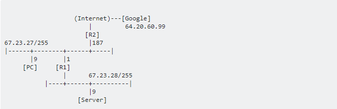

    * If router R1 is PC's default gateway, when PC first tries to contact Google, PC will send data to R1 (as PC knows Google's IP-address is not in PC's subnet), However R1 will tell the PC that a more appropriate route to 64.20.60.99 is via router R2. PC will add this to it's routing table, hence R1 won't show in a subsequent traceroute.
    * The command `netstat -nr` on your PC will **reveal both the static routes it learned from it's configuration files and the dynamic routes it learned by ICMP redirects** or by listening to routing protocol broadcasts/multicasts.

## vmware虚拟连接

* 连接模式
    * bridge mode: **Share the network interface with the Host**. The host will be able to ping the guest, and the guest will be able to ping the host and any other devices on that subnet directly.

    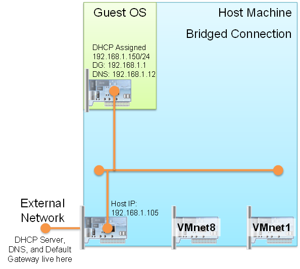

    * host-only mode: The purpose of the host only interface is to allow you to set up a virtual machine that can **only be seen by your host machine**. It is a network-in-a-box.(When VMware created the VMnet1 interface, it also created a process that acts as a DHCP server for VMnet1.)

    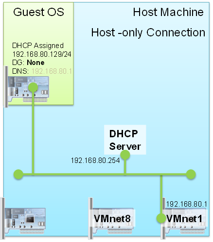

    * NAT mode: The purpose of the NAT interface is to **allow your VM access to external devices without using another IP** address from the host’s subnet as required when using a Bridged networking connection.

    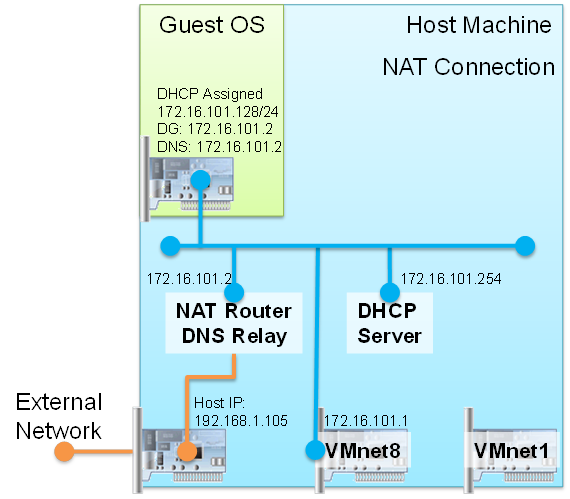

    * VMnet0(bridge)
        * 桥接使用的是你机器的真实网卡进行上网
    * VMnet1(Host-Only)
        * created a process that acts as a DHCP server
        * 从主机的“VMWare Virtual Ethernet Adapter for VMnet1”虚拟网卡出来，vmnet1也是一个虚拟的交换机，交换机的一个端口连接到你的Host上
        * host-only与wmnet1虚拟网卡进行通信
    * VMNet8(NAT)
        * created a process that acts as a DHCP server, a DNS server, and a NAT router
        * 从主机的“VMWare Virtual Ethernet Adapter for VMnet8”虚拟网卡出来，连接到vmnet8虚拟交换机，虚拟交换机的另外的口连接到虚拟的NAT服务器（这也是一个Vmware组件），还有一个口 连接到虚拟DHCP服务器，其他的口连虚拟机
        * NAT模式与VMnet8虚拟网卡进行通信
* 参考
    * [VMWare Interfaces Tutorial](https://rednectar.net/2011/07/20/vmware-interfaces-tutorial/)
    * [虚拟机vmnet0、vmnet1和vmnet8的区别](https://blog.csdn.net/u012110719/article/details/42318717)

## NAT

* 名称
    * 网络地址转换（Network Address Translation，缩写为NAT），也叫做网络掩蔽或者IP掩蔽（IP masquerading）
* 初衷
    * 让**少数公有IP地址被使用私有地址的大量主机所共享**。这一机制允许远多于IP地址空间所支持的主机共享网络。同时，由于NAT屏蔽了内部网络，也为局域网内的机器提供了安全保障。
* 原理
    * 在本地网络与公网之间安装一个或多个具有NAT功能的路由器。**NAT路由器实现的功能包括将数据报中私网地址转换成公网地址，反向亦然**。当有报文通过时，网络地址转换其不仅检查报文信息，还将报文头中的IP地址和端口信息进行修改，以使处于NAT之后的机器共享少数公网IP地址。
    * 存在多种江内部地址转换为外部地址的方式，其中一种为端口映射。如下图所示：
    
    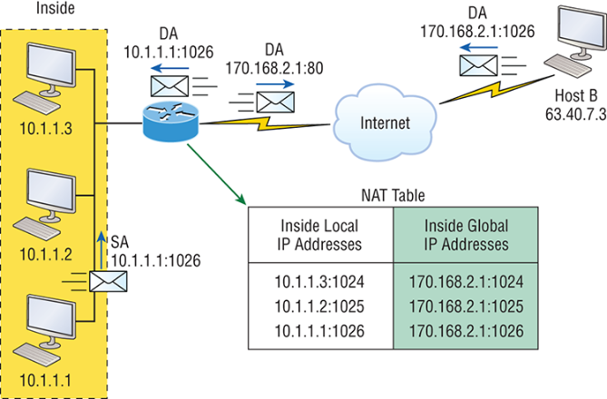

* 参考
    * [细说NAT原理与配置](https://wizardforcel.gitbooks.io/network-basic/content/18.html)
    * [网络地址转换NAT原理（易于理解）](https://blog.csdn.net/hzhsan/article/details/45038265)
* 延伸
    * UDP打洞
        * NAT模式存在一个问题：如果外网的Server想主动发起通信是不可以的。同样的，另一个内网的ClientB想访问ClientA就更难了。
        * UDP打洞就是解决这个问题，对于外网server，可以通过这个洞来访问了。因为ClientA请求了Server，代表信任Server。那么Server通过这个洞就能和ClientA进行通信了；而对于clientB，则不行，因为来源不可信
    * UDP打洞流程
        * （1）ClientA请求Server。
        * （2）ClientB请求Server。
        * （3）Server把ClientA的IP和端口信息发给ClientB。
        * （4）Server把ClientB的IP和端口信息发给ClientA。
        * （5）ClientA利用信息给ClientB发消息。（A信任B）
        * （6）ClinetB利用信息给ClientA发消息。（B信任A）
        * （7）连接已经建立。两者可以直接通信了。
    * NAT的几种类别
        * 对称NAT
            * 一个连接对应一个NAT门牌
            * 光纤入户，3g 4g网络，公共wifi登因为安全因素都是对称nat。
        * 锥形NAT
            * 多个连接对应一个NAT门牌
            * 大部运营商提供的光猫上网服务都是锥形nat
    * UDP打洞限制
        * 双方都是对称NAT的情况下无法打洞。因为服务器告知client另一方的地址和client实际连接的另一方地址不同
    * 参考：[为什么大多数NAT网关都是对称型NAT而不是锥形NAT？](https://www.zhihu.com/question/38729355)，[去中心化的网络设计 — P2P的实现](https://blog.51cto.com/wangbojing/1968118)

# 服务器

## 常识

* 单台服务器的并发度限制
    * 文件句柄限制
        * `ulimit -n`输出 1024，说明对于一个进程而言最多只能打开1024个文件，所以你要采用此默认配置最多也就可以并发上千个TCP连接。临时修改：ulimit -n 1000000
        * `cat /proc/sys/fs/file-nr` 输出 9344 0 592026，分别为：1. 已经分配的文件句柄数，2. 已经分配但没有使用的文件句柄数，3. 最大文件句柄数。可通过root修改/etc/sysctl.conf完成
    * server最大tcp连接数
        * 每个TCP连接都要占一个端口号。操作系统上端口号1024以下是系统保留的，从1024-65535是用户使用的，所以最多可以有60000多个并发连接。
        * server端tcp连接4元组中只有remote ip（也就是client ip）和remote port（客户端port）是可变的，因此最大tcp连接为**客户端ip数×客户端port数**。
    * 系统资源限制
        * 创建的进程线程多了，数据拷贝频繁（缓存I/O、内核将数据拷贝到用户进程空间、阻塞）， 进程/线程上下文切换消耗大， 导致操作系统崩溃，这就是C10K问题的本质！
        * select解决方案（单线程多连接）：在读取文件句柄之前，先查下它的状态，ready 了就进行处理，不 ready 就不进行处理。缺点：逐个检查状态存在管理上限，只有一个字段记录关注和发生事件。
        * poll解决方案（单线程多连接）：一个 pollfd 数组向内核传递需要关注的事件消除文件句柄上限，同时使用不同字段分别标注关注事件和发生事件，来避免重复初始化。缺点：仍要逐个排查，只不过数量减少。
        * epoll解决方案（单线程多连接）：调用返回的时候只给应用提供发生了状态变化（很可能是数据 ready）的文件句柄。优势：当文件句柄数目达到 10K 的时候，epoll 已经超过 select 和 poll 两个数量级。
    * 参考
        * [高性能网络编程(一)：单台服务器并发TCP连接数到底可以有多少](http://www.52im.net/thread-561-1-1.html)
        * [高性能网络编程(二)：上一个10年，著名的C10K并发连接问题](http://www.52im.net/thread-566-1-1.html)
        * [高性能网络编程(三)：下一个10年，是时候考虑C10M并发问题了](http://www.52im.net/thread-568-1-1.html)
* 典型后端框架
    * ruby on rails：ruby语言
    * node.js：javascript语言，前端后端工程师合二为一
    * nginx：c语言（反向代理服务器）
    * apache：经典后端服务器框架
        * prefork模式，默认模式，使用多个子进程，每个子进程只有一个线程。每个进程在某个确定的时间只能维持一个连接，效率高，但内存占用量比较大。
        * worker模式，使用多个子进程，每个子进程有多个线程，每个线程在某个确定的时间只能维持一个连接，内存占用量比较小，适合高流量的http服务器。（其实没用epoll等方式，同样低效）
    * 差异
        * apache，并发性不足；nginx，反向代理解决并发性，实现完整的http1.1协议；node.js：实现完整的http1.1协议，并发性也够（在这样的情况下，仍然使用反向代理反而降低了效率）；nginx侧重协议层逻辑和性能，nodejs包含协议和逻辑层（php）
        * 什么是反向代理：反向代理（Reverse Proxy）方式是指用代理服务器来接受 internet 上的连接请求，然后将请求转发给内部网络上的服务器，并将从服务器上得到的结果返回给 internet 上请求连接的客户端，此时代理服务器对外就表现为一个反向代理服务器。
    * 后端框架设计
        * 考虑要点：线程切换（少）；共享冲突（少）；无锁设计（尽可能）；工作中的线程数尽量等于CPU核心数；逻辑尽量简化，避免不必要的封装和转发
    * 参考：[为什么 Node.js 做的站点可以不用 nginx / Apache 这类 Web server 软件？](https://www.zhihu.com/question/20262642);[8分钟带你深入浅出搞懂Nginx](https://zhuanlan.zhihu.com/p/34943332)

## IO模型

* IO操作
    * 一个基本的IO，它会涉及到两个系统对象，一个是调用这个IO的进程对象，另一个就是系统内核(kernel)。当一个read操作发生时，它会经历两个阶段：
        * 通过read系统调用想内核发起读请求。
        * 内核向硬件发送读指令，并等待读就绪。 
        * 内核把将要读取的数据复制到描述符所指向的内核缓存区中。
        * 将数据从内核缓存区拷贝到用户进程空间中。
    * IO模型类别
        * 阻塞I/O模型(recvfrom)
        * 非阻塞I/O模型(recvfrom)
        * I/O复用模型(select/poll/epoll)
        * 异步I/O
    * 参考
        * [linux基础编程：IO模型：阻塞/非阻塞/IO复用 同步/异步 Select/Epoll/AIO](https://blog.csdn.net/colzer/article/details/8169075)
        * [使用异步 I/O 大大提高应用程序的性能](https://www.ibm.com/developerworks/cn/linux/l-async/index.html)
        * [如何使用epoll？一个完整的C例子](http://www.yeolar.com/note/2012/07/02/epoll-example/)

# 应用

## 游戏框架

### 卡牌、跑酷等弱交互服务端

* 核心架构
    * client~server
    * 完成后提交，服务器验证
    * 客户端定时发送查询消息，轮询服务器推送的新消息
* 通信机制
    * 服务器根据客户端uid，当前时间戳还有服务端私钥，计算哈希得到的加密 key 并发送给客户端。之后双方都用 HTTP通信，并用那个key进行RC4加密。
    * 客户端收到key和时间戳后保存在内存，用于之后通信，服务端不需要保存 key，因为每次都可以根据客户端传上来的 uid 和 时间戳 以及服务端自己的私钥计算得到。

### 基于地图的网游

* 演进过程和原因
    * 因频繁写入和读取用户数据，将database拆开
    
    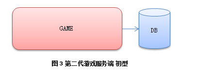

    * 因游戏内容增加，拆分游戏世界（按地图）服务器

    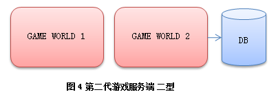

    * 因多台游戏服务器同时访问数据库，存在大量重复访问和数据交换，形成数据库前端代理，提供内存级cache

    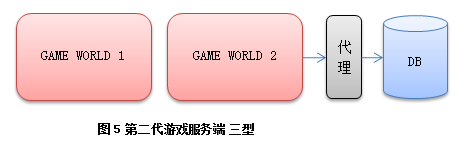

    * 因玩家在地图间经常切换场景导致状态易错，拆分网络功能，独立网关服务，用户统一连接网关服务器，网关服务器再转发至后端游戏服务器，游戏服务器间的切换也交给网关服务器。（这样类型的服务器基本能稳定的为玩家提供游戏服务，一台网关服务1-2万人，后面的游戏服务器每台服务5k-1w，依游戏类型和复杂度不同而已）

    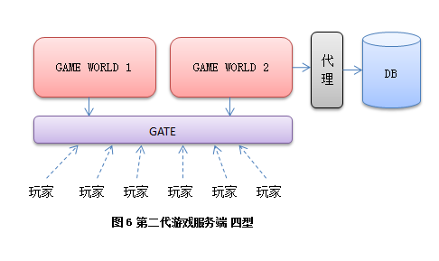

    * 因魔兽世界开始的无缝世界地图已经深入人心（比较以往游戏玩家走个几步还需要切换场景，每次切换就要等待 LOADING个几十秒是一件十分破坏游戏体验的事情），提出Node服务器管理地图区域。（由 NodeMaster（NM）来为他们提供总体管理。更高层次的 World则提供大陆级别的管理服务。）

        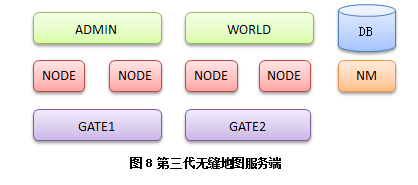

        * 用户在Node间的切换无明确界限。（玩家1完全由节点A控制，玩家3完全由节点B控制。而处在两个节点边缘的2号玩家，则同时由A和B提供服务。玩家2从A移动到B的过程中，会同时向A请求左边的情况，并向B请求右边的情况。但是此时玩家2还是属于A管理。直到玩家2彻底离开AB边界很远，才彻底交由B管理。按照这样的逻辑将世界地图分割为一块一块的区域，交由不同的 Node去管理。）

        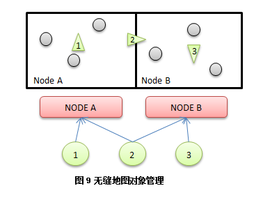

        * 地图管理的切分是静态完成的。（对于一个 Node所负责的区域，地理上没必要连接在一起，比如大陆的四周边缘部分和高山部分的区块人比较少，可以统一交给一个Node去管理，而这些区块在地理上并没有联系在一起的必要性。一个 Node到底管理哪些区块，可以根据游戏实时运行的负载情况，定时维护的时候进行更改 NodeMaster 上面的配置。）

    * 因Node和Gate管理用户混乱（Node服务器按UID查找玩家比较麻烦，GATE需要动态根据坐标计算和哪些Node通信），形成了OBJ模块。该模块负责：对象移动（管理具体玩家在不同的 Node所管辖的区域之间的移动，并同需要的Node进行沟通），数据广播（Node可以给每个用户设置若干 TAG，然后通知 Object Master 按照TAG广播）等。

    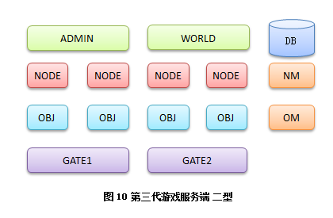

    * 此外，应对因线上大型活动出现的玩家分布不规律或数量激增，地图管理开始强调负载均衡和动态规划。

### 战网类游戏

* 模式
    * 首先通过房间服务器构建链接
    * 然后用户间通过P2P方式进行数据交互（主要为：星状模型（所有玩家连接一个主玩家））
* 游戏公正性
    * 投票法，所有客户端都会独立计算，然后传递给服务器。如果结果相同就更新记录，如果结果不一致，会采取类似投票的方式确定最终结果。
    * 同时记录本剧游戏的所有输入，在可能的情况下，找另外闲散的游戏客户端验算整局游戏是否为该结果。并且记录经常有作弊嫌疑的用户，供运营人员封号时参考。
* 参考：[server 端游、手游服务端常用的架构是什么样的？](https://www.zhihu.com/collection/153981439)