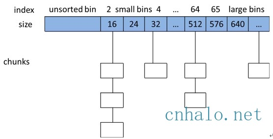
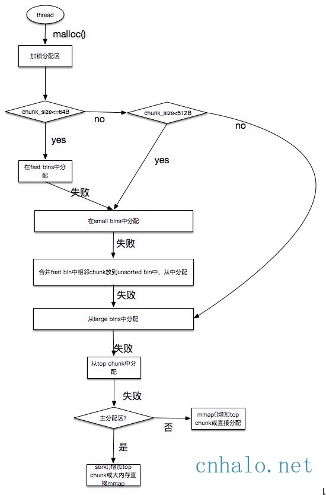

[toc]

[system](./system.md)

# memory-management

* 现有内存管理框架
  * 框架
    * ptmalloc: glibc default ([GNU Allocator](https://www.gnu.org/software/libc/manual/html_node/The-GNU-Allocator.html), [malloc src code](https://code.woboq.org/userspace/glibc/malloc/malloc.c.html))
    * jemalloc: facebook
    * temalloc: google
  * 框架原理
    * ptmalloc，根据分配大小选择不同流程，fastbin针对小内存

  * 框架比较
* 内存管理器的目标
  * 额外的空间损耗尽量少
  * 分配速度尽可能快
  * 尽量避免内存碎片
  * 缓存本地化友好
  * 通用性，兼容性，可移植性，易调试
* 参考
  * [内存优化总结:ptmalloc、tcmalloc和jemalloc](https://blog.csdn.net/junlon2006/article/details/77854898)