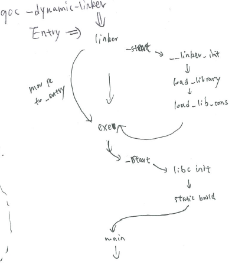
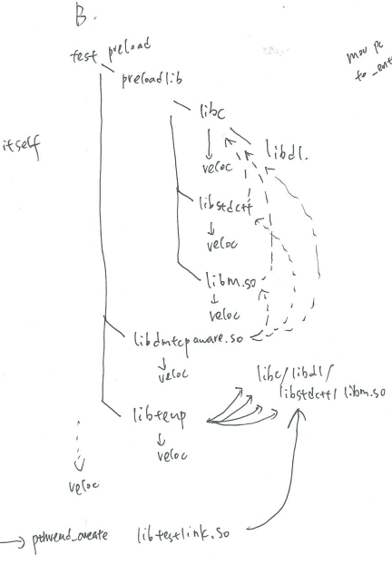
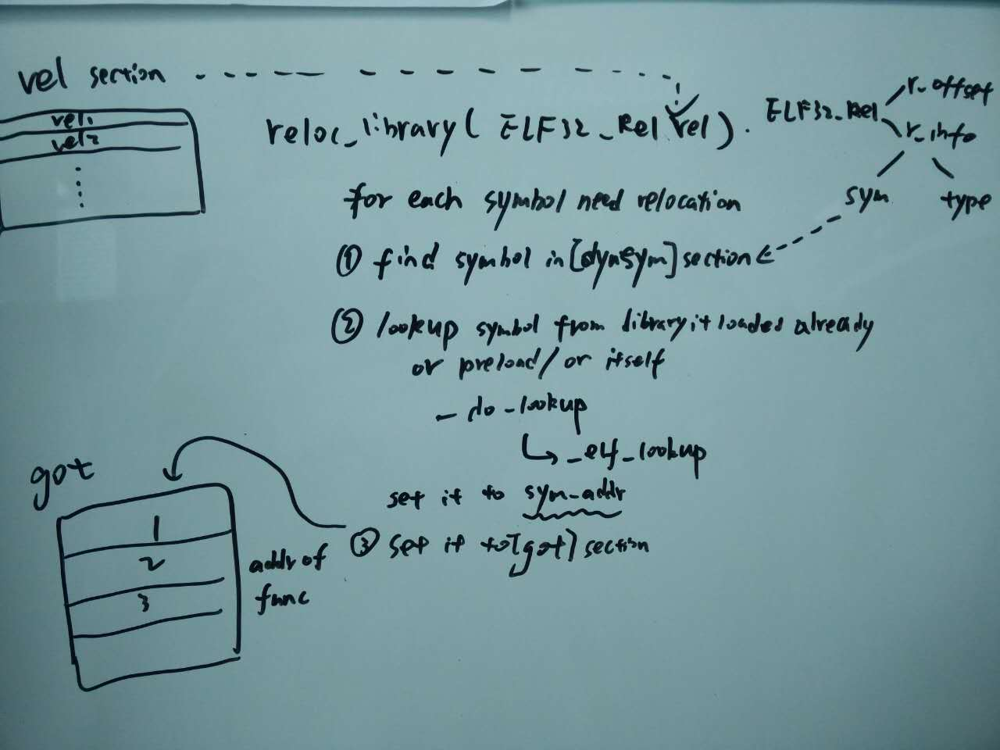
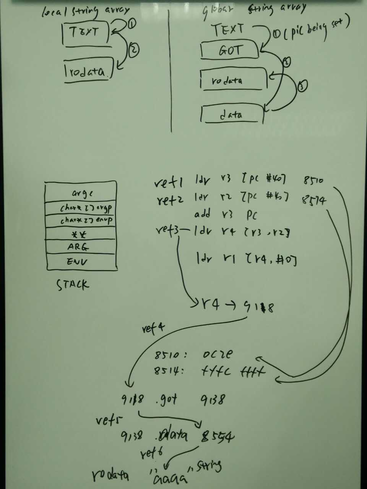
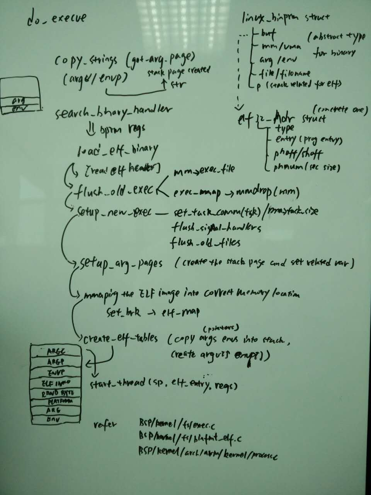

[toc]

[system](./system.md)

# history

* glibc与linux libc
    * 历史上有Linux libc基于glibc1.0版本的分支，用于适配linux系统，该分支一度包含libc.so.4 libc.so.5，但1997年后glibc升级至glibc.2.0后，优势极度明显，于是开发者切换至glibc2.0，为了保持名字的兼容性，glibc2.0也叫做libc.so.6
	见 linux manpage libc(7)
* Glibc与linux libc的license
    * 基于GNU的libc与libstdc++原始license为LGPL，即允许被动态链接，但后续升级为了GPLv3 + section 7 of an exception
    * GPLv2.x~3.x系列跟GPL license的语义保持一致，但包含漏洞，即仅针对发布软件，而对于云端软件和托管平台软件，由于软件没有发布，可以完全绕开GPL协议，于是诞生AGPL协议进行补充
    * 基于GNU的libc与libstdc++现在均使用GPLv3协议，这导致**所有链接基础库的程序都必须遵循GPL协议，这显然是不可能的**。**规避的方式是增加了section 7 of an exception** 。该特例规定程序可包含libc和libstdc++编译时的特殊代码段，以及运行时链接这些库。具体请参见GCC RUNTIME LIBRARY EXCEPTION:
        * When you use gcc to compile a program, gcc may combine portions of certain gcc header files and runtime libraries with the compiled program. The purpose of this exception is to allow compilation of non-GPL program to use, in this way the header files and runtime libraries covered by the exception.

# memory-management

* 现有内存管理框架
    * 框架
        * ptmalloc: glibc default ([GNU Allocator](https://www.gnu.org/software/libc/manual/html_node/The-GNU-Allocator.html), [malloc src code](https://code.woboq.org/userspace/glibc/malloc/malloc.c.html))
        * jemalloc: facebook
        * temalloc: google
    * 框架原理
        * ptmalloc，根据分配大小选择不同流程，fastbin针对小内存

        

        

* 内存管理器的目标
    * 额外的空间损耗尽量少
    * 分配速度尽可能快
    * 尽量避免内存碎片
    * 缓存本地化友好
    * 通用性，兼容性，可移植性，易调试
* 参考
    * [内存优化总结:ptmalloc、tcmalloc和jemalloc](https://blog.csdn.net/junlon2006/article/details/77854898)
    * [Linux c 开发 - 内存管理器ptmalloc](https://blog.csdn.net/initphp/article/details/50833036)
    * [How is malloc() implemented internally?](https://stackoverflow.com/questions/3479330/how-is-malloc-implemented-internally)

# link, load and run

* **程序loader和linker加载动态库的过程**
    * 先编译器静态解析。before loading program, all static library are loaded in the program and there contains no relocation problem as symbols has been solved during compiling.
    * 再通过linker解析符号（详见[程序linker解析符号的详细过程](#solve-symbol)）
        * linker的加载与解析的顺序
            1. load library it needs
            2. resolve relocation of itself
            3. init_array & ctor
            * 注意步骤1是个迭代过程，且abc步骤均完成才算完成该library的加载
        * linker定位符号的顺序
            1. search in itself(this should be done in compile stage)
            2. search in preload library that has been loaded
            3. search in dynamic library it needs

            

    * 最后通过entry加载执行程序。all libc program entry is `_start`, `_start` contains in `crtbegin.S`(BSP/android/bionic/libc/arch-arm/bionic/crtbegin_static.S), but for linker it's in(BSP/android/bionic/linker/arch/arm/begin.S), it jump to `__linker_init`, and it returns the entry of program(_start of the program).(也就是说程序先进入linker的_start，解决完符号问题后，再进入exec的_start)
    * 其他。如果想要修改默认的linker过程，使用：gcc use [`-dynamic-linker`](https://ftp.gnu.org/old-gnu/Manuals/ld-2.9.1/html_node/ld_3.html) option to set the linker(BSP/android/build/core/combo/TARGET_linux-arm.mk define transform-o-to-executable-inner)(--dynamic-linker file: Set the name of the dynamic linker. This is only meaningful when generating dynamically linked ELF executables. The default dynamic linker is normally correct; don't use this unless you know what you are doing.)
* loader和linker在代码和原理上的分析
    * 三种在main函数之前运行的代码段，`DT_INIT`，`DT_INIT_ARRAY`，`DT_PREINIT_ARRAY`（参见BSP/android/bionic/linker/README.TXT）其中`DT_PREINIT_ARRAY`最先运行，`DT_INIT`段只针对executable而不是library
    * 三种crtbegin.S分别是
        * `crtbegin_static.S`针对链接到静态的libc.a的程序。跳转到`__libc_init`，直接到`__libc_init_common`，初始化pthread相关参数，并call上述三个INIT段
        * `crtbegin_dynamic.S`针对链接到动态的libc.so的程序。首先在Linker中的call_constructor函数中调用preinit段时跳转到dynamic中注册的preinit段中完成Pthread操作，然后在linker调用剩下的init段，最后跳转到main
        * `crtbegin_so.S`针对library程序的`crtbegin`无__libc_init入口
    * linker如何找到程序的entry入口：通过auxiliary vector table
        * **gcc编译时，程序的入口地址为linker的entry，可执行文件的entry由kernel通过输入参数的形式在stack上传递给linker**。该部分俗称auxiliary vector table。参见：[ELF Auxiliary Vectors](http://articles.manugarg.com/aboutelfauxiliaryvectors.html)，[glibc的ld源码](http://repo.or.cz/w/glibc.git/blob/HEAD:/elf/rtld.c)
* 程序loader和linker加载动态库的过程示例
    * there exist two methods of wrapping system call or glibc functions
        * LD_PRELOAD
            * preloadlib is set by LD_PRELOAD env when running the program:
            * Using `LD_PRELOAD`: There is a shell environment variable in Linux called `LD_PRELOAD`, which can be set to a path of a shared library, and that library will be loaded before any other library (including glibc).
        * wrap_symbol 参考：[How to reimplement (or wrap) a syscall function in linux?](http://stackoverflow.com/questions/3662856/how-to-reimplement-or-wrap-a-syscall-function-in-linux)
        
        
<span id="solve-symbol"></span>

* 程序linker解析符号的详细过程
    * PLT段&GOT段
        * 对于静态链接无FPIC的，没有GOT和PLT段
        * 对于动态链接的非dlopen方式，GOT段在program运行之前已经被ld/loader正确填充。
        * 对于动态链接的dlopen方式（如果dlopen的option设置为RTLD_LAZY）
            * **PLT段是一段代码**，printf等通过library调用的外部函数将跳转到该段，这段代码的用处是跳转到GOT段，而**GOT段对应地址第一次指向了类似于__libc_init之类的函数地址**，该函数进行了计算后，将地址重新填回GOT段对应位置。下一次诸如printf函数运行时，跳转到PLT段，再跳转到GOT段，GOT段将指向正确的printf在libc中的地址。
    * .interp段
        * 指定了动态链接器的位置。/lib/ld-linux.so.2
    * .dynamic段
        * 动态链接ELF中最重要的段是.dynamic段，这个段里面保存了动态链接器所需要的基本信息，比如依赖于哪些共享对象，动态链接符号表的位置，动态链接重定位表的位置，共享对象初始化代码的地址等。
        * `readelf -d lib.so`获取dynamic段信息
    * .dynsym段
        * **只保存与动态链接相关的符号**。为了表示动态链接这些模块之间的符号导入导出关系，ELF专门有个动态符号表.dynsym。它只保存与动态链接相关的符号，对于哪些模块内部的符号，比如模块私有变量则不保存。很多动态链接模块同时拥有.symtab和.dynsym。.symtab保存了所有符号，包含.dynsym中的符号。
        * `readelf -sD lib.so`查看dynsym段符号
    * .rel.text & .rel.data & .rel.dyn & .rel.plt
        * 在静态链接时有.rel.text表示代码段重定位段。.rel.data表示数据段重定位段。
        * 在动态链接下.rel.dyn和.rel.plt分别相当于.rel.data和.rel.text。其中.rel.dyn是对数据段应用的修正，它所修正的位置位于.got和数据段。而.rel.plt是对函数引用的修正，它所修正的位置位于.got.plt。
    * 参考：[ELF在Linux下的动态链接实现](http://nicephil.blinkenshell.org/my_book/ch07s05.html)
    * 代码分析函数符号解析过程
        1. reloc_library中输入rel.plt段，该段包含offset，既got表对应symbol的地址，unsigned reloc = (unsigned)(rel->r_offset + si->base); symbol在got中的位置为reloc
        2. reloc_library从自己symtab中查询symbol的name，对于动态symbol，使用_do_loopup查到该symbol name
        3. 最终调用_elf_loopup在某个library中搜索，方式为：从该library的symtab中逐个查找symbol，直到找到与之匹配的symbol，返回symtab指向的Elf32_Sym对象，其中st_name为symbol名，st_value为其位置在library中的offset，返回该symbol的Elf32_Sym对象的同时，返回其所在library mmap到memory的base基地址
        4. 根据base基地址和st_value对象offset，可以得到该symbol在memory当中的地址，将该地址存到got表中，*((unsigned*)reloc) = (unsigned)(s->st_value + base);
        5. 总结，symtab包含symbol在library中的偏移，symbol的name索引，syntab为symtab的一个子集，只包含动态symbol func，rel.dyn为rel的对象列表（只有不使用plt时才有意义），rel.plt为rel的对象列表（使用plt时才有意义），其包含symbol对应的got表中的地址。
        6. 下图中的sym_addr = (unsigned)(s->st_value + base);
        
        

    * 函数符号链接数据示例
        * 典型的__libc_init函数入口
        
        ```
        00008464 <__libc_init@plt-0x14>:
        8464: e52de004 push {lr} ; (str lr, [sp, #-4]!)
        8468: e59fe004 ldr lr, [pc, #4] ; 8474 <__libc_init@plt-0x4>
        846c: e08fe00e add lr, pc, lr
        8470: e5bef008 ldr pc, [lr, #8]!
        8474: 00000ca4 andeq r0, r0, r4, lsr #25
        ```

        * printf函数的plt段

        ```
        00008490 <printf@plt>:
        8490: e28fc600 add ip, pc, #0, 12
        8494: e28cca00 add ip, ip, #0, 20
        8498: e5bcfc94 ldr pc, [ip, #3220]! ; 0xc94
        ```
        
        * printf函数对应的got段位置
        
        ```
        00009114 <.got>:
        9114: 00009150 andeq r9, r0, r0, asr r1
        ...(需要被填充的部分)...
        9124: 00008464 andeq r8, r0, r4, ror #8
        9128: 00008464 andeq r8, r0, r4, ror #8
        912c: 00008464 andeq r8, r0, r4, ror #8
        9130: 00008464 andeq r8, r0, r4, ror #8
        9134: 00008464 andeq r8, r0, r4, ror #8
        ```

    * 数据段地址解析
        * 对于数据段的寻址，分两种情况
        1. **local string array**字符串数组中的数据，比如“abcdef”之类是**放在rodata段**中。对于str[3] = "a1" "a2" "a3"的各个字符串的访问，被编译器优化为str[0]..**地址计算放在TEXT段**中，计算好的地址会跳转到rodata中
        2. **global string array**字符串数组中的数据，同样是**放在rodata**中，而指向string的地址比如str[0], str[1]是被**放在data段**中。如果设置了地址无关代码fpic，那么寻址过程首先跳转到GOT段，再从got段跳转到data段，得到str指针的位置，最后才能拿到字符串。
      
        

    * 参考：[What symbol tables stay after a strip In ELF format?](https://reverseengineering.stackexchange.com/questions/2539/what-symbol-tables-stay-after-a-strip-in-elf-format)

* 程序创建的过程
    * 下图展现了do_execve调用后，一个新的Program的各类资源的创建和载入流程

    

    * 参考代码
        `BSP/kernel/fs/exec.c`  
        `BSP/kernel/fs/binfmt_elf.c`  
        `BSP/kernel/arch/arm/kernel/process.c`  

* 程序的输入参数和环境变量的构建
    * how env implemented in libc
        1. at very beginning, envp and all env strings are located in stack, envp behind argp, env strings behind arg strings.
        
        ```c
        __libc_init_common
          int argc = *elfdata;
          char** argv = (char**)(elfdata + 1);
          char** envp = argv + argc + 1;
          (refer to BSP/android/bionic/libc/bionic/libc_init_common.c)
        ```
  
        2. once fetch the value of env - use envp to find the env string
        
        ```c
        call chain --> getenv -> findenv
        refer to BSP/android/bionic/libc/stdlib/getenv.c
        ```
        
        3. change or add a new env value
            * if new value exist and size larger than before, malloc a new place to hold the env string
            * else just reset the env string in that position
            * when add a new env, realloc the envp, and then malloc a new place to hold the env string
            * `refer to BSP/android/bionic/libc/stdlib/setenv.c`
        4. unset an env value
              * remove that pointer in envp, and replace it by the pointer after in envp array.
    * 环境变量通过setenv设置，getenv获取；env环境变量在fork或者exec时，均会传递给新创建的进程 ；除非使用exec*e系列指定新的环境变量

# ABI

## 什么是ABI

* 典型的 ABI 包含以下信息：
	* 机器代码应使用的 CPU 指令集。
	* 运行时内存存储和加载的字节顺序。
	* 可执行二进制文件（例如程序和共享库）的格式，以及它们支持的内容类型。
	* 用于解析内容与系统之间数据的各种约定。这些约定包括对齐限制，以及系统如何使用堆栈和在调用函数时注册。
	* 运行时可用于机器代码的函数符号列表 - 通常来自非常具体的库集。
* 形象理解
    * An ABI is very similar. Think of it as the compiled version of an API
    * 参考：[What is an application binary interface (ABI)?](http://stackoverflow.com/questions/2171177/what-is-application-binary-interface-abi)
* 示例
    * 典型ABI，参考[NDK 支持的 ABI](https://developer.android.com/ndk/guides/abis.html?hl=zh-cn)

| ABI | 支持的指令集说明armeabi | 说明 |
|---|---|---|
|armeabi|ARMV5TE 和更高版本<br>Thumb-1|无硬浮点。|
|armeabi-v7a|armeabi<br>Thumb-2<br>VFPv3-D16<br>其他（可选）|与 ARMv5、v6 设备不兼容。|
|arm64-v8a|AArch-64||
|x86|x86 (IA-32)<br>MMX<br>SSE/2/3<br>SSSE3|不支持 MOVBE 或 SSE4。|
|x86_64|x86-64<br>MMX<br>SSE/2/3<br>SSSE3<br>SSE4.1、4.2<br>POPCNT||
|mips|MIPS32r1 及更高版本|使用硬浮点，并且假设 CPU:FPU 时钟比率为 2:1 以获取最大兼容性。 不提供 micromips 或 MIPS16。|
|mips64|MIPS64r6||

* 其他
    * [arm-abi](./soc.md#arm-abi)
