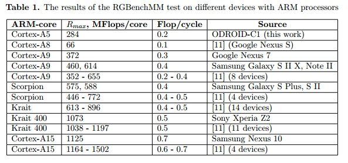
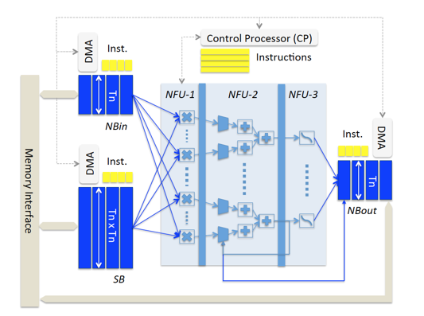
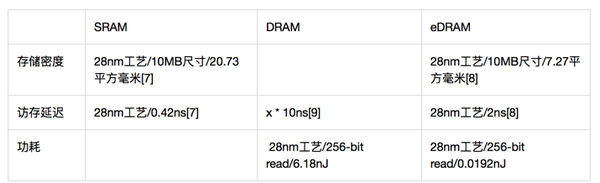

[toc]

[system](./system.md)

# Soc General

## design

* 参考：
    * [轻松读懂移动处理器 CPU微架构全解析](http://www.pcpop.com/article/878268_1.shtml)
* 流水线设计
    * 目的：取指、解码、执行、写回都是放在同一个拍（周期）内顺序完成，此时的 CPI(每指令周期数）基本上是 1，但是这样设计的效率很低：当取指的时候，其余工位都只能瞎瞪眼等开饭，这样的设计也被称作非流水线化执行。
    * e.g.: Cortex-A15、Sandy Bridge 都分别具备 15 级、14 级流水线，而 Intel NetBurst（Pentium 4）、AMD Bulldozer 都是 20 级流水线，它们的工位数都远超出基本的四（或者五）工位流水线设计。**更长的流水线虽然能提高频率，但是代价是耗电更高而且可能会有各种性能惩罚**。
    * pipeline stage list:Sony Cell PPU23IBM PowerPC 717IBM Xenon19AMD Athlon10AMD Athlon XP11AMD Athlon6412AMD Phenom12AMD Opteron15ARM7TDMI(-S) 3ARM7EJ-S 5ARM810 5ARM9TDMI 5ARM1020E 6XScale PXA210/PXA250 7ARM1136J(F)-S 8ARM1156T2(F)-S 9ARM Cortex-A5 8ARM Cortex-A813AVR32 AP7 7AVR32 UC3 3DLX 5Intel P5 (Pentium) 5Intel P6 (Pentium Pro) 14Intel P6 (Pentium III) 10Intel NetBurst (Willamette)20Intel NetBurst (Northwood)20Intel NetBurst (Prescott)31Intel NetBurst (Cedar Mill)31Intel Core14Intel Atom16LatticeMico32 6R4000 8StrongARM SA-110 5SuperH SH2 5SuperH SH2A 5SuperH SH4 5SuperH SH4A 7UltraSPARC 9UltraSPARC T1 6UltraSPARC T2 8WinChip 4LC2200 32 bit 5
* 超标量（指令多发）
    * 常用于SIMD计算，此时数据依赖关联往往不强，流水线无需等待
* 分支（转移）预测
    * 目的：处理器平均六条指令就会遇到一条分支指令，因此流水线设计带来的大部分性能提升优势此时会被丧失掉。
    * 方法：
        * 动态分支预测。记录最近的历史信息，用该信息指导预测（动态分支表需要占用相当可观的芯片面积，但是另一方面来说分支预测对流水线化处理器是相当重要的，所以是物有所值的。）
        * 条件执行指令（predicated instruction）
            * 原先
                * 采用了判定指令后，原来的 5 条指令变成 3 条，避免了两条分支指令，cmp 和 mov 可以并行执行实现 50% 的性能提升，消除了分支预测错误导致的大量误预测惩罚。
                * ARM 从一开始就具备完整的判定指令集

                ```asm
                cmp a, 5 ; a > 5 ?
                ble L1
                mov c, b ; b = c
                br L2
                L1: mov d, b ; b = d
                L2: ...
                ```

            * 优化

                ```asm
                cmp a, 5 ; a > 5 ?
                mov c, b ; b = c
                cmovle d, b ; if le, then b = d
                ```
* 动态调度（乱序执行OoOE）
    * 目的：为了充分利用由于分支以及长时延指令导致的流水线“气泡（停摆）”而浪费的资源，人们引入了乱序执行（OoOE）技术。当出现需要等待某条指令的时候，程序中的指令会被“重排序（Re-Ordered）”，使得其他指令可以被执行。
    * 应用：ARM Cortex-A8、Intel Pentium、Intel Atom（Bonnell 内核）、IBM Cell PPU 都属于顺序执行，它们选择顺序执行的原因主要是为了省电，因为 OoOE 需要大量的晶体管来实现。随着制程的改进，**OoOE 的开销会逐渐淡化变得在某些场合里可行**，因此像 ARM 从 Cortex-A9、Intel 从 Pentium Pro/Atom（Silvermont 内核）都开始采用 OoOE。
* 数据级并行（SIMD）
    * SIMD 就是单指令多数据的缩写，理解起来并不困难，例如执行一条 SIMD 加法指令就能在一个周期里完成 64 条数据流发来的 64 个数字的加法运算。SIMD 的初衷是为了摊薄大量执行单元上的控制单元成本，顺带减少程序的尺寸，因为SIMD 只需要复制一份代码就能开跑，而多核处理器（或者说 MIMD）需要每个内核都复制一份代码和在 cache 上共享多个程序拷贝。
* 存储系统分层结构
    * ARM Cortex-A9为例：
        * L1 cache 是 32-KiB（时延 4 周期）
        * L2 Cache 是 1-MiB，不同大小区段的时延是：
        	* 64 KiB - 128KiB = L1C + L2C = 4 + 19 = 23 周期
        	* 256 KiB - 512 KiB = L1_C + L2_C + TLB_L1 = 4 + 19 + 7 = 30 周期
        	* 1 MiB = L1_C + L2_C + TLB_L1 + TLB_L2 = 4 + 19 + 7 +7 = 37 周期


# GPU

## cuda

* introduction
    * [cuda c programming guide](https://docs.nvidia.com/cuda/cuda-c-programming-guide/#introduction)
    * [practice of cuda programming](https://docs.nvidia.com/cuda/cuda-c-best-practices-guide/#abstract)
* data transformation
    * device-2-host&host-2-device
        * depending on the speed of PCI-e
    * virtualization UVM (Unified Memory)
        * 统一地址空间的最大优势其实不是性能，而是让 GPU 编程，特别是 GPGPU 编程变得更加简单。试想未来可以像写 CPU 代码一样写出高性能的、并行的 GPU 代码，而不需要关心如何在 CPU 与 GPU 之间拷贝数据，分配空间。


# ARM

## cortex-a series

### performance

* performance of for cortex v7

    
    * refer: [Floating-point performance of ARM cores and their efficiency in classical molecular dynamics](https://iopscience.iop.org/article/10.1088/1742-6596/681/1/012049/pdf)
* performance of computing int8/float multiply operation (by software)
    * cortex m3: cycles for each FLO in compiler supported platform(cortex M3, compile implement the operation) (**The integer multiplication took 7 cycles**, of which **4 cycles** were used to **load** operands and **2 cycles** - to **store** the result. The **multiplication itself is 1 cycle**, in accordance with 'hardware single-cycle multiply' promise of Cortex-M3.**The float multiplication took 47 cycles** with the **multiplication itself taking 41 cycles**. Keep in mind that the float multiplication execution time depends on the values of operands. refer: [Floating point performance on Cortex M3](https://community.arm.com/developer/tools-software/tools/f/keil-forum/28234/floating-point-performance-on-cortex-m3)

# ASIC(for AI)

* 寒武纪DianNao系列NPU设计
    * [DianNao: A Small-Footprint High-Throughput Accelerator for Ubiquitous Machine-Learning](http://novel.ict.ac.cn/ychen/pdf/DianNao.pdf) 2014
    * [DaDianNao: A Machine-Learning Supercomputer](http://novel.ict.ac.cn/ychen/pdf/DaDianNao.pdf) 2014 - for server end
    * [ShiDianNao: Shifting Vision Processing Closer to the Sensor](https://www.epfl.ch/labs/lap/wp-content/uploads/2018/05/DuJun15_ShiDianNaoShiftingVisionProcessingCloserToTheSensor_ISCA15.pdf) 2015 - for embedding end
    * [PuDianNao: A Polyvalent Machine Learning Accelerator](https://dl.acm.org/doi/10.1145/2694344.2694358) 2015
    * [中科院说的深度学习指令集diannaoyu到底是什么?](https://www.zhihu.com/question/41216802)
* NPU加速设计思想
    * NFU和片上存储的时分复用特性。针对一个大网络，其模型参数会依次被加载到SB里，每层神经layer的输入数据也会被依次加载到NBin，layer计算结果写入到NBout。
    * Adder/Multiplier/AdderTree提供对全连接操作的快速支持
    * 加速芯片SRAM与传感器直连，减少两次DRAM的数据搬移（合理设计）
    * 合理利用AI计算场景中的data locality
    * 在服务器端芯片中，使用eDRAM代替SRAM/DRAM，在存储密度/访存延迟/功耗之间获得了大模型所需的更适宜的trade-off（服务器场景中模型更大，计算能耗更高）

    

    