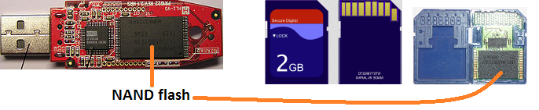
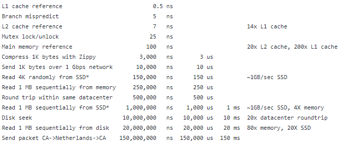
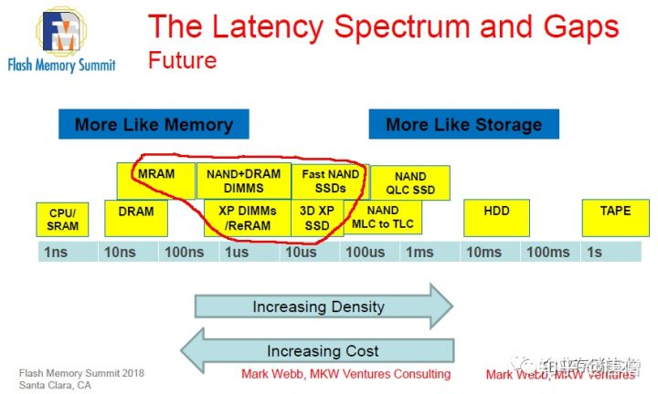
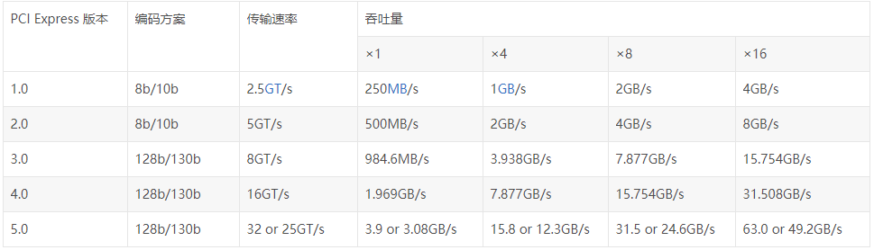

[toc]

[main page](../entry.md)

# link of sub chapter

* [ai_framework](./ai_framework.md)
* [runtime_library](./runtime_library.md)
* [operating_system](./operating_system.md)
* [soc](./soc.md)
* [network](./network.md)

# concept

## storage

* [SD/SSD/eMMC/NAND区别](https://superuser.com/questions/594357/ssd-sd-emmc-raw-nand-what-are-the-differences)
    * NAND stands for Negated AND。是一种存储介质，其单个区域的写入次数是有限的。
    * NAND需要有对应的控制器controller管理分配NAND的写入，并负责和外界交互。
    * controller的不同决定了SD/SSD/eMMC之间的区别。其中SD/USB是一类，SSD是另一类。
    

# performance

* evolution
    * [evolution of storage and computing](http://pages.experts-exchange.com/processing-power-compared/) -- [localpage](./data/system/Processing%20Power%20Compared.html)
* storage and speed
    * latency of storage in general
        * [Latency Comparison Numbers (~2012)](https://gist.github.com/jboner/2841832)

        

    * latency of emmc storage

        

    * HDD v.s. SSD 参考:[UserBenchmark](https://ssd.userbenchmark.com/)
        
||HDD|SSD|
|---|---|---|
|series write|140MB/s|2100MB/s|
|series read|160MB/s|2400MB/s|
|random 4k write|1.5MB/s|150MB/s|
|random 4k read|0.8MB/s|70MB/s|
|latency|10ms|10us|

  * 参考文档
    * [3D XPoint、XL-Flash、MRAM：未来鹿死谁手？](https://zhuanlan.zhihu.com/p/78216825)

* PCIE
    * PCIe 吞吐量（可用带宽）计算方法：
        * 吞吐量 = 传输速率 *  编码方案
        * 例如：PCI-e2.0 协议支持 5.0 GT/s，即每一条Lane 上支持每秒钟内传输 5G个Bit；但这并不意味着 PCIe 2.0协议的每一条Lane支持 5Gbps 的速率。为什么这么说呢？因为PCIe 2.0 的物理层协议中使用的是 8b/10b 的编码方案。 即每传输8个Bit，需要发送10个Bit；这多出的2个Bit并不是对上层有意义的信息。那么， PCIe 2.0协议的每一条Lane支持 5 * 8 / 10 = 4 Gbps = 500 MB/s 的速率。以一个PCIe 2.0 x8的通道为例，x8的可用带宽为 4 * 8 = 32 Gbps = 4 GB/s。

    

# architecture

## concept

* hyper threading
  * AMD and ARM has no HyperThreading support
  * why hyper threading: in some cases, there are more cpu idles caused by cache miss, hyper threading save that cpu idle
  * thereafter, hyper threading turns out to have a better throughput in special case.
  * refer [Is HyperThreading / SMT a flawed concept?](https://stackoverflow.com/questions/23078766/is-hyperthreading-smt-a-flawed-concept)
* SMP & NUMA & MPP
    * SMP(Symmetric Multi Processing)
        * 特点：所有的CPU共享全部资源，如总线，内存和I/O系统等，操作系统或管理数据库的复本只有一个，这种系统有一个最大的特点就是共享所有资源。多个CPU之间没有区别，平等地访问内存、外设、一个操作系统。
        * 缺陷：导致了 SMP 服务器的主要问题，那就是它的**扩展能力非常有限**。对于 SMP 服务器而言，**每一个共享的环节都可能造成 SMP 服务器扩展时的瓶颈**，而最受限制的则是**内存**。由于每个CPU必须通过相同的内存总线访问相同的内存资源，因此随着CPU数量的增加，内存访问冲突将迅速增加，最终会造成CPU资源的浪费，使CPU性能的有效性大大降低。实验证明，SMP服务器CPU利用率最好的情况是2至4个CPU。
        * 应用：一般是家用机和手机
    * NUMA(Nonuniform Memory Access)
        * 特点：具有**多个CPU模块**，每个 CPU 模块由多个 CPU( 如 4 个 ) 组成，并且具有独立的本地内存、 I/O 槽口等。由于其节点之间可以通过互联模块 ( 如称为 Crossbar Switch) 进行连接和信息交互，因此每个 CPU 可以访问整个系统的内存 ( 这是 NUMA 系统与 MPP 系统的重要差别 )。访问本地内存的速度将远远高于访问远地内存 ( 系统内其它节点的内存 ) 的速度，这也是非一致存储访问 NUMA 的由来
        * 缺陷：较好地**解决原来SMP系统的扩展问题**，但访问远地内存的延时远远超过本地内存，因此**当CPU数量增加时，系统性能无法线性增加**。比如，HP 公司发布 Superdome 服务器，64 路 CPU 的 Superdome (NUMA 结构 ) 的相对性能值是 20 ，而 8 路 N4000( 共享的 SMP 结构 ) 的相对性能值是 6.3 。从这个结果可以看到， 8 倍数量的 CPU 换来的只是 3 倍性能的提升。
        * 应用：服务器
    * MPP(Massive Parallel Processing)
        * 特点：提供了另外一种进行系统扩展的方式，它由**多个 SMP 服务器通过一定的节点互联网络进行连接**，协同工作，完成相同的任务，从用户的角度来看是一个服务器系统。其基本特征是由多个 SMP 服务器 ( 每个 SMP 服务器称节点 ) 通过节点互联网络连接而成，**每个节点只访问自己的本地资源** ( 内存、存储等 ) ，是一种完全无共享 (Share Nothing) 结构，因而扩展能力最好，理论上其扩展无限制，目前的技术可实现 512 个节点互联，数千个 CPU 。**节点之间的信息交互是通过节点互联网络实现的，这个过程一般称为数据重分配** (Data Redistribution)
        * 缺陷：数据交互量有限
        * 应用：分布式集群等
    * 参考：[SMP、NUMA、MPP体系结构介绍](https://www.cnblogs.com/yubo/archive/2010/04/23/1718810.html)