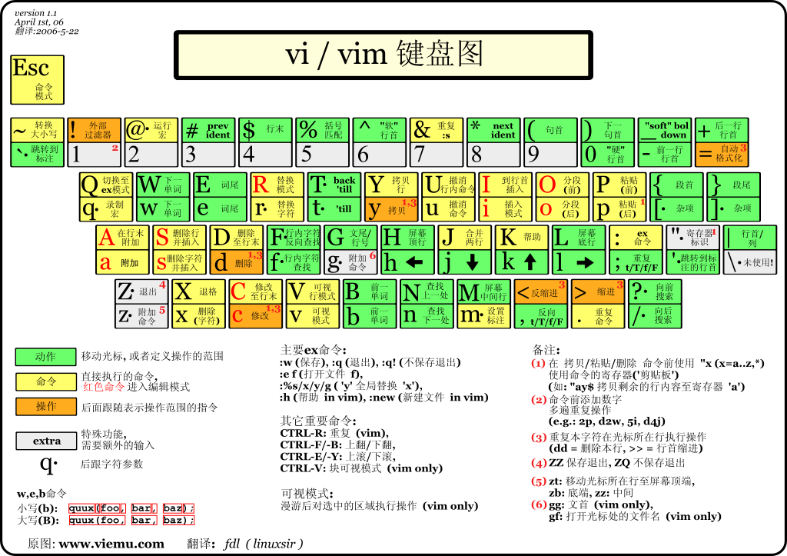
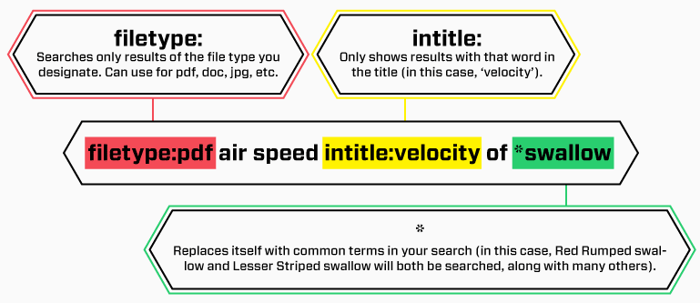

[toc]

[tool](./tool.md)

# terminal

* linux 修改终端界面大小
    * 在~/.bashrc文件末尾加入如下命令:其中rows为终端显示的行数cols为列数
    ```
    resize -s rows cols
    ```
* [linux 修改终端字体颜色](http://blog.chinaunix.net/uid-26021340-id-3481924.html)
    * vim ~/.bashrc。修改和PS1有关的部分
    ```
    PS1='\[\033[4;31;40m\]\u\[\033[00m\]@\h:\[\033[37;40m\]\w\[\033[32;40m\]\$ \[\033[34;40m\]'
    ```

* 终端常用命令
    * tab 补全
    * ctrl+a 开始位置
    * ctrl+e 最后位置
    * ctrl+k 删除此处至末尾所有内容
    * ctrl+u 删除此处至开始所有内容
    * ctrl+d 删除当前字母
    * ctrl+shift+c 复制
    * ctrl+shift+v 粘贴
    * ctrl+shift+T 快捷键创建新标签页
    * ctrl+alt+T 启动terminal
    * ctrl+left-arrow 光标移动到上一个单词的词首
    * ctrl+right-arrow 光标移动到下一个单词的词尾
    * ctrl+w 删除光标位置的前一个单词
    * ctrl+d 删除光标位置出的一个字符

# visual studio

* image watch工具
    * 如何使用image watch插件
    
    ```
    @mem(address, type, channels, width, height, stride)
    @mem(myimg.data, UINT8, 1, 320, 240, 320)
    ```

# vscode

* 基本编辑
    * Ctrl+PageUp/PageDown 回到上一个编辑处
* 编辑多行
    * Alt+Shift 竖列选择
    * Alt+up/down 某一行上下移动
    * Ctrl + [和 Ctrl + ] 实现文本的向左移动或者向右移动；
* 代码
    * CTRL+Shift+O 查看当前文件中的函数列表
    * Ctrl+P 查看当前文件中的符号
    * Shift  +  Alt  + F     实现代码的对齐
    * 首先用鼠标选中多行，然后先按Ctrl+k，再按下Ctrl+c  完成注释
    * 首先用鼠标选中多行，然后先按Ctrl+k，再按下Ctrl+u  取消注释

# git

* branch
    * create branch

        ```
        git checkout -b 1.1.4-jspooner
        ```

    * switch branch

        ```
        git checkout master
        ```

* rebase
    * [modify a specific commit](http://stackoverflow.com/questions/1186535/how-to-modify-a-specified-commit-in-git)
        * 1 `git rebase -i @~9 # Show the last 9 commits in a text editor`
        * Find the commit you want, change pick to e (edit), and save and close the file. Git will rewind to that commit, allowing you to either:
        * 2 use `git commit --amend` to make changes, or use `git reset @~` to discard the last commit
        * 3 run `git rebase --continue`, and Git will replay the subsequent changes on top of your modified commit. You may be asked to fix some merge conflicts.

* pull & fetch
    * In the simplest terms, git pull does a git fetch followed by a git merge.

* stash
    * git stash 保存
    * git stash pop切回来
    * git stash list列出来
* reset
    * `git reset --hard HEAD^`  撤销上一次的操作
    * `git reset --hard <commit>` 撤销到某次commit
    * `git reset --soft <commit>` 撤销到某次commit，但改动的代码依旧保留
* reference
    * [Git 分支 - 分支的衍合](https://git-scm.com/book/zh/v1/Git-%E5%88%86%E6%94%AF-%E5%88%86%E6%94%AF%E7%9A%84%E8%A1%8D%E5%90%88)
* 中文支持性
    * git diff show code in utf-8 format, but if source code is encoded in euc-cn(GB2312) format
    * git status支持中文
        * `git config --global core.quotepath false`
    * [修改编码](./shell.md#text-encoder)


# vim

* 编码
    * `:set fileencoding` 查看编码
    * `:set fileencoding=utf-8` 设置编码
    * [修改编码](./shell.md#text-encoder)
* autoident
    * turn off autoindent `:set paste`
    * turn on autoindent `:set nopaste`
* space and tab
    * 在.vimrc中添加以下代码后，重启vim即可实现按TAB产生4个空格：
    
    ```
    set ts=4  (注：ts是tabstop的缩写，设TAB宽4个空格)
    set expandtab
    ```

    * 对于已保存的文件，可以使用下面的方法进行空格和TAB的替换：（TAB替换为空格：）

    ```
    :set ts=4
    :set expandtab
    :%retab!
    ```

* 使用vim在文件中插入命令执行的输出结果
    * 基本用法：
        * 在指令模式下运行 `:!command` ，如`!date`将日期显示在vim底部，`!ls`列出当前目录
    * 将命令结果插入文件：
        * 运行 `:r! command `， command命令的结果插入光标下一行

* 屏幕滑动
    * `CTRL-F` 向下滑动一页
    * `CTRL-B` 向上滑动一页
    * `zt` 当前行显示在顶部
    * `zz` 当前行显示在中部
    * `zb` 当前行显示在底部
* 剪切与复制
    * `dd`：剪切当前行
    * `dw`：从光标处剪切至一个单子/单词的末尾，包括空格
    * `d$`：从当前光标剪切到行末
    * `d0`：从当前光标位置（不包括光标位置）剪切之行首
    * y命令类似
* 快捷键与其他参考教程
    * 




# google


